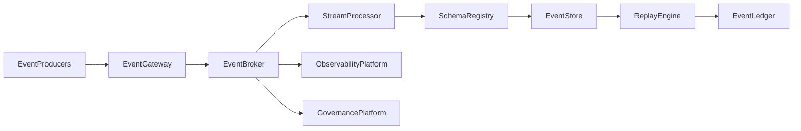

# Enterprise AI Software Factory
# Architecture Design Specification (ADS)

> **Document ID:** ADS-038-v1
>
> **Document Name:** Enterprise Event Streaming, Messaging & Real-Time Data Platform — Architecture
>
> **Version:** 1.0.0
>
> **Classification:** Enterprise Platform Plane
>
> **Importance:** CRITICAL
>
> **Depends On:** ADS-021-v5
>
> **Depends On:** ADS-023-v5
>
> **Depends On:** ADS-025-v5
>
> **Depends On:** ADS-026-v5
>
> **Depends On:** ADS-027-v5
>
> **Depends On:** ADS-030-v5
>
> **Depends On:** ADS-037-v5
>
> **Next:** ADS-038-v2 — Event Algorithms & Lifecycle

---

# Executive Summary

The Enterprise Event Streaming, Messaging & Real-Time Data Platform provides the event backbone for the Enterprise AI Software Factory.

It enables reliable, scalable, observable, and governed movement of events between enterprise services, AI agents, workflows, digital twins, edge devices, analytics engines, and external systems.

The platform supports event sourcing, CQRS, schema governance, stream processing, replay, and exactly-once delivery semantics.

Every event is immutable.

Every stream is governed.

Every message is traceable.

---

# Design Philosophy

The platform follows eight principles.

- Event First
- Immutable Events
- Stream Native
- Exactly-Once Delivery
- Schema Governance
- Replayable History
- Observable Messaging
- Tenant Isolation

---

# Platform Architecture



The Event Broker coordinates every enterprise event.

---

# Core Components

## Event Gateway

Responsible for

- Event Ingestion
- Authentication
- Authorization
- Validation
- Rate Limiting
- Routing

---

## Event Broker

Responsible for

- Topic Management
- Partition Management
- Message Routing
- Delivery Guarantees
- Consumer Coordination

---

## Stream Processor

Responsible for

- Event Transformation
- Window Processing
- Filtering
- Aggregation
- Enrichment

---

## Schema Registry

Responsible for

- Event Schemas
- Versioning
- Compatibility Rules
- Validation
- Metadata

---

## Replay Engine

Responsible for

- Event Replay
- Point-in-Time Recovery
- Historical Reconstruction
- Backfill
- Audit Replay

---

## Event Ledger

Maintains immutable records for

- Published Events
- Schema Changes
- Consumer Offsets
- Replay Operations
- Governance Decisions

---

# Primary Artifacts

The platform introduces

- Event
- Event Record
- Stream
- Topic
- Consumer Group
- Stream Session
- Event Health Record
- Runtime Snapshot
- Event Ledger Entry

---

# Event

Every enterprise event is represented as an immutable Event.

```yaml
event:

  eventId:

  eventType:

  source:

  tenant:

  schemaVersion:

  payload:

  metadata:

  timestamp:

  traceId:
```

Events are immutable after publication.

---

# Platform Responsibilities

The platform governs

- Event Publication
- Event Consumption
- Stream Processing
- Topic Lifecycle
- Schema Evolution
- Replay
- Dead-Letter Handling
- Event Governance

---

# Delivery Guarantees

Supported delivery modes

| Mode | Purpose |
|-------|----------|
| At Most Once | Best-effort delivery |
| At Least Once | Reliable delivery |
| Exactly Once | Transactional processing |

Delivery semantics are policy-controlled.

---

# Platform Guarantees

The platform guarantees

- Immutable Events
- Ordered Partitions
- Schema Compatibility
- Replayability
- Observable Streams
- Tenant Isolation
- Auditability
- High Availability

---

# End of Part 1
