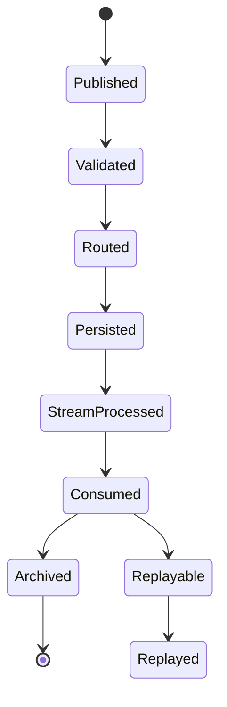

# Enterprise AI Software Factory
# Architecture Design Specification (ADS)

> **Document ID:** ADS-038-v2
>
> **Document Name:** Enterprise Event Streaming, Messaging & Real-Time Data Platform — Event Algorithms & Lifecycle
>
> **Version:** 1.0.0
>
> **Classification:** Enterprise Platform Plane
>
> **Importance:** CRITICAL
>
> **Depends On:** ADS-038-v1
>
> **Next:** ADS-038-v3 — APIs, Events & Contracts

---

# Executive Summary

This document defines the lifecycle algorithms governing enterprise event publication, schema validation, stream processing, consumer coordination, replay, and retention.

Every published event follows a deterministic lifecycle.

Every schema is governed.

Every stream is replayable.

---

# Design Philosophy

The Event Lifecycle follows six principles.

- Immutable Publication
- Deterministic Ordering
- Schema Compatibility
- Observable Processing
- Replayable History
- Controlled Retention

---

# ALG-038-001

## Event Publication

Every business event SHALL be published through the Event Gateway.

Publication validates

- Producer Identity
- Topic Authorization
- Event Schema
- Payload Integrity
- Trace Context
- Tenant Context

Successful publication creates an Event Record.

---

# Event

```yaml
event:

  eventId:

  eventType:

  source:

  tenant:

  schemaVersion:

  payload:

  metadata:

  timestamp:

  traceId:
```

Events remain immutable after publication.

---

# ALG-038-002

## Schema Validation

Schema Registry validates

- Schema Version
- Compatibility Rules
- Required Fields
- Data Types
- Metadata
- Evolution Policy

Validation occurs before publication.

---

# ALG-038-003

## Topic Assignment

Every event is routed to a managed Topic.

Routing evaluates

- Event Type
- Tenant
- Domain
- Priority
- Ordering Requirements
- Retention Policy

Topic assignment remains deterministic.

---

# Delivery Modes

| Mode | Purpose |
|--------|----------|
| At Most Once | Low-latency best effort |
| At Least Once | Reliable processing |
| Exactly Once | Transactional event processing |

Delivery guarantees remain policy-controlled.

---

# ALG-038-004

## Stream Processing

The Stream Processor performs

- Filtering
- Enrichment
- Transformation
- Aggregation
- Window Processing
- Routing

Processing pipelines remain deterministic.

---

# Processing Patterns

| Pattern | Purpose |
|----------|----------|
| Stateless | Simple transformations |
| Stateful | Windowed aggregation |
| Event Sourcing | Immutable history |
| CQRS | Read/write separation |
| CEP | Complex Event Processing |

---

# ALG-038-005

## Consumer Coordination

Consumer Groups coordinate

- Partition Assignment
- Offset Tracking
- Load Balancing
- Retry Handling
- Rebalancing
- Acknowledgement

Consumer processing remains ordered.

---

# Event Record

Every published event generates an immutable Event Record.

```yaml
eventRecord:

  eventRecordId:

  event:

  topic:

  partition:

  offset:

  producer:

  publicationStatus:

  deliveryGuarantee:

  retentionPolicy:

  publishedAt:
```

Event Records remain append-only.

---

# ALG-038-006

## Replay Processing

The Replay Engine reconstructs historical event streams for recovery, auditing, backfilling, and testing.

Replay evaluates

- Replay Scope
- Time Window
- Topic Selection
- Consumer Group
- Ordering Constraints
- Replay Policy

Replay never mutates original events.

---

# ALG-038-007

## Dead-Letter Handling

Events that cannot be successfully processed SHALL be redirected to a Dead-Letter Queue (DLQ).

Dead-letter processing records

- Original Event
- Failure Reason
- Retry Count
- Consumer Group
- Processing Timestamp
- Resolution Status

DLQ processing remains auditable.

---

# ALG-038-008

## Event Retention

Retention policies determine

- Storage Duration
- Archival Rules
- Compliance Requirements
- Replay Eligibility
- Secure Deletion Schedule

Retention policies are tenant-aware.

---

# Stream Record

Every managed event stream is represented by a Stream Record.

```yaml
streamRecord:

  streamRecordId:

  stream:

  topics:

  consumerGroups:

  retentionPolicy:

  deliveryGuarantee:

  operationalStatus:

  throughput:

  lastEvaluatedAt:
```

Stream Records remain immutable with append-only operational history.

---

# Event Lifecycle



Every event progresses through a deterministic lifecycle.

---

# Consumer Lifecycle

```text
Consumer Registered

↓

Partition Assigned

↓

Offset Initialized

↓

Events Consumed

↓

Offsets Committed

↓

Rebalanced

↓

Consumer Stopped
```

Consumer state is continuously coordinated by the Event Broker.

---

# Stream Processing Pipeline

```text
Event Published

↓

Schema Validation

↓

Topic Routing

↓

Partition Assignment

↓

Broker Persistence

↓

Stream Processing

↓

Consumer Delivery

↓

Ledger Recording
```

The processing pipeline remains reproducible.

---

# Replay Lifecycle

```text
Replay Requested

↓

Authorization

↓

Replay Scope Validation

↓

Historical Event Retrieval

↓

Ordered Replay

↓

Consumer Delivery

↓

Replay Completed
```

Replay operations preserve original ordering.

---

# Failure Handling

Failures are classified as

| Failure | Recovery Strategy |
|----------|-------------------|
| Schema Validation | Reject Event |
| Producer Failure | Retry Publication |
| Consumer Failure | Retry / Rebalance |
| Broker Failure | Replica Failover |
| Stream Failure | Replay |
| Storage Failure | Snapshot Recovery |

Recovery policies are governance-controlled.

---

# Prometheus Metrics

```text
events_published_total

events_consumed_total

active_streams_total

consumer_groups_total

dead_letter_events_total

event_replays_total

schema_validation_failures_total

event_processing_latency_seconds

broker_partition_count

stream_throughput_events_per_second
```

---

# Structured Logging

Example

```json
{
  "eventRecord":"ER-20492",
  "streamRecord":"SR-081",
  "topic":"orders.created",
  "partition":4,
  "offset":189472,
  "consumerGroup":"analytics-service",
  "processingStatus":"Completed"
}
```

Logs remain immutable and traceable.

---

# Architecture Decision Records

## ADR-038-01

### Decision

Treat Events as immutable business facts.

### Status

Accepted

### Reason

Immutable events enable replay, auditing, and deterministic processing.

---

## ADR-038-02

### Decision

Separate Event Records from Stream Records.

### Status

Accepted

### Reason

Operational stream management evolves independently from individual event publication.

---

## ADR-038-03

### Decision

Replay events without modifying historical records.

### Status

Accepted

### Reason

Historical integrity must always be preserved.

---

# Operational Readiness Scorecard

| Capability | Status |
|------------|--------|
| Event Publication | ✅ Required |
| Schema Validation | ✅ Required |
| Stream Processing | ✅ Required |
| Consumer Coordination | ✅ Required |
| Replay Engine | ✅ Required |
| Dead-Letter Queue | ✅ Required |
| Retention Policies | ✅ Required |
| Immutable Event History | ✅ Required |

---

# Related Documents

ADS-021-v5 — Workflow Kernel

ADS-023-v5 — Knowledge & Memory Platform

ADS-025-v5 — Compute & Infrastructure Platform

ADS-026-v5 — Security Platform

ADS-027-v5 — Observability Platform

ADS-030-v5 — Integration & Ecosystem Platform

ADS-037-v5 — Enterprise Edge, IoT & Cyber-Physical Systems Platform

ADS-038-v1 — Architecture

ADS-038-v3 — APIs, Events & Contracts

---

# End of Document
