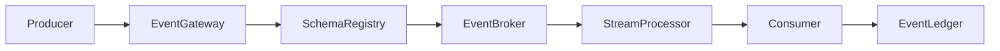

# Enterprise AI Software Factory
# Architecture Design Specification (ADS)

> **Document ID:** ADS-038-v3
>
> **Document Name:** Enterprise Event Streaming, Messaging & Real-Time Data Platform — APIs, Events & Contracts
>
> **Version:** 1.0.0
>
> **Classification:** Enterprise Platform Plane
>
> **Importance:** CRITICAL
>
> **Depends On:** ADS-038-v1
>
> **Depends On:** ADS-038-v2
>
> **Next:** ADS-038-v4 — Runtime & Event Infrastructure

---

# Executive Summary

This document specifies the APIs, messaging contracts, event schemas, security policies, and integration interfaces used by the Enterprise Event Streaming Platform.

Every event contract is versioned.

Every topic is governed.

Every API is observable.

---

# REST APIs

## API-038-001

### Publish Event

```http
POST /events/v1/publish
```

Request

```json
{
  "eventType": "OrderCreated",
  "topic": "orders.created",
  "tenant": "tenant-a",
  "payload": {},
  "metadata": {},
  "traceId": "TRC-932001"
}
```

Response

```json
{
  "eventId": "EV-10021",
  "eventRecordId": "ER-24011",
  "publicationStatus": "Published"
}
```

---

## API-038-002

### Register Topic

```http
POST /events/v1/topics
```

Registers a governed event topic.

---

## API-038-003

### Register Schema

```http
POST /events/v1/schemas
```

Registers a new schema version in the Schema Registry.

---

## API-038-004

### Replay Events

```http
POST /events/v1/replay
```

Initiates a replay operation for an authorized scope.

---

## API-038-005

### Query Event

```http
GET /events/v1/events/{eventId}
```

Returns immutable event metadata.

---

# gRPC Service

```protobuf
service EventStreamingService {

  rpc PublishEvent(EventRequest)
      returns (EventResponse);

  rpc RegisterTopic(TopicRequest)
      returns (TopicResponse);

  rpc RegisterSchema(SchemaRequest)
      returns (SchemaResponse);

  rpc ReplayEvents(ReplayRequest)
      returns (ReplayResponse);

  rpc QueryEvent(QueryRequest)
      returns (EventRecord);
}
```

---

# Core Schemas

## Event

```yaml
event:

  eventId:

  eventType:

  source:

  tenant:

  schemaVersion:

  payload:

  metadata:

  timestamp:

  traceId:
```

---

## Event Record

```yaml
eventRecord:

  eventRecordId:

  event:

  topic:

  partition:

  offset:

  producer:

  publicationStatus:

  deliveryGuarantee:

  retentionPolicy:

  publishedAt:
```

---

## Stream Record

```yaml
streamRecord:

  streamRecordId:

  stream:

  topics:

  consumerGroups:

  retentionPolicy:

  deliveryGuarantee:

  operationalStatus:

  throughput:

  lastEvaluatedAt:
```

---

## Topic Record

```yaml
topicRecord:

  topicRecordId:

  topicName:

  partitions:

  replicationFactor:

  retentionPolicy:

  schemaRegistry:

  accessPolicy:

  operationalStatus:

  createdAt:
```

---

# MCP Tools

The platform exposes the following tools.

- publish_event
- query_event
- replay_events
- register_topic
- register_schema
- create_consumer_group
- stream_health
- topic_diagnostics

---

# Platform Events

## EVT-038-001

EventPublished

---

## EVT-038-002

SchemaRegistered

---

## EVT-038-003

TopicCreated

---

## EVT-038-004

ConsumerGroupCreated

---

## EVT-038-005

ReplayStarted

---

## EVT-038-006

ReplayCompleted

---

## EVT-038-007

DeadLetterQueued

---

## EVT-038-008

RetentionExpired

---

# Event Flow



Every interaction produces immutable operational evidence.

---

# End of Part 1
