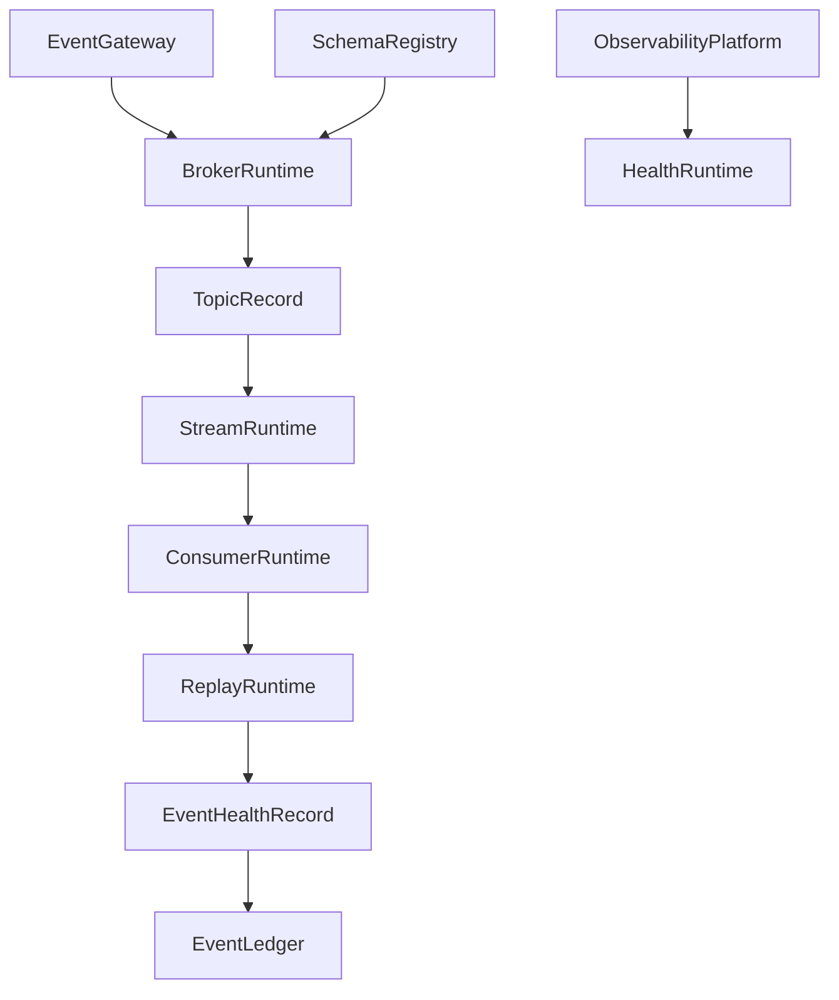
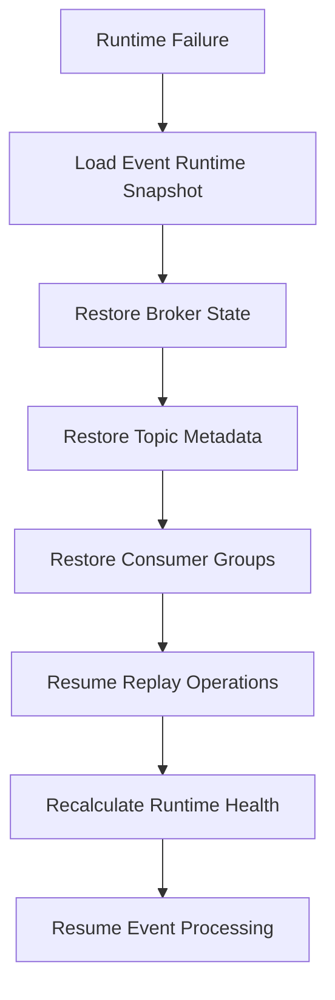

# Enterprise AI Software Factory
# Architecture Design Specification (ADS)

> **Document ID:** ADS-038-v4
>
> **Document Name:** Enterprise Event Streaming, Messaging & Real-Time Data Platform — Runtime & Event Infrastructure
>
> **Version:** 1.0.0
>
> **Classification:** Enterprise Runtime Specification
>
> **Importance:** CRITICAL
>
> **Depends On:** ADS-038-v1
>
> **Depends On:** ADS-038-v2
>
> **Depends On:** ADS-038-v3
>
> **Next:** ADS-038-v5 — End-to-End Event Lifecycle

---

# Executive Summary

This document specifies the runtime architecture responsible for continuously operating enterprise event streams.

The Event Runtime manages event ingestion, topic routing, partition scheduling, stream processing, replay execution, consumer coordination, schema validation, and immutable event persistence while maintaining deterministic execution across distributed infrastructure.

Every event is processed once according to its configured delivery guarantees.

Every stream is continuously observable.

Every runtime interaction becomes operational evidence.

---

# Runtime Philosophy

The Event Runtime follows eight principles.

- Event First
- Immutable Processing
- Continuous Availability
- Deterministic Scheduling
- Observable Execution
- Replayable Operations
- Policy Enforcement
- Operational Resilience

Runtime execution never bypasses governance.

---

# Runtime Layers

## Gateway Runtime

Responsible for

- Event Reception
- Authentication
- Authorization
- Request Validation
- Rate Limiting

---

## Broker Runtime

Responsible for

- Topic Routing
- Partition Management
- Replication
- Delivery Coordination
- Offset Tracking

---

## Stream Runtime

Responsible for

- Event Transformation
- Aggregation
- Window Processing
- Enrichment
- Stateful Operations

---

## Replay Runtime

Responsible for

- Replay Scheduling
- Historical Reconstruction
- Ordered Replay
- Recovery Execution
- Audit Replay

---

## Consumer Runtime

Responsible for

- Consumer Coordination
- Rebalancing
- Offset Commit
- Retry Processing
- Dead-Letter Routing

---

## Health Runtime

Responsible for

- Runtime Monitoring
- Broker Health
- Topic Health
- Consumer Health
- Replay Health

---

# Runtime Architecture



The runtime coordinates every enterprise event lifecycle.

---

# Runtime Components

| Component | Responsibility |
|------------|----------------|
| Gateway Runtime | Event ingestion |
| Broker Runtime | Message routing |
| Stream Runtime | Event processing |
| Consumer Runtime | Event delivery |
| Replay Runtime | Historical reconstruction |
| Health Runtime | Runtime monitoring |
| Event Ledger | Immutable operational history |

---

# Runtime Pipeline

```text
Receive Event

↓

Authenticate Producer

↓

Validate Schema

↓

Assign Topic

↓

Assign Partition

↓

Persist Event

↓

Process Stream

↓

Deliver to Consumers

↓

Persist Ledger Entry
```

Every event follows the same runtime pipeline.

---

# Gateway Runtime

Gateway Runtime manages

- Identity Verification
- Admission Control
- Topic Authorization
- Schema Validation
- Trace Context
- Rate Limiting

Gateway execution is deterministic.

---

# Broker Runtime

Broker Runtime coordinates

- Topic Scheduling
- Partition Assignment
- Replica Synchronization
- Delivery Guarantees
- Offset Management

Broker state remains durable.

---

# Stream Session Management

Every runtime execution creates or participates in a Stream Session.

Each Stream Session tracks

- Stream Record
- Topic Record
- Consumer Group Record
- Active Partitions
- Processing Window
- Runtime Metadata
- Throughput

Stream Sessions remain immutable.

---

# Runtime Guarantees

The Event Runtime guarantees

- Ordered Partition Processing
- Schema Enforcement
- Replay Consistency
- Consumer Isolation
- Immutable Operational History
- Observable Runtime Execution
- Deterministic Recovery

---

# Failure Recovery

The Event Runtime automatically recovers from broker, consumer, stream processor, replay engine, and infrastructure failures while preserving delivery guarantees.

Recovery follows approved governance policies.



Recovery guarantees

- No committed event loss
- Partition ordering preserved
- Consumer offsets restored
- Replay consistency maintained

---

# Runtime Health Monitoring

Every runtime component continuously reports health.

Collected metrics

- Broker Health
- Topic Health
- Consumer Group Health
- Replay Engine Health
- Stream Runtime Health
- Active Stream Sessions
- Partition Availability
- Processing Latency

Health Flow

```text
Runtime Component

↓

Heartbeat

↓

Runtime Monitor

↓

Operations Dashboard

↓

Alert Engine

↓

Operations Team
```

Health monitoring remains continuous.

---

# Event Runtime Snapshot

The runtime periodically generates Event Runtime Snapshots.

```yaml
eventRuntimeSnapshot:

  snapshotId:

  generatedAt:

  activeTopics:

  activeConsumerGroups:

  activeStreamSessions:

  brokerClusterStatus:

  replayQueueDepth:

  partitionHealth:

  platformHealth:

  throughput:
```

Runtime Snapshots provide deterministic operational state.

---

# Runtime Configuration

Example

```yaml
eventRuntime:

  schemaValidation: enabled

  exactlyOnceProcessing: enabled

  deadLetterQueue: enabled

  replayEngine: enabled

  eventLedger: enabled

  runtimeSnapshots: enabled

  partitionAutoBalancing: enabled

  snapshotInterval: 5m
```

Configuration remains version-controlled.

---

# Runtime Scaling

The Event Runtime supports

- Horizontal Broker Scaling
- Dynamic Partition Rebalancing
- Elastic Consumer Scaling
- Parallel Stream Processing
- Multi-Region Replication

Scaling remains policy-driven.

---

# Runtime Isolation

The Event Runtime isolates

- Tenants
- Topics
- Consumer Groups
- Stream Sessions
- Replay Operations
- Processing Pipelines

Isolation prevents cross-tenant interference.

---

# Prometheus Metrics

```text
event_runtime_snapshots_total

active_topics_total

active_consumer_groups_total

active_stream_sessions_total

broker_replication_lag_seconds

partition_rebalance_total

replay_queue_depth

consumer_offset_commits_total

event_runtime_health_score

stream_processing_latency_seconds
```

---

# OpenTelemetry

Distributed tracing spans

```text
Event Gateway

↓

Broker Runtime

↓

Schema Registry

↓

Stream Runtime

↓

Consumer Runtime

↓

Replay Runtime

↓

Event Ledger
```

Every runtime stage contributes trace spans.

---

# Structured Logging

Example

```json
{
  "streamSession":"SS-1022",
  "eventHealthRecord":"EHR-0451",
  "topic":"orders.created",
  "consumerGroup":"analytics-service",
  "platformHealth":"Healthy",
  "processingLatencyMs":17
}
```

Logs remain immutable and correlated.

---

# Disaster Recovery

Recovery flow

```text
Broker Failure

↓

Restore Event Runtime Snapshot

↓

Restore Topic Metadata

↓

Restore Consumer Offsets

↓

Resume Stream Processing

↓

Validate Runtime Health

↓

Resume Event Delivery
```

Recovery targets

Recovery Point Objective (RPO)

Near-zero committed event loss

Recovery Time Objective (RTO)

Less than five minutes

---

# Recommended Production Deployment

```text
Event Gateway

↓

Broker Cluster

↓

Schema Registry

↓

Stream Processor

↓

Replay Engine

↓

Event Ledger

↓

OpenTelemetry

↓

Prometheus

↓

Grafana
```

---

# Technology Decision Records

## TDR-038-01

### Technology

Apache Kafka

### Decision

Use Apache Kafka (or an equivalent distributed event streaming platform) as the primary event broker.

### Reason

Provides scalable partitioning, durable persistence, replay capability, and mature ecosystem support.

---

## TDR-038-02

### Technology

Apache Flink

### Decision

Use Apache Flink (or an equivalent stream processing engine) for stateful event processing.

### Reason

Supports low-latency processing, windowing, and exactly-once semantics.

---

## TDR-038-03

### Technology

Schema Registry

### Decision

Maintain centralized schema governance with compatibility enforcement.

### Reason

Ensures safe schema evolution and interoperability across producers and consumers.

---

## TDR-038-04

### Technology

Event Runtime Snapshot

### Decision

Persist periodic runtime snapshots.

### Reason

Supports diagnostics, replay, disaster recovery, and operational visibility.

---

## TDR-038-05

### Technology

Dead-Letter Queue

### Decision

Route unrecoverable events to governed dead-letter queues.

### Reason

Prevents data loss while isolating processing failures for later analysis.

---

# Runtime Checklist

The Event Platform MUST

- Enforce schema validation
- Preserve partition ordering
- Support exactly-once processing where configured
- Generate Event Runtime Snapshots
- Maintain immutable operational history
- Support replay and recovery
- Monitor runtime health continuously

The Event Platform MUST NOT

- Accept invalid event schemas
- Lose committed event history
- Bypass governance policies
- Break tenant isolation
- Execute unauthorized replay operations

---

# Architecture Decision Records

## ADR-038-07

### Decision

Treat Event Runtime Snapshots as immutable runtime artifacts.

### Status

Accepted

### Reason

Snapshots improve recovery, diagnostics, replay validation, and operational resilience.

---

## ADR-038-08

### Decision

Separate broker runtime from stream processing runtime.

### Status

Accepted

### Reason

Independent scaling and operational isolation improve reliability and maintainability.

---

## ADR-038-09

### Decision

Represent runtime execution through immutable Stream Sessions.

### Status

Accepted

### Reason

Provides deterministic runtime traceability, replay support, and operational observability.

---

# Operational Readiness Scorecard

| Capability | Status |
|------------|--------|
| Broker Runtime | ✅ Required |
| Stream Runtime | ✅ Required |
| Runtime Snapshots | ✅ Required |
| Replay Runtime | ✅ Required |
| Runtime Recovery | ✅ Required |
| Exactly-Once Processing | ✅ Required |
| OpenTelemetry | ✅ Required |
| Deterministic Execution | ✅ Required |

---

# Related Documents

ADS-021-v5 — Workflow Kernel

ADS-023-v5 — Knowledge & Memory Platform

ADS-025-v5 — Compute & Infrastructure Platform

ADS-026-v5 — Security Platform

ADS-027-v5 — Observability Platform

ADS-030-v5 — Integration & Ecosystem Platform

ADS-037-v5 — Enterprise Edge, IoT & Cyber-Physical Systems Platform

ADS-038-v1 — Architecture

ADS-038-v2 — Event Algorithms & Lifecycle

ADS-038-v3 — APIs, Events & Contracts

ADS-038-v5 — End-to-End Event Lifecycle

---

# End of Document
