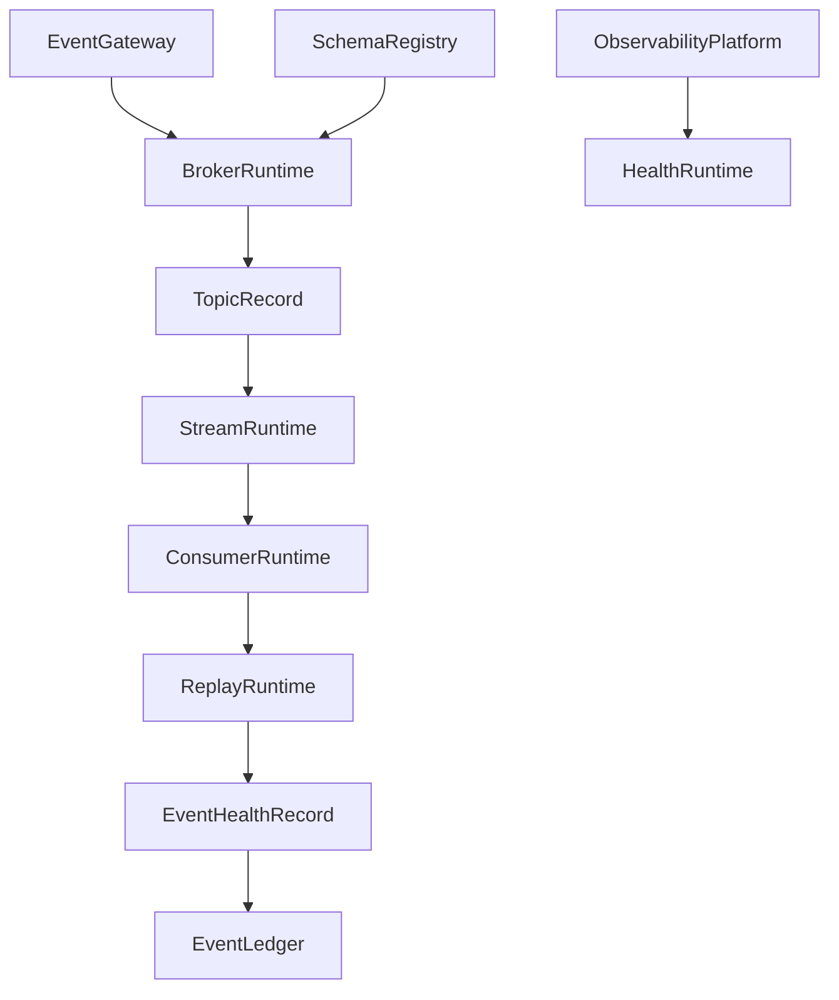

# Enterprise AI Software Factory
# Architecture Design Specification (ADS)

> **Document ID:** ADS-038-v4
>
> **Document Name:** Enterprise Event Streaming, Messaging & Real-Time Data Platform — Runtime & Event Infrastructure
>
> **Version:** 1.0.0
>
> **Classification:** Enterprise Runtime Specification
>
> **Importance:** CRITICAL
>
> **Depends On:** ADS-038-v1
>
> **Depends On:** ADS-038-v2
>
> **Depends On:** ADS-038-v3
>
> **Next:** ADS-038-v5 — End-to-End Event Lifecycle

---

# Executive Summary

This document specifies the runtime architecture responsible for continuously operating enterprise event streams.

The Event Runtime manages event ingestion, topic routing, partition scheduling, stream processing, replay execution, consumer coordination, schema validation, and immutable event persistence while maintaining deterministic execution across distributed infrastructure.

Every event is processed once according to its configured delivery guarantees.

Every stream is continuously observable.

Every runtime interaction becomes operational evidence.

---

# Runtime Philosophy

The Event Runtime follows eight principles.

- Event First
- Immutable Processing
- Continuous Availability
- Deterministic Scheduling
- Observable Execution
- Replayable Operations
- Policy Enforcement
- Operational Resilience

Runtime execution never bypasses governance.

---

# Runtime Layers

## Gateway Runtime

Responsible for

- Event Reception
- Authentication
- Authorization
- Request Validation
- Rate Limiting

---

## Broker Runtime

Responsible for

- Topic Routing
- Partition Management
- Replication
- Delivery Coordination
- Offset Tracking

---

## Stream Runtime

Responsible for

- Event Transformation
- Aggregation
- Window Processing
- Enrichment
- Stateful Operations

---

## Replay Runtime

Responsible for

- Replay Scheduling
- Historical Reconstruction
- Ordered Replay
- Recovery Execution
- Audit Replay

---

## Consumer Runtime

Responsible for

- Consumer Coordination
- Rebalancing
- Offset Commit
- Retry Processing
- Dead-Letter Routing

---

## Health Runtime

Responsible for

- Runtime Monitoring
- Broker Health
- Topic Health
- Consumer Health
- Replay Health

---

# Runtime Architecture



The runtime coordinates every enterprise event lifecycle.

---

# Runtime Components

| Component | Responsibility |
|------------|----------------|
| Gateway Runtime | Event ingestion |
| Broker Runtime | Message routing |
| Stream Runtime | Event processing |
| Consumer Runtime | Event delivery |
| Replay Runtime | Historical reconstruction |
| Health Runtime | Runtime monitoring |
| Event Ledger | Immutable operational history |

---

# Runtime Pipeline

```text
Receive Event

↓

Authenticate Producer

↓

Validate Schema

↓

Assign Topic

↓

Assign Partition

↓

Persist Event

↓

Process Stream

↓

Deliver to Consumers

↓

Persist Ledger Entry
```

Every event follows the same runtime pipeline.

---

# Gateway Runtime

Gateway Runtime manages

- Identity Verification
- Admission Control
- Topic Authorization
- Schema Validation
- Trace Context
- Rate Limiting

Gateway execution is deterministic.

---

# Broker Runtime

Broker Runtime coordinates

- Topic Scheduling
- Partition Assignment
- Replica Synchronization
- Delivery Guarantees
- Offset Management

Broker state remains durable.

---

# Stream Session Management

Every runtime execution creates or participates in a Stream Session.

Each Stream Session tracks

- Stream Record
- Topic Record
- Consumer Group Record
- Active Partitions
- Processing Window
- Runtime Metadata
- Throughput

Stream Sessions remain immutable.

---

# Runtime Guarantees

The Event Runtime guarantees

- Ordered Partition Processing
- Schema Enforcement
- Replay Consistency
- Consumer Isolation
- Immutable Operational History
- Observable Runtime Execution
- Deterministic Recovery

---

# End of Part 1
