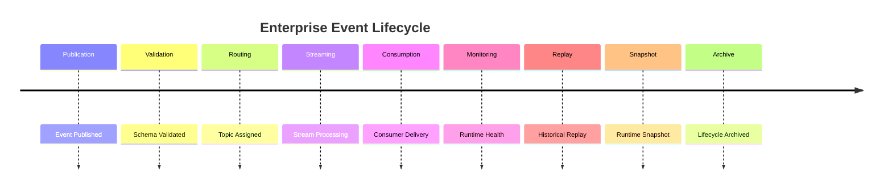

# Enterprise AI Software Factory
# Architecture Design Specification (ADS)

> **Document ID:** ADS-038-v5
>
> **Document Name:** Enterprise Event Streaming, Messaging & Real-Time Data Platform — End-to-End Event Lifecycle
>
> **Version:** 1.0.0
>
> **Classification:** Reference Implementation
>
> **Importance:** CRITICAL
>
> **Depends On:** ADS-038-v1
>
> **Depends On:** ADS-038-v2
>
> **Depends On:** ADS-038-v3
>
> **Depends On:** ADS-038-v4

---

# Executive Summary

This document demonstrates the complete lifecycle of an enterprise event—from publication through validation, topic routing, stream processing, consumer delivery, replay, runtime monitoring, and archival.

It illustrates how Events, Event Records, Stream Records, Topic Records, Consumer Group Records, Stream Sessions, Event Health Records, Event Runtime Snapshots, and Event Ledger Entries interact during real-world execution.

Every event is immutable.

Every stream is governed.

Every runtime interaction is auditable.

---

# Scenario

A global retail enterprise processes customer orders from web, mobile, and in-store systems.

Participating systems

- Event Streaming Platform
- Workflow Platform
- Knowledge Platform
- Analytics Platform
- AI Platform
- Edge Platform
- Observability Platform
- Governance Platform

Daily workload

- 180 million published events
- 1.9 billion consumer deliveries
- 14,000 active consumer groups
- 8 PB retained event history

---

# Stage 1 — Event Publication

Generated

```
EV-2027-104812
```

Producer submits

- Event Type
- Payload
- Metadata
- Tenant
- Trace ID

Publication request received.

---

# Stage 2 — Event Validation

Generated

```
ER-2027-083194
```

Validation performs

- Identity Verification
- Topic Authorization
- Schema Validation
- Payload Integrity
- Governance Checks

Event Record created.

---

# Stage 3 — Topic Assignment

Generated

```
TP-2027-0048
```

Topic configuration

- 24 Partitions
- Replication Factor: 3
- Retention: 30 Days
- Exactly-Once Enabled

Topic becomes active.

---

# Stage 4 — Stream Registration

Generated

```
SR-2027-0126
```

Stream configuration

- Order Processing
- Fraud Detection
- Inventory Updates
- Customer Analytics

Stream initialized.

---

# Stage 5 — Consumer Coordination

Generated

```
CG-2027-0184
```

Consumer Group manages

- Partition Assignment
- Offset Tracking
- Rebalancing
- Retry Policy

Consumers synchronized.

---

# Stage 6 — Runtime Processing

Generated

```
SS-2027-00577
```

Stream Session coordinates

- Partition Processing
- Window Aggregation
- Event Transformation
- Stateful Operations
- Runtime Metadata

Processing begins.

---

# Stage 7 — Runtime Health

Generated

```
EHR-2027-00091
```

Health evaluation

- Broker Health: Healthy
- Topic Health: Healthy
- Consumer Health: Healthy
- Replay Health: Healthy
- Throughput Health: Healthy

Platform remains Healthy.

---

# Stage 8 — Runtime Snapshot

Generated

```
ERS-2027-00019
```

Snapshot contains

- Active Topics
- Consumer Groups
- Broker Status
- Replay Queue
- Runtime Health

Snapshot archived.

---

# Stage 9 — Event Replay

Replay requested for

```
orders.created
```

Replay performs

- Authorization
- Historical Retrieval
- Ordered Delivery
- Offset Isolation
- Completion Verification

Replay completes successfully.

---

# Stage 10 — Event Ledger

Generated

```
EL-2027-00048
```

Ledger Entry references

- Event
- Event Record
- Stream Record
- Topic Record
- Consumer Group Record
- Stream Session
- Event Health Record
- Runtime Snapshot

Entry becomes immutable.

---

# Stage 11 — Executive Review

Operations leadership evaluates

- Broker Throughput
- Consumer Lag
- Replay Success
- Delivery Guarantees
- Schema Compatibility
- Runtime Availability

Enterprise platform approved.

---

# Stage 12 — Archive & Retention

Archived artifacts

- Event
- Event Record
- Stream Record
- Topic Record
- Consumer Group Record
- Stream Session
- Event Health Record
- Runtime Snapshot
- Event Ledger Entry

Lifecycle remains reproducible.

---

# Event Lifecycle Timeline



---

# Event Flow

```text
Publish Event

↓

Validate Schema

↓

Assign Topic

↓

Persist Event

↓

Process Stream

↓

Deliver to Consumers

↓

Monitor Runtime

↓

Replay (Optional)

↓

Write Event Ledger

↓

Archive
```

---

# Produced Artifacts

| Artifact | Identifier |
|-----------|------------|
| Event | EV-2027-104812 |
| Event Record | ER-2027-083194 |
| Topic Record | TP-2027-0048 |
| Stream Record | SR-2027-0126 |
| Consumer Group Record | CG-2027-0184 |
| Stream Session | SS-2027-00577 |
| Event Health Record | EHR-2027-00091 |
| Event Runtime Snapshot | ERS-2027-00019 |
| Event Ledger Entry | EL-2027-00048 |

---

# Runtime Metrics

| Metric | Value |
|---------|------:|
| Published Events / Day | 180 Million |
| Consumer Deliveries / Day | 1.9 Billion |
| Active Topics | 12,400 |
| Active Consumer Groups | 14,000 |
| Replay Success Rate | 99.99% |
| Average End-to-End Latency | 18 ms |
| Platform Availability | 99.995% |
| Schema Compatibility Success | 100% |

---

# Operational Readiness Scorecard

| Capability | Status |
|------------|--------|
| Event Publication | ✅ Verified |
| Schema Registry | ✅ Verified |
| Topic Management | ✅ Verified |
| Stream Processing | ✅ Verified |
| Consumer Coordination | ✅ Verified |
| Replay Engine | ✅ Verified |
| Runtime Snapshots | ✅ Verified |
| Event Ledger | ✅ Verified |

---

# Lessons Learned

The Enterprise Event Streaming Platform demonstrates the following principles.

- Events remain immutable throughout their lifecycle.
- Event Records separate publication metadata from business payloads.
- Topic Records govern routing and retention policies.
- Stream Records coordinate enterprise event flows.
- Consumer Group Records manage delivery coordination.
- Stream Sessions preserve runtime execution context.
- Event Health Records continuously evaluate operational quality.
- Event Runtime Snapshots support diagnostics, replay, and disaster recovery.
- Event Ledger Entries provide immutable operational history.

---

# Architecture Decision Record

## ADR-038-10

### Decision

Represent enterprise event processing as a deterministic lifecycle composed of immutable operational artifacts.

### Status

Accepted

### Reason

Artifact-centric event management improves governance, observability, replayability, auditability, compliance, and operational resilience.

---

# Technology Decision Record

## TDR-038-06

### Technology

Enterprise Event Streaming Platform

### Decision

Implement a centralized Enterprise Event Streaming, Messaging & Real-Time Data Platform responsible for event publication, stream processing, schema governance, consumer coordination, replay, runtime monitoring, and immutable operational history.

### Reason

A unified Event Platform provides the real-time integration backbone for all enterprise platforms while ensuring scalable, observable, secure, and deterministic event-driven execution.

---

# Related Documents

ADS-021-v5 — Workflow Kernel

ADS-023-v5 — Knowledge & Memory Platform

ADS-025-v5 — Compute & Infrastructure Platform

ADS-026-v5 — Security Platform

ADS-027-v5 — Observability Platform

ADS-030-v5 — Integration & Ecosystem Platform

ADS-037-v5 — Enterprise Edge, IoT & Cyber-Physical Systems Platform

ADS-038-v1 — Architecture

ADS-038-v2 — Event Algorithms & Lifecycle

ADS-038-v3 — APIs, Events & Contracts

ADS-038-v4 — Runtime & Event Infrastructure

---

# End of Document
