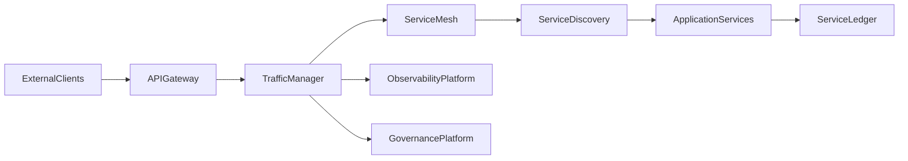

# Enterprise AI Software Factory
# Architecture Design Specification (ADS)

> **Document ID:** ADS-039-v1
>
> **Document Name:** Enterprise API Gateway, Service Mesh & Traffic Management Platform — Architecture
>
> **Version:** 1.0.0
>
> **Classification:** Enterprise Platform Plane
>
> **Importance:** CRITICAL
>
> **Depends On:** ADS-022-v5
>
> **Depends On:** ADS-025-v5
>
> **Depends On:** ADS-026-v5
>
> **Depends On:** ADS-027-v5
>
> **Depends On:** ADS-030-v5
>
> **Depends On:** ADS-038-v5
>
> **Next:** ADS-039-v2 — Traffic Algorithms & Lifecycle

---

# Executive Summary

The Enterprise API Gateway, Service Mesh & Traffic Management Platform governs all synchronous communication between enterprise applications, AI services, APIs, microservices, and external consumers.

It provides centralized ingress, decentralized service-to-service communication, traffic policies, zero-trust networking, service discovery, resilience mechanisms, deployment strategies, and runtime observability.

Every request is authenticated.

Every route is governed.

Every service interaction is observable.

---

# Executive Summary

The Enterprise API Gateway, Service Mesh & Traffic Management Platform governs all synchronous communication between enterprise applications, AI services, APIs, microservices, and external consumers.

It provides centralized ingress, decentralized service-to-service communication, traffic policies, zero-trust networking, service discovery, resilience mechanisms, deployment strategies, and runtime observability.

Every request is authenticated.

Every route is governed.

Every service interaction is observable.

---

# Design Philosophy

The platform follows eight principles.

- API First
- Zero Trust
- Service Identity
- Policy Driven Routing
- Resilient Communication
- Observable Traffic
- Progressive Delivery
- Immutable Governance

---

# Platform Architecture



The Traffic Manager coordinates every synchronous service interaction.

---

# Core Components

## API Gateway

Responsible for

- Request Reception
- Authentication
- Authorization
- API Versioning
- Rate Limiting
- Request Validation

---

## Traffic Manager

Responsible for

- Routing
- Load Balancing
- Traffic Policies
- Retry Policies
- Circuit Breaking
- Progressive Delivery

---

## Service Mesh

Responsible for

- Service-to-Service Communication
- Mutual TLS
- Service Identity
- Traffic Encryption
- Sidecar Coordination

---

## Service Discovery

Responsible for

- Service Registration
- Endpoint Resolution
- Health Awareness
- Dynamic Discovery
- Topology Updates

---

## Service Ledger

Maintains immutable records for

- Requests
- Routing Decisions
- Policy Evaluations
- Deployment Transitions
- Traffic Events

---

# Primary Artifacts

The platform introduces

- API Request
- Request Record
- Route Record
- Service Record
- Mesh Session
- Traffic Health Record
- Runtime Snapshot
- Traffic Ledger Entry

---

# API Request

Every incoming request is represented as an immutable API Request.

```yaml
apiRequest:

  requestId:

  apiVersion:

  method:

  path:

  client:

  tenant:

  headers:

  payload:

  traceId:

  timestamp:
```

API Requests remain immutable after acceptance.

---

# Platform Responsibilities

The platform governs

- API Ingress
- Service Routing
- Service Discovery
- Mutual TLS
- Traffic Shaping
- Progressive Delivery
- Resilience Policies
- Traffic Governance

---

# Supported Traffic Strategies

| Strategy | Purpose |
|-----------|----------|
| Round Robin | Even distribution |
| Least Connections | Load optimization |
| Weighted Routing | Controlled balancing |
| Canary Routing | Progressive rollout |
| Blue-Green | Safe deployments |
| Shadow Traffic | Validation without production impact |

Traffic strategies are policy-controlled.

---

# Platform Guarantees

The platform guarantees

- Secure Routing
- Service Authentication
- Policy Enforcement
- Observable Communication
- Deterministic Routing
- Tenant Isolation
- High Availability
- Immutable Traffic History

---

# End of Part 1
