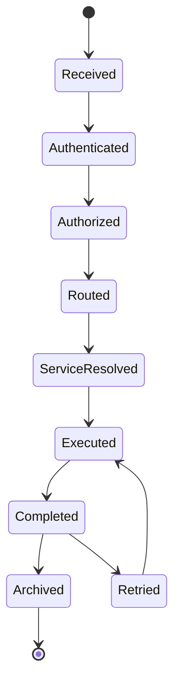

# Enterprise AI Software Factory
# Architecture Design Specification (ADS)

> **Document ID:** ADS-039-v2
>
> **Document Name:** Enterprise API Gateway, Service Mesh & Traffic Management Platform — Traffic Algorithms & Lifecycle
>
> **Version:** 1.0.0
>
> **Classification:** Enterprise Platform Plane
>
> **Importance:** CRITICAL
>
> **Depends On:** ADS-039-v1
>
> **Next:** ADS-039-v3 — APIs, Events & Contracts

---

# Executive Summary

This document defines the lifecycle algorithms governing API requests, routing decisions, service discovery, load balancing, resiliency policies, and progressive traffic management.

Every request follows a deterministic execution lifecycle.

Every routing decision is governed.

Every traffic policy is observable.

---

# Design Philosophy

The Traffic Lifecycle follows six principles.

- Deterministic Routing
- Zero Trust
- Policy Enforcement
- Service Resilience
- Progressive Delivery
- Immutable Auditability

---

# ALG-039-001

## API Request Acceptance

Every client request SHALL enter the platform through the API Gateway.

Gateway validation performs

- Client Authentication
- API Version Validation
- Header Validation
- Payload Validation
- Rate Limit Verification
- Trace Context Generation

Successful validation creates a Request Record.

---

# API Request

```yaml
apiRequest:

  requestId:

  apiVersion:

  method:

  path:

  client:

  tenant:

  headers:

  payload:

  traceId:

  timestamp:
```

API Requests remain immutable.

---

# ALG-039-002

## Authentication & Authorization

Before routing begins, the platform validates

- Client Identity
- Service Identity
- Tenant Context
- API Scope
- Authorization Policies
- Security Classification

Unauthorized requests terminate immediately.

---

# ALG-039-003

## Service Discovery

Traffic Manager queries Service Discovery.

Resolution evaluates

- Service Availability
- Version
- Region
- Health Status
- Deployment Ring
- Service Identity

Discovery remains deterministic.

---

# ALG-039-004

## Traffic Routing

Traffic Manager selects a destination according to policy.

Routing evaluates

- Traffic Strategy
- Service Health
- Request Priority
- Regional Affinity
- Circuit Breaker State
- Deployment Strategy

Routing decisions are fully auditable.

---

# Supported Routing Policies

| Policy | Purpose |
|----------|----------|
| Round Robin | Even distribution |
| Least Connections | Load balancing |
| Weighted Routing | Controlled traffic split |
| Canary | Progressive deployment |
| Blue-Green | Safe release |
| Shadow | Non-production validation |

---

# ALG-039-005

## Load Balancing

Load Balancer continuously evaluates

- Active Connections
- CPU Utilization
- Memory Utilization
- Service Latency
- Error Rate
- Health Score

Traffic distribution remains adaptive.

---

# Request Record

Every processed request generates a Request Record.

```yaml
requestRecord:

  requestRecordId:

  apiRequest:

  gateway:

  route:

  authenticatedIdentity:

  authorizationDecision:

  trafficPolicy:

  requestStatus:

  completedAt:
```

Request Records remain append-only.

---

# ALG-039-006

## Service Mesh Communication

All service-to-service communication SHALL occur through the Service Mesh.

Mesh coordination manages

- Mutual TLS
- Service Identity
- Certificate Validation
- Traffic Encryption
- Retry Policies
- Connection Lifecycle

Direct service communication outside the mesh is prohibited.

---

# ALG-039-007

## Resilience Management

The Traffic Manager continuously evaluates runtime resilience.

Resilience policies include

- Automatic Retries
- Exponential Backoff
- Circuit Breakers
- Timeout Policies
- Bulkheads
- Fallback Routing

Resilience actions remain policy-driven.

---

# ALG-039-008

## Progressive Delivery

Traffic Manager governs deployment strategies.

Supported strategies

- Canary
- Blue-Green
- Shadow
- Rolling Deployment
- Weighted Rollout

Progressive delivery requires governance approval before production rollout.

---

# Route Record

Every routing decision generates a Route Record.

```yaml
routeRecord:

  routeRecordId:

  route:

  destinationService:

  routingPolicy:

  deploymentStrategy:

  healthEvaluation:

  trafficWeight:

  operationalStatus:

  evaluatedAt:
```

Route Records maintain append-only operational history.

---

# Traffic Lifecycle



Every request follows a deterministic lifecycle.

---

# Service Discovery Lifecycle

```text
Service Registered

↓

Health Evaluation

↓

Endpoint Published

↓

Traffic Routing

↓

Continuous Monitoring

↓

Service Deregistered
```

Service discovery remains continuously synchronized.

---

# Request Processing Pipeline

```text
Client Request

↓

Gateway Validation

↓

Authentication

↓

Authorization

↓

Service Discovery

↓

Traffic Routing

↓

Service Mesh

↓

Application Service

↓

Traffic Ledger
```

The processing pipeline remains reproducible.

---

# Failure Handling

Failures are classified as

| Failure | Recovery Strategy |
|----------|-------------------|
| Authentication Failure | Reject Request |
| Authorization Failure | Reject Request |
| Service Discovery Failure | Retry Resolution |
| Service Failure | Retry / Circuit Breaker |
| Mesh Failure | Failover |
| Gateway Failure | High-Availability Failover |

Recovery remains policy-controlled.

---

# Prometheus Metrics

```text
api_requests_total

gateway_request_latency_seconds

gateway_authentication_failures_total

service_mesh_connections_total

traffic_routes_total

circuit_breaker_open_total

service_discovery_latency_seconds

retry_attempts_total

request_processing_latency_seconds

traffic_policy_evaluations_total
```

---

# Structured Logging

Example

```json
{
  "requestRecord":"RR-10482",
  "routeRecord":"RT-0084",
  "service":"order-service",
  "trafficPolicy":"Canary",
  "routingDecision":"Accepted",
  "processingStatus":"Completed"
}
```

Logs remain immutable and traceable.

---

# Architecture Decision Records

## ADR-039-01

### Decision

Require all service-to-service communication to traverse the Service Mesh.

### Status

Accepted

### Reason

Provides consistent security, observability, and policy enforcement.

---

## ADR-039-02

### Decision

Separate Route Records from Request Records.

### Status

Accepted

### Reason

Routing decisions evolve independently from request execution history.

---

## ADR-039-03

### Decision

Manage progressive delivery through centralized Traffic Manager policies.

### Status

Accepted

### Reason

Central governance reduces deployment risk while enabling controlled releases.

---

# Operational Readiness Scorecard

| Capability | Status |
|------------|--------|
| API Gateway | ✅ Required |
| Service Discovery | ✅ Required |
| Service Mesh | ✅ Required |
| Traffic Routing | ✅ Required |
| Progressive Delivery | ✅ Required |
| Circuit Breakers | ✅ Required |
| mTLS | ✅ Required |
| Immutable Traffic History | ✅ Required |

---

# Related Documents

ADS-022-v5 — Identity & Trust Plane

ADS-025-v5 — Compute & Infrastructure Platform

ADS-026-v5 — Security Platform

ADS-027-v5 — Observability Platform

ADS-030-v5 — Integration & Ecosystem Platform

ADS-038-v5 — Enterprise Event Streaming, Messaging & Real-Time Data Platform

ADS-039-v1 — Architecture

ADS-039-v3 — APIs, Events & Contracts

---

# End of Document
