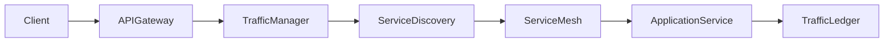

# Enterprise AI Software Factory
# Architecture Design Specification (ADS)

> **Document ID:** ADS-039-v3
>
> **Document Name:** Enterprise API Gateway, Service Mesh & Traffic Management Platform — APIs, Events & Contracts
>
> **Version:** 1.0.0
>
> **Classification:** Enterprise Platform Plane
>
> **Importance:** CRITICAL
>
> **Depends On:** ADS-039-v1
>
> **Depends On:** ADS-039-v2
>
> **Next:** ADS-039-v4 — Runtime & Traffic Infrastructure

---

# Executive Summary

This document defines the APIs, contracts, service interfaces, traffic policies, and governance mechanisms for the Enterprise API Gateway, Service Mesh & Traffic Management Platform.

Every API contract is versioned.

Every routing policy is governed.

Every service interaction is observable.

---

# REST APIs

## API-039-001

### Register Service

```http
POST /gateway/v1/services
```

Registers a new service with Service Discovery.

---

## API-039-002

### Register Route

```http
POST /gateway/v1/routes
```

Registers a governed routing rule.

---

## API-039-003

### Execute Request

```http
POST /gateway/v1/requests
```

Accepts a client request for policy evaluation and routing.

Request

```json
{
  "apiVersion":"v1",
  "method":"POST",
  "path":"/orders",
  "tenant":"tenant-a",
  "headers":{},
  "payload":{},
  "traceId":"TRC-90441"
}
```

Response

```json
{
  "requestId":"REQ-10028",
  "requestRecordId":"RR-44091",
  "status":"Accepted"
}
```

---

## API-039-004

### Query Service

```http
GET /gateway/v1/services/{serviceId}
```

Returns the current governed service state.

---

## API-039-005

### Query Route

```http
GET /gateway/v1/routes/{routeId}
```

Returns routing policy and operational status.

---

# gRPC Service

```protobuf
service TrafficManagementService {

  rpc RegisterService(ServiceRequest)
      returns (ServiceResponse);

  rpc RegisterRoute(RouteRequest)
      returns (RouteResponse);

  rpc ExecuteRequest(RequestEnvelope)
      returns (RequestResponse);

  rpc QueryService(ServiceQuery)
      returns (ServiceRecord);

  rpc QueryRoute(RouteQuery)
      returns (RouteRecord);
}
```

---

# Core Schemas

## API Request

```yaml
apiRequest:

  requestId:

  apiVersion:

  method:

  path:

  client:

  tenant:

  headers:

  payload:

  traceId:

  timestamp:
```

---

## Request Record

```yaml
requestRecord:

  requestRecordId:

  apiRequest:

  gateway:

  route:

  authenticatedIdentity:

  authorizationDecision:

  trafficPolicy:

  requestStatus:

  completedAt:
```

---

## Route Record

```yaml
routeRecord:

  routeRecordId:

  route:

  destinationService:

  routingPolicy:

  deploymentStrategy:

  healthEvaluation:

  trafficWeight:

  operationalStatus:

  evaluatedAt:
```

---

## Service Record

```yaml
serviceRecord:

  serviceRecordId:

  serviceName:

  serviceVersion:

  deploymentEnvironment:

  endpoints:

  healthStatus:

  serviceIdentity:

  trafficPolicies:

  operationalStatus:

  lastEvaluatedAt:
```

---

# MCP Tools

The platform exposes

- register_service
- register_route
- execute_request
- query_route
- query_service
- mesh_health
- traffic_diagnostics
- deployment_status

---

# Platform Events

## EVT-039-001

ServiceRegistered

---

## EVT-039-002

RouteRegistered

---

## EVT-039-003

RequestAccepted

---

## EVT-039-004

ServiceResolved

---

## EVT-039-005

TrafficPolicyApplied

---

## EVT-039-006

CircuitBreakerOpened

---

## EVT-039-007

CanaryDeploymentStarted

---

## EVT-039-008

RequestCompleted

---

# Request Flow



Every request produces immutable operational evidence.

---

# End of Part 1
