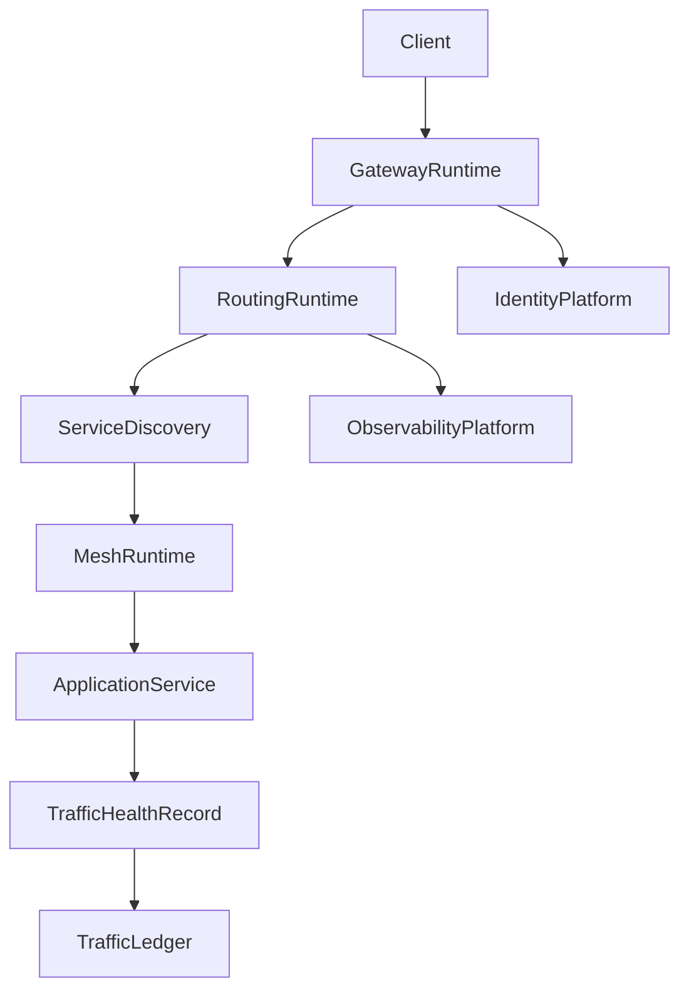

# Enterprise AI Software Factory
# Architecture Design Specification (ADS)

> **Document ID:** ADS-039-v4
>
> **Document Name:** Enterprise API Gateway, Service Mesh & Traffic Management Platform — Runtime & Traffic Infrastructure
>
> **Version:** 1.0.0
>
> **Classification:** Enterprise Runtime Specification
>
> **Importance:** CRITICAL
>
> **Depends On:** ADS-039-v1
>
> **Depends On:** ADS-039-v2
>
> **Depends On:** ADS-039-v3
>
> **Next:** ADS-039-v5 — End-to-End Traffic Lifecycle

---

# Executive Summary

This document specifies the runtime architecture responsible for continuously operating enterprise API traffic.

The Traffic Runtime manages request admission, service discovery, routing, load balancing, mutual TLS, policy enforcement, resilience mechanisms, and runtime observability while maintaining deterministic execution across distributed environments.

Every request is authenticated.

Every route is deterministic.

Every runtime interaction becomes immutable operational evidence.

---

# Runtime Philosophy

The Traffic Runtime follows eight principles.

- Zero Trust
- Deterministic Routing
- Continuous Availability
- Service Identity
- Policy Enforcement
- Runtime Observability
- Progressive Delivery
- Operational Resilience

Runtime execution never bypasses governance.

---

# Runtime Layers

## Gateway Runtime

Responsible for

- Request Reception
- Authentication
- Authorization
- API Validation
- Rate Limiting

---

## Routing Runtime

Responsible for

- Route Resolution
- Traffic Policies
- Load Balancing
- Progressive Delivery
- Retry Decisions

---

## Service Mesh Runtime

Responsible for

- Mutual TLS
- Service Identity
- Sidecar Coordination
- Connection Lifecycle
- Secure Communication

---

## Discovery Runtime

Responsible for

- Service Registration
- Endpoint Resolution
- Health Awareness
- Topology Synchronization
- Region Awareness

---

## Resilience Runtime

Responsible for

- Circuit Breakers
- Retries
- Failover
- Timeout Policies
- Bulkheads

---

## Health Runtime

Responsible for

- Gateway Health
- Mesh Health
- Service Health
- Route Health
- Policy Compliance

---

# Runtime Architecture



The runtime coordinates every synchronous request lifecycle.

---

# Runtime Components

| Component | Responsibility |
|------------|----------------|
| Gateway Runtime | API ingress |
| Routing Runtime | Traffic decisions |
| Service Mesh Runtime | Secure service communication |
| Discovery Runtime | Endpoint resolution |
| Resilience Runtime | Fault tolerance |
| Health Runtime | Runtime monitoring |
| Traffic Ledger | Immutable operational history |

---

# Runtime Pipeline

```text
Receive Request

↓

Authenticate Identity

↓

Authorize Request

↓

Resolve Service

↓

Apply Traffic Policy

↓

Establish mTLS

↓

Execute Request

↓

Collect Metrics

↓

Persist Traffic Ledger
```

Every request follows the same runtime pipeline.

---

# Gateway Runtime

Gateway Runtime manages

- Client Identity
- Request Validation
- API Version Resolution
- Quota Enforcement
- Rate Limiting
- Trace Context

Gateway execution remains deterministic.

---

# Routing Runtime

Routing Runtime coordinates

- Route Selection
- Deployment Strategies
- Traffic Weights
- Retry Decisions
- Regional Affinity
- Service Health

Routing decisions remain reproducible.

---

# Mesh Session Management

Every runtime interaction creates or joins a Mesh Session.

Each Mesh Session tracks

- Request Record
- Route Record
- Service Record
- Source Service
- Destination Service
- Mutual TLS Context
- Runtime Metadata

Mesh Sessions remain immutable.

---

# Runtime Guarantees

The Traffic Runtime guarantees

- Deterministic Routing
- Mutual TLS Enforcement
- Policy Compliance
- Service Identity Verification
- Progressive Delivery Support
- Immutable Operational History
- Observable Runtime Execution

---

# End of Part 1
