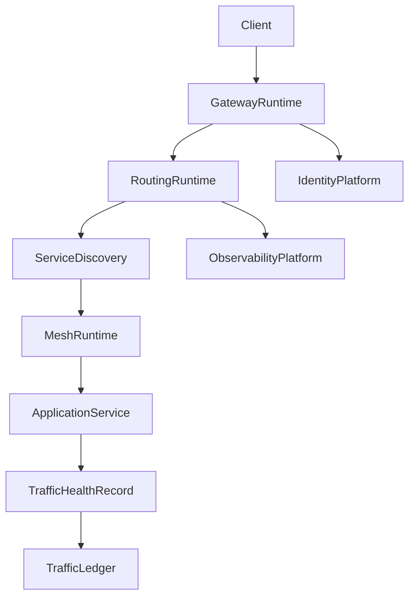
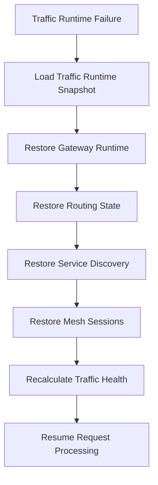

# Enterprise AI Software Factory
# Architecture Design Specification (ADS)

> **Document ID:** ADS-039-v4
>
> **Document Name:** Enterprise API Gateway, Service Mesh & Traffic Management Platform — Runtime & Traffic Infrastructure
>
> **Version:** 1.0.0
>
> **Classification:** Enterprise Runtime Specification
>
> **Importance:** CRITICAL
>
> **Depends On:** ADS-039-v1
>
> **Depends On:** ADS-039-v2
>
> **Depends On:** ADS-039-v3
>
> **Next:** ADS-039-v5 — End-to-End Traffic Lifecycle

---

# Executive Summary

This document specifies the runtime architecture responsible for continuously operating enterprise API traffic.

The Traffic Runtime manages request admission, service discovery, routing, load balancing, mutual TLS, policy enforcement, resilience mechanisms, and runtime observability while maintaining deterministic execution across distributed environments.

Every request is authenticated.

Every route is deterministic.

Every runtime interaction becomes immutable operational evidence.

---

# Runtime Philosophy

The Traffic Runtime follows eight principles.

- Zero Trust
- Deterministic Routing
- Continuous Availability
- Service Identity
- Policy Enforcement
- Runtime Observability
- Progressive Delivery
- Operational Resilience

Runtime execution never bypasses governance.

---

# Runtime Layers

## Gateway Runtime

Responsible for

- Request Reception
- Authentication
- Authorization
- API Validation
- Rate Limiting

---

## Routing Runtime

Responsible for

- Route Resolution
- Traffic Policies
- Load Balancing
- Progressive Delivery
- Retry Decisions

---

## Service Mesh Runtime

Responsible for

- Mutual TLS
- Service Identity
- Sidecar Coordination
- Connection Lifecycle
- Secure Communication

---

## Discovery Runtime

Responsible for

- Service Registration
- Endpoint Resolution
- Health Awareness
- Topology Synchronization
- Region Awareness

---

## Resilience Runtime

Responsible for

- Circuit Breakers
- Retries
- Failover
- Timeout Policies
- Bulkheads

---

## Health Runtime

Responsible for

- Gateway Health
- Mesh Health
- Service Health
- Route Health
- Policy Compliance

---

# Runtime Architecture



The runtime coordinates every synchronous request lifecycle.

---

# Runtime Components

| Component | Responsibility |
|------------|----------------|
| Gateway Runtime | API ingress |
| Routing Runtime | Traffic decisions |
| Service Mesh Runtime | Secure service communication |
| Discovery Runtime | Endpoint resolution |
| Resilience Runtime | Fault tolerance |
| Health Runtime | Runtime monitoring |
| Traffic Ledger | Immutable operational history |

---

# Runtime Pipeline

```text
Receive Request

↓

Authenticate Identity

↓

Authorize Request

↓

Resolve Service

↓

Apply Traffic Policy

↓

Establish mTLS

↓

Execute Request

↓

Collect Metrics

↓

Persist Traffic Ledger
```

Every request follows the same runtime pipeline.

---

# Gateway Runtime

Gateway Runtime manages

- Client Identity
- Request Validation
- API Version Resolution
- Quota Enforcement
- Rate Limiting
- Trace Context

Gateway execution remains deterministic.

---

# Routing Runtime

Routing Runtime coordinates

- Route Selection
- Deployment Strategies
- Traffic Weights
- Retry Decisions
- Regional Affinity
- Service Health

Routing decisions remain reproducible.

---

# Mesh Session Management

Every runtime interaction creates or joins a Mesh Session.

Each Mesh Session tracks

- Request Record
- Route Record
- Service Record
- Source Service
- Destination Service
- Mutual TLS Context
- Runtime Metadata

Mesh Sessions remain immutable.

---

# Runtime Guarantees

The Traffic Runtime guarantees

- Deterministic Routing
- Mutual TLS Enforcement
- Policy Compliance
- Service Identity Verification
- Progressive Delivery Support
- Immutable Operational History
- Observable Runtime Execution

---

# Failure Recovery

The Traffic Runtime automatically recovers from gateway, routing, service mesh, discovery, and infrastructure failures while preserving security and policy guarantees.

Recovery follows approved governance policies.



Recovery guarantees

- No routing policy corruption
- No service identity loss
- No unauthorized request execution
- Deterministic recovery

---

# Runtime Health Monitoring

Every runtime component continuously reports health.

Collected metrics

- Gateway Health
- Routing Health
- Service Mesh Health
- Service Discovery Health
- Policy Compliance
- Active Mesh Sessions
- Request Throughput
- Request Latency

Health Flow

```text
Runtime Component

↓

Heartbeat

↓

Traffic Runtime Monitor

↓

Operations Dashboard

↓

Alert Engine

↓

Operations Team
```

Health monitoring remains continuous.

---

# Traffic Runtime Snapshot

The runtime periodically generates Traffic Runtime Snapshots.

```yaml
trafficRuntimeSnapshot:

  snapshotId:

  generatedAt:

  activeGateways:

  activeRoutes:

  activeMeshSessions:

  serviceTopology:

  policyEvaluationState:

  platformHealth:

  throughput:
```

Runtime Snapshots provide deterministic operational state.

---

# Runtime Configuration

Example

```yaml
trafficRuntime:

  mutualTLS: enabled

  serviceDiscovery: enabled

  progressiveDelivery: enabled

  circuitBreakers: enabled

  retries: enabled

  trafficLedger: enabled

  runtimeSnapshots: enabled

  snapshotInterval: 5m
```

Configuration remains version-controlled.

---

# Runtime Scaling

The Traffic Runtime supports

- Horizontal Gateway Scaling
- Dynamic Route Evaluation
- Elastic Service Mesh Expansion
- Regional Traffic Distribution
- Multi-Cluster Federation

Scaling remains policy-driven.

---

# Runtime Isolation

The Traffic Runtime isolates

- Tenants
- APIs
- Services
- Mesh Sessions
- Traffic Policies
- Deployment Rings

Isolation prevents cross-tenant and cross-service interference.

---

# Prometheus Metrics

```text
gateway_runtime_snapshots_total

gateway_requests_total

active_mesh_sessions_total

route_evaluations_total

service_discovery_updates_total

traffic_runtime_health_score

gateway_latency_seconds

service_mesh_connections_total

circuit_breaker_transitions_total

policy_compliance_score
```

---

# OpenTelemetry

Distributed tracing spans

```text
Client

↓

API Gateway

↓

Routing Runtime

↓

Service Discovery

↓

Service Mesh

↓

Application Service

↓

Traffic Ledger
```

Every runtime stage contributes trace spans.

---

# Structured Logging

Example

```json
{
  "meshSession":"MS-0421",
  "trafficHealthRecord":"THR-0094",
  "gateway":"gateway-east-01",
  "route":"orders-v1",
  "platformHealth":"Healthy",
  "latencyMs":14
}
```

Logs remain immutable and correlated.

---

# Disaster Recovery

Recovery flow

```text
Gateway Failure

↓

Restore Traffic Runtime Snapshot

↓

Restore Routing State

↓

Restore Mesh Sessions

↓

Validate Traffic Health

↓

Resume Request Processing
```

Recovery targets

Recovery Point Objective (RPO)

Near-zero runtime state loss

Recovery Time Objective (RTO)

Less than five minutes

---

# Recommended Production Deployment

```text
Global Load Balancer

↓

API Gateway Cluster

↓

Traffic Manager

↓

Service Discovery

↓

Service Mesh

↓

Application Services

↓

Traffic Ledger

↓

OpenTelemetry

↓

Prometheus

↓

Grafana
```

---

# Technology Decision Records

## TDR-039-01

### Technology

Envoy Proxy

### Decision

Use Envoy as the primary data plane proxy for gateway and service mesh traffic.

### Reason

Provides high-performance routing, mTLS, observability, and advanced traffic management.

---

## TDR-039-02

### Technology

Istio (or equivalent service mesh)

### Decision

Adopt a service mesh to manage secure service-to-service communication.

### Reason

Centralizes traffic policy enforcement, identity, encryption, and telemetry.

---

## TDR-039-03

### Technology

Traffic Runtime Snapshot

### Decision

Persist periodic runtime snapshots.

### Reason

Supports diagnostics, replay, disaster recovery, and operational visibility.

---

## TDR-039-04

### Technology

Service Discovery

### Decision

Maintain dynamic service discovery with health-aware endpoint selection.

### Reason

Ensures resilient routing and rapid adaptation to topology changes.

---

## TDR-039-05

### Technology

Progressive Delivery Controller

### Decision

Support canary, blue-green, rolling, shadow, and weighted deployments.

### Reason

Enables low-risk production releases with policy-controlled rollout strategies.

---

# Runtime Checklist

The Traffic Platform MUST

- Enforce mutual TLS
- Verify service identity
- Apply routing policies deterministically
- Generate Traffic Runtime Snapshots
- Maintain immutable operational history
- Continuously monitor runtime health
- Support progressive delivery

The Traffic Platform MUST NOT

- Permit unauthenticated service communication
- Bypass governance policies
- Execute unauthorized routing changes
- Break tenant isolation
- Lose runtime audit history

---

# Architecture Decision Records

## ADR-039-07

### Decision

Treat Traffic Runtime Snapshots as immutable runtime artifacts.

### Status

Accepted

### Reason

Snapshots improve recovery, diagnostics, replay, and operational resilience.

---

## ADR-039-08

### Decision

Separate Gateway Runtime from Service Mesh Runtime.

### Status

Accepted

### Reason

Independent scaling and lifecycle management improve performance and maintainability.

---

## ADR-039-09

### Decision

Represent runtime interactions through immutable Mesh Sessions.

### Status

Accepted

### Reason

Provides deterministic traceability, security auditing, and reproducible runtime execution.

---

# Operational Readiness Scorecard

| Capability | Status |
|------------|--------|
| Gateway Runtime | ✅ Required |
| Service Mesh Runtime | ✅ Required |
| Runtime Snapshots | ✅ Required |
| Service Discovery | ✅ Required |
| Runtime Recovery | ✅ Required |
| Progressive Delivery | ✅ Required |
| OpenTelemetry | ✅ Required |
| Deterministic Execution | ✅ Required |

---

# Related Documents

ADS-022-v5 — Identity & Trust Plane

ADS-025-v5 — Compute & Infrastructure Platform

ADS-026-v5 — Security Platform

ADS-027-v5 — Observability Platform

ADS-030-v5 — Integration & Ecosystem Platform

ADS-038-v5 — Enterprise Event Streaming, Messaging & Real-Time Data Platform

ADS-039-v1 — Architecture

ADS-039-v2 — Traffic Algorithms & Lifecycle

ADS-039-v3 — APIs, Events & Contracts

ADS-039-v5 — End-to-End Traffic Lifecycle

---

# End of Document
