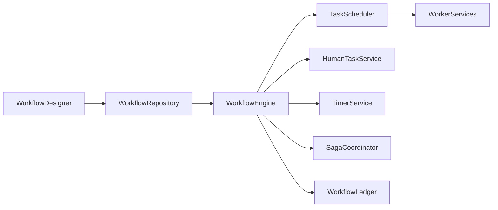
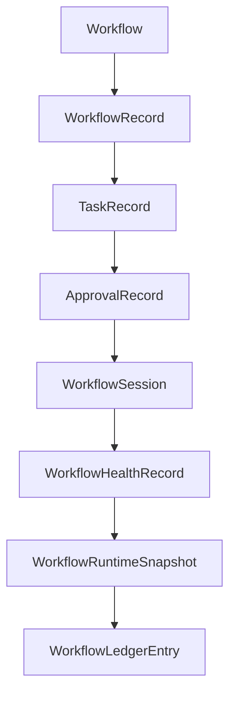

# Enterprise AI Software Factory
# Architecture Design Specification (ADS)

> **Document ID:** ADS-040-v1
>
> **Document Name:** Enterprise Workflow Orchestration & Business Process Automation Platform — Architecture
>
> **Version:** 1.0.0
>
> **Classification:** Enterprise Platform Plane
>
> **Importance:** CRITICAL
>
> **Status:** Active

---

# Executive Summary

The Enterprise Workflow Orchestration & Business Process Automation Platform coordinates long-running business processes across distributed enterprise systems.

It manages workflow execution, task orchestration, human approvals, timers, retries, compensating transactions, event-driven coordination, and governance.

Every workflow is versioned.

Every task is traceable.

Every execution is auditable.

---

# Platform Responsibilities

The platform SHALL provide

- Workflow Definition
- Workflow Execution
- Task Scheduling
- Human Task Management
- Approval Routing
- Timer Management
- Retry Policies
- Saga Orchestration
- Compensation Execution
- Workflow Ledger

---

# Architectural Principles

The platform follows

- Deterministic Execution
- Immutable Workflow History
- Event-Driven Coordination
- Human-in-the-Loop Support
- Policy-Based Governance
- Fault Tolerance
- Replayability
- Operational Observability

---

# High-Level Architecture



The Workflow Engine coordinates every execution path.

---

# Core Components

## Workflow Designer

Responsible for

- Workflow Modeling
- BPMN Authoring
- Version Management
- Validation

---

## Workflow Repository

Responsible for

- Workflow Storage
- Version Control
- Publication
- Retrieval

---

## Workflow Engine

Responsible for

- Workflow Execution
- State Management
- Task Coordination
- Compensation Logic

---

## Task Scheduler

Responsible for

- Task Dispatch
- Queue Management
- Retry Scheduling
- Priority Enforcement

---

## Human Task Service

Responsible for

- Approval Assignment
- Escalations
- SLA Monitoring
- User Notifications

---

## Timer Service

Responsible for

- Delays
- Deadlines
- Timeouts
- Scheduled Events

---

## Saga Coordinator

Responsible for

- Distributed Transactions
- Compensation
- Rollback Coordination
- Failure Recovery

---

## Workflow Ledger

Responsible for

- Immutable Execution History
- Audit Records
- Replay
- Compliance

---

# Primary Artifact

Every business process begins with a Workflow.

```yaml
workflow:

  workflowId:

  workflowName:

  version:

  businessDomain:

  trigger:

  input:

  executionPolicy:

  status:

  createdAt:
```

The Workflow is the immutable definition of a business process.

---

# Workflow Record

Every execution of a Workflow creates a Workflow Record.

```yaml
workflowRecord:

  workflowRecordId:

  workflow:

  executionInstance:

  currentState:

  activeTask:

  executionStatus:

  startedAt:

  completedAt:
```

Workflow Records maintain immutable execution metadata.

---

# Task Record

Every workflow task generates a Task Record.

```yaml
taskRecord:

  taskRecordId:

  workflowRecord:

  taskName:

  taskType:

  assignedWorker:

  executionStatus:

  retryCount:

  completedAt:
```

Task Records remain append-only.

---

# Approval Record

Human approvals generate Approval Records.

```yaml
approvalRecord:

  approvalRecordId:

  workflowRecord:

  approver:

  approvalDecision:

  approvalComments:

  decisionTimestamp:

  approvalStatus:
```

Approval Records preserve governance evidence.

---

# Workflow Session

Every runtime execution creates a Workflow Session.

```yaml
workflowSession:

  workflowSessionId:

  workflowRecord:

  activeTasks:

  timers:

  retries:

  compensationState:

  executionContext:

  startedAt:

  endedAt:
```

Workflow Sessions represent active runtime execution.

---

# Workflow Health Record

Operational health is continuously evaluated.

```yaml
workflowHealthRecord:

  workflowHealthRecordId:

  workflowSession:

  executionHealth:

  schedulerHealth:

  timerHealth:

  approvalHealth:

  compensationHealth:

  evaluatedAt:
```

Health remains independent from execution history.

---

# Workflow Runtime Snapshot

The platform periodically generates runtime snapshots.

```yaml
workflowRuntimeSnapshot:

  snapshotId:

  generatedAt:

  activeWorkflows:

  activeTasks:

  activeTimers:

  pendingApprovals:

  platformHealth:

  throughput:
```

Snapshots support replay and disaster recovery.

---

# Workflow Ledger Entry

Every completed lifecycle generates an immutable ledger entry.

```yaml
workflowLedgerEntry:

  entryId:

  workflow:

  workflowRecord:

  taskRecord:

  approvalRecord:

  workflowSession:

  workflowHealthRecord:

  workflowRuntimeSnapshot:

  traceId:

  timestamp:

  digitalSignature:
```

Ledger Entries provide the authoritative audit history.

---

# Platform Architecture



Every artifact extends the operational lifecycle without modifying prior artifacts.

---

# Workflow Lifecycle Overview

```text
Workflow Definition

↓

Workflow Execution

↓

Task Scheduling

↓

Human Approval

↓

Business Processing

↓

Health Evaluation

↓

Runtime Snapshot

↓

Ledger Persistence

↓

Archive
```

The lifecycle remains deterministic and reproducible.

---

# Platform Guarantees

The Workflow Platform guarantees

- Immutable Workflow Definitions
- Deterministic Execution
- Human Approval Governance
- Replayable Workflow History
- Distributed Transaction Support
- Continuous Health Monitoring
- Immutable Operational History

---

# Architecture Decision Records

## ADR-040-01

### Decision

Represent every workflow execution as immutable operational artifacts.

### Status

Accepted

### Reason

Artifact-centric execution improves governance, replayability, compliance, and observability.

---

## ADR-040-02

### Decision

Separate workflow definitions from runtime execution state.

### Status

Accepted

### Reason

Allows independent versioning, execution scalability, and deterministic replay.

---

## ADR-040-03

### Decision

Model human approvals as independent Approval Records.

### Status

Accepted

### Reason

Supports regulatory compliance, auditability, delegation, and SLA tracking.

---

# Operational Readiness Scorecard

| Capability | Status |
|------------|--------|
| Workflow Definitions | ✅ Required |
| Workflow Execution | ✅ Required |
| Task Scheduling | ✅ Required |
| Human Approvals | ✅ Required |
| Saga Coordination | ✅ Required |
| Runtime Snapshots | ✅ Required |
| Immutable Ledger | ✅ Required |
| Deterministic Replay | ✅ Required |

---

# Related Documents

ADS-021-v5 — Workflow Kernel

ADS-022-v5 — Identity & Trust Plane

ADS-025-v5 — Compute & Infrastructure Platform

ADS-026-v5 — Security Platform

ADS-027-v5 — Observability Platform

ADS-030-v5 — Integration & Ecosystem Platform

ADS-038-v5 — Enterprise Event Streaming, Messaging & Real-Time Data Platform

ADS-039-v5 — Enterprise API Gateway, Service Mesh & Traffic Management Platform

ADS-040-v2 — Workflow Algorithms & Lifecycle

---

# End of Document
