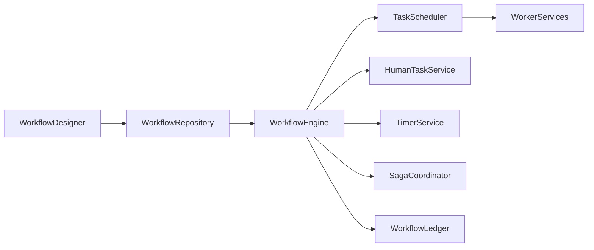

# Enterprise AI Software Factory
# Architecture Design Specification (ADS)

> **Document ID:** ADS-040-v1
>
> **Document Name:** Enterprise Workflow Orchestration & Business Process Automation Platform — Architecture
>
> **Version:** 1.0.0
>
> **Classification:** Enterprise Platform Plane
>
> **Importance:** CRITICAL
>
> **Status:** Active

---

# Executive Summary

The Enterprise Workflow Orchestration & Business Process Automation Platform coordinates long-running business processes across distributed enterprise systems.

It manages workflow execution, task orchestration, human approvals, timers, retries, compensating transactions, event-driven coordination, and governance.

Every workflow is versioned.

Every task is traceable.

Every execution is auditable.

---

# Platform Responsibilities

The platform SHALL provide

- Workflow Definition
- Workflow Execution
- Task Scheduling
- Human Task Management
- Approval Routing
- Timer Management
- Retry Policies
- Saga Orchestration
- Compensation Execution
- Workflow Ledger

---

# Architectural Principles

The platform follows

- Deterministic Execution
- Immutable Workflow History
- Event-Driven Coordination
- Human-in-the-Loop Support
- Policy-Based Governance
- Fault Tolerance
- Replayability
- Operational Observability

---

# High-Level Architecture



The Workflow Engine coordinates every execution path.

---

# Core Components

## Workflow Designer

Responsible for

- Workflow Modeling
- BPMN Authoring
- Version Management
- Validation

---

## Workflow Repository

Responsible for

- Workflow Storage
- Version Control
- Publication
- Retrieval

---

## Workflow Engine

Responsible for

- Workflow Execution
- State Management
- Task Coordination
- Compensation Logic

---

## Task Scheduler

Responsible for

- Task Dispatch
- Queue Management
- Retry Scheduling
- Priority Enforcement

---

## Human Task Service

Responsible for

- Approval Assignment
- Escalations
- SLA Monitoring
- User Notifications

---

## Timer Service

Responsible for

- Delays
- Deadlines
- Timeouts
- Scheduled Events

---

## Saga Coordinator

Responsible for

- Distributed Transactions
- Compensation
- Rollback Coordination
- Failure Recovery

---

## Workflow Ledger

Responsible for

- Immutable Execution History
- Audit Records
- Replay
- Compliance

---

# Primary Artifact

Every business process begins with a Workflow.

```yaml
workflow:

  workflowId:

  workflowName:

  version:

  businessDomain:

  trigger:

  input:

  executionPolicy:

  status:

  createdAt:
```

The Workflow is the immutable definition of a business process.

---

# End of Part 1
