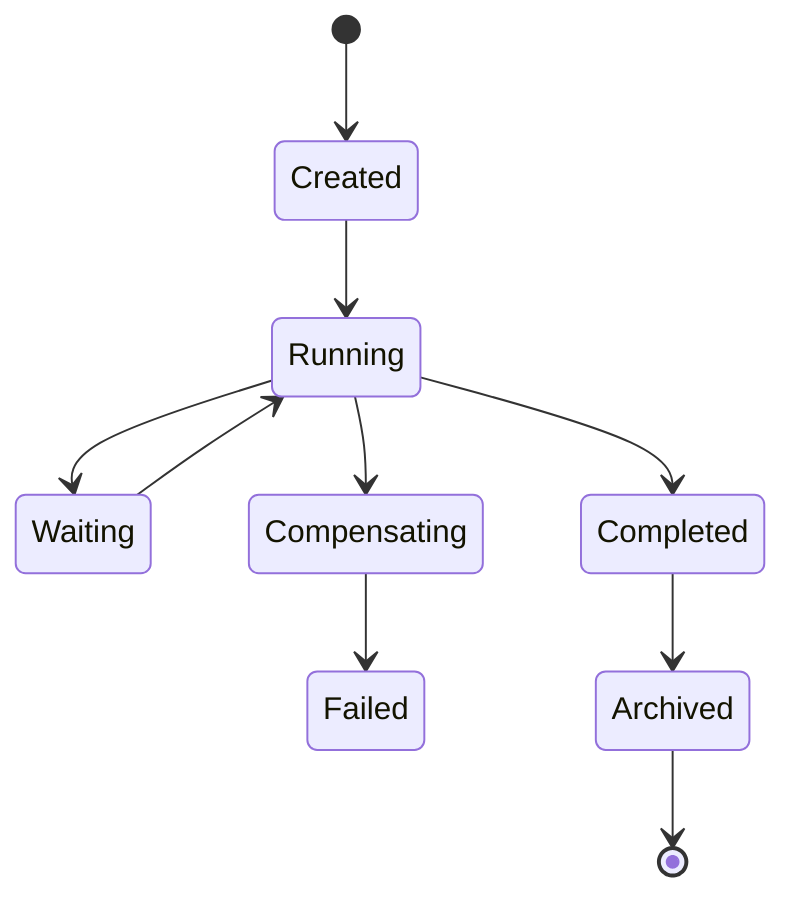

# Enterprise AI Software Factory
# Architecture Design Specification (ADS)

> **Document ID:** ADS-040-v2
>
> **Document Name:** Enterprise Workflow Orchestration & Business Process Automation Platform — Workflow Algorithms & Lifecycle
>
> **Version:** 1.0.0
>
> **Classification:** Enterprise Platform Plane
>
> **Importance:** CRITICAL
>
> **Depends On:** ADS-040-v1
>
> **Next:** ADS-040-v3 — APIs, Events & Contracts

---

# Executive Summary

This document defines the lifecycle algorithms governing enterprise workflow execution, task orchestration, human approvals, timers, retry policies, Saga compensation, and workflow completion.

Every workflow follows a deterministic execution lifecycle.

Every task is observable.

Every approval is auditable.

---

# Design Philosophy

The Workflow Lifecycle follows six principles.

- Deterministic Execution
- Immutable Workflow History
- Human-in-the-Loop Governance
- Fault Tolerance
- Replayable Execution
- Compensation over Rollback

---

# ALG-040-001

## Workflow Initialization

Every workflow execution SHALL begin by creating a Workflow Record.

Initialization performs

- Workflow Version Resolution
- Input Validation
- Execution Context Creation
- Policy Loading
- Trace Context Generation
- Initial State Assignment

Initialization creates a Workflow Session.

---

# Workflow

```yaml
workflow:

  workflowId:

  workflowName:

  version:

  businessDomain:

  trigger:

  input:

  executionPolicy:

  status:

  createdAt:
```

Workflow definitions remain immutable.

---

# ALG-040-002

## Task Scheduling

The Task Scheduler coordinates

- Task Prioritization
- Dependency Resolution
- Worker Assignment
- Retry Scheduling
- Timeout Policies
- Queue Management

Task scheduling remains deterministic.

---

# ALG-040-003

## Human Approval

Human Task Service manages

- Approval Assignment
- Escalation Rules
- SLA Monitoring
- Delegation
- Approval Decisions
- Audit Logging

Approval outcomes generate Approval Records.

---

# Approval Modes

| Mode | Purpose |
|--------|----------|
| Single Approver | One decision required |
| Sequential | Ordered approvals |
| Parallel | Multiple independent approvals |
| Majority | Majority vote |
| Unanimous | All approvers required |

Approval strategy remains policy-controlled.

---

# ALG-040-004

## Timer Management

The Timer Service coordinates

- Delays
- Deadlines
- Waiting States
- Scheduled Wakeups
- Timeout Events
- Reminder Notifications

Timers are durable and replayable.

---

# Workflow States

| State | Description |
|---------|-------------|
| Created | Workflow initialized |
| Running | Tasks executing |
| Waiting | Awaiting approval or timer |
| Compensating | Saga compensation in progress |
| Completed | Successfully finished |
| Failed | Unrecoverable failure |
| Archived | Lifecycle finalized |

State transitions remain deterministic.

---

# ALG-040-005

## Retry Execution

Retry policies evaluate

- Retry Count
- Retry Interval
- Backoff Strategy
- Error Classification
- Idempotency
- Maximum Attempts

Retries remain governed by workflow policy.

---

# Workflow Record

Every workflow execution generates a Workflow Record.

```yaml
workflowRecord:

  workflowRecordId:

  workflow:

  executionInstance:

  currentState:

  activeTask:

  executionStatus:

  startedAt:

  completedAt:
```

Workflow Records remain append-only.

---

# ALG-040-006

## Saga Compensation

The Saga Coordinator executes compensating actions when a distributed workflow cannot complete successfully.

Compensation evaluates

- Completed Tasks
- Compensation Policies
- Dependency Order
- External Transactions
- Failure Classification
- Recovery Strategy

Compensation follows reverse execution order.

---

# ALG-040-007

## Workflow Completion

A workflow reaches completion when

- All mandatory tasks succeed
- Required approvals are granted
- Timers have expired or completed
- Compensation is unnecessary
- Final validation succeeds

Successful completion produces a Workflow Ledger Entry.

---

# ALG-040-008

## Workflow Archival

Completed workflows transition to archival.

Archival records

- Workflow Definition
- Workflow Record
- Task Records
- Approval Records
- Workflow Session
- Health Records
- Runtime Snapshot
- Ledger Entry

Archived workflows remain replayable.

---

# Task Record

Every workflow task generates a Task Record.

```yaml
taskRecord:

  taskRecordId:

  workflowRecord:

  taskName:

  taskType:

  assignedWorker:

  executionStatus:

  retryPolicy:

  startedAt:

  completedAt:
```

Task Records remain immutable after completion.

---

# Workflow Lifecycle



Every workflow progresses through deterministic lifecycle states.

---

# Task Lifecycle

```text
Task Created

↓

Task Scheduled

↓

Task Assigned

↓

Task Executing

↓

Task Completed

↓

Archived
```

Failed tasks may transition to retry or compensation according to workflow policy.

---

# Approval Lifecycle

```text
Approval Requested

↓

Assigned

↓

Decision Pending

↓

Approved / Rejected

↓

Recorded
```

Approval evidence remains immutable.

---

# Workflow Execution Pipeline

```text
Workflow Triggered

↓

Workflow Initialization

↓

Task Scheduling

↓

Task Execution

↓

Human Approval (Optional)

↓

Timer Events (Optional)

↓

Saga Compensation (If Required)

↓

Workflow Completion

↓

Ledger Persistence
```

The execution pipeline remains reproducible.

---

# Failure Handling

Failures are classified as

| Failure | Recovery Strategy |
|----------|-------------------|
| Task Failure | Retry |
| Worker Failure | Reassign |
| Approval Timeout | Escalate |
| Timer Failure | Recover Timer State |
| External Service Failure | Retry / Compensation |
| Workflow Engine Failure | Runtime Recovery |

Recovery policies are workflow-governed.

---

# Prometheus Metrics

```text
workflow_executions_total

active_workflows_total

workflow_completion_total

workflow_failures_total

task_executions_total

task_retry_total

approval_requests_total

approval_timeout_total

saga_compensations_total

workflow_execution_duration_seconds
```

---

# Structured Logging

Example

```json
{
  "workflowRecord":"WR-10241",
  "taskRecord":"TR-8042",
  "workflowSession":"WS-551",
  "executionState":"Completed",
  "activeTask":"ValidateOrder",
  "traceId":"TRC-902114"
}
```

Logs remain immutable and fully correlated.

---

# Architecture Decision Records

## ADR-040-04

### Decision

Use Saga compensation instead of distributed two-phase commit.

### Status

Accepted

### Reason

Improves scalability, resilience, and support for loosely coupled distributed systems.

---

## ADR-040-05

### Decision

Represent every workflow task as an independent Task Record.

### Status

Accepted

### Reason

Supports independent retries, scheduling, SLA monitoring, and operational observability.

---

## ADR-040-06

### Decision

Persist immutable workflow history for replay.

### Status

Accepted

### Reason

Supports auditing, diagnostics, compliance, and deterministic execution replay.

---

# Operational Readiness Scorecard

| Capability | Status |
|------------|--------|
| Workflow Execution | ✅ Required |
| Task Scheduling | ✅ Required |
| Human Approvals | ✅ Required |
| Timer Management | ✅ Required |
| Saga Compensation | ✅ Required |
| Retry Policies | ✅ Required |
| Immutable History | ✅ Required |
| Replay Support | ✅ Required |

---

# Related Documents

ADS-021-v5 — Workflow Kernel

ADS-022-v5 — Identity & Trust Plane

ADS-025-v5 — Compute & Infrastructure Platform

ADS-026-v5 — Security Platform

ADS-027-v5 — Observability Platform

ADS-030-v5 — Integration & Ecosystem Platform

ADS-038-v5 — Enterprise Event Streaming, Messaging & Real-Time Data Platform

ADS-039-v5 — Enterprise API Gateway, Service Mesh & Traffic Management Platform

ADS-040-v1 — Architecture

ADS-040-v3 — APIs, Events & Contracts

---

# End of Document
