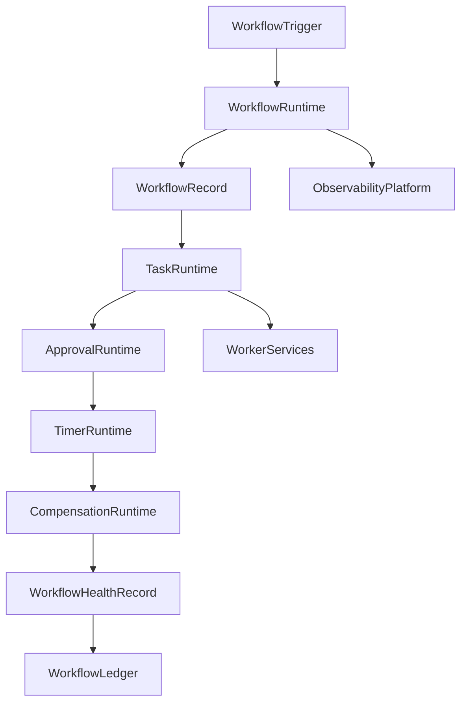

# Enterprise AI Software Factory
# Architecture Design Specification (ADS)

> **Document ID:** ADS-040-v4
>
> **Document Name:** Enterprise Workflow Orchestration & Business Process Automation Platform — Runtime & Workflow Infrastructure
>
> **Version:** 1.0.0
>
> **Classification:** Enterprise Runtime Specification
>
> **Importance:** CRITICAL
>
> **Depends On:** ADS-040-v1
>
> **Depends On:** ADS-040-v2
>
> **Depends On:** ADS-040-v3
>
> **Next:** ADS-040-v5 — End-to-End Workflow Lifecycle

---

# Executive Summary

This document specifies the runtime architecture responsible for continuously executing enterprise workflows.

The Workflow Runtime coordinates workflow execution, task scheduling, worker assignment, human approvals, timer management, Saga compensation, state persistence, and runtime observability while maintaining deterministic execution across distributed infrastructure.

Every workflow execution is durable.

Every task is observable.

Every runtime interaction becomes immutable operational evidence.

---

# Runtime Philosophy

The Workflow Runtime follows eight principles.

- Deterministic Execution
- Durable State
- Event-Driven Coordination
- Human-in-the-Loop
- Fault Tolerance
- Observable Execution
- Replayable Runtime
- Operational Resilience

Runtime execution never bypasses governance.

---

# Runtime Layers

## Workflow Runtime

Responsible for

- Workflow Execution
- State Management
- Context Propagation
- Execution Coordination
- Lifecycle Management

---

## Task Runtime

Responsible for

- Task Scheduling
- Worker Assignment
- Queue Management
- Retry Handling
- Timeout Enforcement

---

## Approval Runtime

Responsible for

- Human Approvals
- Escalations
- Delegation
- SLA Tracking
- Decision Recording

---

## Timer Runtime

Responsible for

- Delays
- Deadlines
- Wake-Up Events
- Timeout Detection
- Reminder Scheduling

---

## Compensation Runtime

Responsible for

- Saga Coordination
- Compensation Scheduling
- Reverse Execution
- Failure Recovery
- State Reconciliation

---

## Health Runtime

Responsible for

- Workflow Health
- Task Health
- Worker Health
- Approval Health
- Runtime Monitoring

---

# Runtime Architecture



The runtime coordinates every workflow execution.

---

# Runtime Components

| Component | Responsibility |
|------------|----------------|
| Workflow Runtime | Execution coordination |
| Task Runtime | Task scheduling |
| Approval Runtime | Human approval processing |
| Timer Runtime | Time-based execution |
| Compensation Runtime | Saga recovery |
| Health Runtime | Runtime monitoring |
| Workflow Ledger | Immutable operational history |

---

# Runtime Pipeline

```text
Workflow Trigger

↓

Initialize Workflow

↓

Schedule Tasks

↓

Execute Tasks

↓

Collect Approvals

↓

Process Timers

↓

Execute Compensation (If Needed)

↓

Evaluate Health

↓

Persist Workflow Ledger
```

Every workflow follows the same runtime pipeline.

---

# Workflow Runtime

Workflow Runtime manages

- Workflow State
- Execution Context
- State Persistence
- Workflow Transitions
- Dependency Resolution
- Trace Context

Execution remains deterministic.

---

# Task Runtime

Task Runtime coordinates

- Task Dispatch
- Worker Selection
- Retry Scheduling
- Timeout Detection
- Queue Prioritization
- Completion Tracking

Task execution remains reproducible.

---

# Workflow Session Management

Every runtime execution creates or participates in a Workflow Session.

Each Workflow Session tracks

- Workflow Record
- Active Tasks
- Current State
- Execution Context
- Timer State
- Retry State
- Compensation State

Workflow Sessions remain immutable.

---

# Runtime Guarantees

The Workflow Runtime guarantees

- Deterministic Workflow Execution
- Durable Workflow State
- Reliable Task Scheduling
- Replayable Runtime History
- Observable Execution
- Policy Compliance
- Immutable Operational History

---

# End of Part 1
