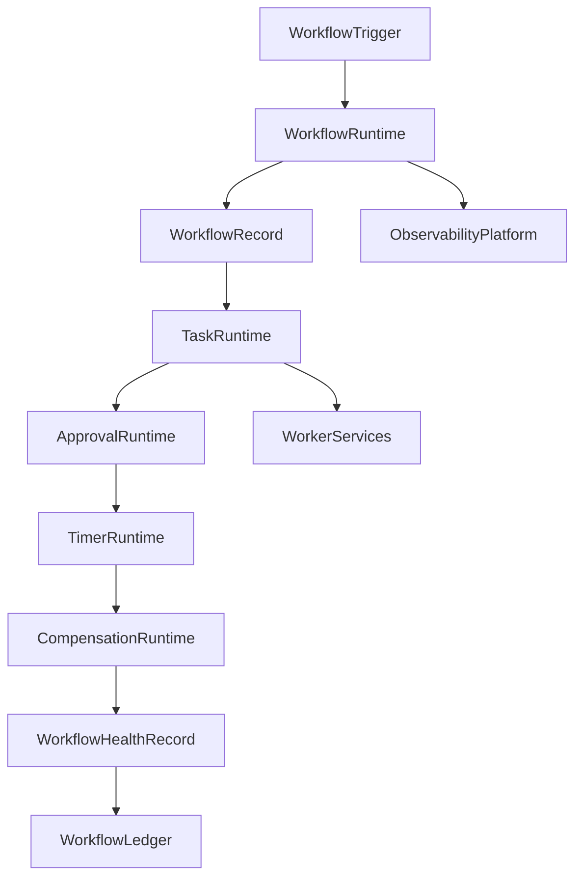
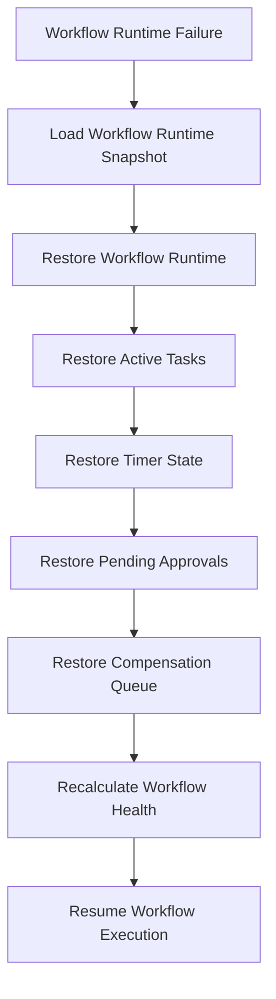

# Enterprise AI Software Factory
# Architecture Design Specification (ADS)

> **Document ID:** ADS-040-v4
>
> **Document Name:** Enterprise Workflow Orchestration & Business Process Automation Platform — Runtime & Workflow Infrastructure
>
> **Version:** 1.0.0
>
> **Classification:** Enterprise Runtime Specification
>
> **Importance:** CRITICAL
>
> **Depends On:** ADS-040-v1
>
> **Depends On:** ADS-040-v2
>
> **Depends On:** ADS-040-v3
>
> **Next:** ADS-040-v5 — End-to-End Workflow Lifecycle

---

# Executive Summary

This document specifies the runtime architecture responsible for continuously executing enterprise workflows.

The Workflow Runtime coordinates workflow execution, task scheduling, worker assignment, human approvals, timer management, Saga compensation, state persistence, and runtime observability while maintaining deterministic execution across distributed infrastructure.

Every workflow execution is durable.

Every task is observable.

Every runtime interaction becomes immutable operational evidence.

---

# Runtime Philosophy

The Workflow Runtime follows eight principles.

- Deterministic Execution
- Durable State
- Event-Driven Coordination
- Human-in-the-Loop
- Fault Tolerance
- Observable Execution
- Replayable Runtime
- Operational Resilience

Runtime execution never bypasses governance.

---

# Runtime Layers

## Workflow Runtime

Responsible for

- Workflow Execution
- State Management
- Context Propagation
- Execution Coordination
- Lifecycle Management

---

## Task Runtime

Responsible for

- Task Scheduling
- Worker Assignment
- Queue Management
- Retry Handling
- Timeout Enforcement

---

## Approval Runtime

Responsible for

- Human Approvals
- Escalations
- Delegation
- SLA Tracking
- Decision Recording

---

## Timer Runtime

Responsible for

- Delays
- Deadlines
- Wake-Up Events
- Timeout Detection
- Reminder Scheduling

---

## Compensation Runtime

Responsible for

- Saga Coordination
- Compensation Scheduling
- Reverse Execution
- Failure Recovery
- State Reconciliation

---

## Health Runtime

Responsible for

- Workflow Health
- Task Health
- Worker Health
- Approval Health
- Runtime Monitoring

---

# Runtime Architecture



The runtime coordinates every workflow execution.

---

# Runtime Components

| Component | Responsibility |
|------------|----------------|
| Workflow Runtime | Execution coordination |
| Task Runtime | Task scheduling |
| Approval Runtime | Human approval processing |
| Timer Runtime | Time-based execution |
| Compensation Runtime | Saga recovery |
| Health Runtime | Runtime monitoring |
| Workflow Ledger | Immutable operational history |

---

# Runtime Pipeline

```text
Workflow Trigger

↓

Initialize Workflow

↓

Schedule Tasks

↓

Execute Tasks

↓

Collect Approvals

↓

Process Timers

↓

Execute Compensation (If Needed)

↓

Evaluate Health

↓

Persist Workflow Ledger
```

Every workflow follows the same runtime pipeline.

---

# Workflow Runtime

Workflow Runtime manages

- Workflow State
- Execution Context
- State Persistence
- Workflow Transitions
- Dependency Resolution
- Trace Context

Execution remains deterministic.

---

# Task Runtime

Task Runtime coordinates

- Task Dispatch
- Worker Selection
- Retry Scheduling
- Timeout Detection
- Queue Prioritization
- Completion Tracking

Task execution remains reproducible.

---

# Workflow Session Management

Every runtime execution creates or participates in a Workflow Session.

Each Workflow Session tracks

- Workflow Record
- Active Tasks
- Current State
- Execution Context
- Timer State
- Retry State
- Compensation State

Workflow Sessions remain immutable.

---

# Runtime Guarantees

The Workflow Runtime guarantees

- Deterministic Workflow Execution
- Durable Workflow State
- Reliable Task Scheduling
- Replayable Runtime History
- Observable Execution
- Policy Compliance
- Immutable Operational History

---

# Failure Recovery

The Workflow Runtime automatically recovers from workflow engine, task scheduler, worker, timer, approval, and compensation failures while preserving deterministic execution.

Recovery follows approved governance policies.



Recovery guarantees

- No workflow state corruption
- No task duplication
- No approval loss
- Deterministic recovery

---

# Runtime Health Monitoring

Every runtime component continuously reports health.

Collected metrics

- Workflow Runtime Health
- Task Runtime Health
- Worker Health
- Approval Runtime Health
- Timer Runtime Health
- Compensation Runtime Health
- Active Workflow Sessions
- Workflow Throughput

Health Flow

```text
Runtime Component

↓

Heartbeat

↓

Workflow Runtime Monitor

↓

Operations Dashboard

↓

Alert Engine

↓

Operations Team
```

Health monitoring remains continuous.

---

# Workflow Runtime Snapshot

The runtime periodically generates Workflow Runtime Snapshots.

```yaml
workflowRuntimeSnapshot:

  snapshotId:

  generatedAt:

  activeWorkflows:

  activeTasks:

  pendingApprovals:

  activeTimers:

  compensationQueue:

  platformHealth:

  throughput:
```

Runtime Snapshots provide deterministic operational state.

---

# Runtime Configuration

Example

```yaml
workflowRuntime:

  workflowExecution: enabled

  taskScheduling: enabled

  timerManagement: enabled

  humanApprovals: enabled

  sagaCompensation: enabled

  workflowLedger: enabled

  runtimeSnapshots: enabled

  snapshotInterval: 5m
```

Configuration remains version-controlled.

---

# Runtime Scaling

The Workflow Runtime supports

- Horizontal Workflow Engine Scaling
- Distributed Task Scheduling
- Elastic Worker Pools
- Regional Workflow Execution
- Multi-Cluster Coordination

Scaling remains policy-driven.

---

# Runtime Isolation

The Workflow Runtime isolates

- Tenants
- Workflow Executions
- Task Queues
- Approval Pipelines
- Timer Queues
- Compensation Processes

Isolation prevents cross-tenant and cross-workflow interference.

---

# Prometheus Metrics

```text
workflow_runtime_snapshots_total

active_workflows_total

active_tasks_total

pending_approvals_total

workflow_runtime_health_score

workflow_execution_latency_seconds

task_queue_depth

timer_events_total

compensation_executions_total

workflow_throughput
```

---

# OpenTelemetry

Distributed tracing spans

```text
Workflow Trigger

↓

Workflow Runtime

↓

Task Runtime

↓

Worker Service

↓

Approval Runtime

↓

Timer Runtime

↓

Compensation Runtime

↓

Workflow Ledger
```

Every runtime stage contributes trace spans.

---

# Structured Logging

Example

```json
{
  "workflowSession":"WS-551",
  "workflowHealthRecord":"WHR-0127",
  "workflowRuntimeSnapshot":"SNAP-0342",
  "currentState":"Running",
  "activeTasks":5,
  "traceId":"TRC-902114"
}
```

Logs remain immutable and correlated.

---

# Disaster Recovery

Recovery flow

```text
Workflow Runtime Failure

↓

Restore Workflow Runtime Snapshot

↓

Restore Workflow State

↓

Restore Active Tasks

↓

Restore Pending Approvals

↓

Validate Workflow Health

↓

Resume Workflow Execution
```

Recovery targets

Recovery Point Objective (RPO)

Near-zero workflow state loss

Recovery Time Objective (RTO)

Less than five minutes

---

# Recommended Production Deployment

```text
Workflow API

↓

Workflow Engine Cluster

↓

Task Scheduler

↓

Worker Pool

↓

Approval Service

↓

Timer Service

↓

Saga Coordinator

↓

Workflow Ledger

↓

OpenTelemetry

↓

Prometheus

↓

Grafana
```

---

# Technology Decision Records

## TDR-040-01

### Technology

Temporal (or equivalent workflow engine)

### Decision

Use a durable workflow orchestration engine for long-running workflow execution.

### Reason

Provides deterministic execution, durable state persistence, retries, timers, and replay capabilities.

---

## TDR-040-02

### Technology

Distributed Task Queue

### Decision

Use distributed task queues for scalable worker coordination.

### Reason

Supports elastic execution, fault tolerance, and workload isolation.

---

## TDR-040-03

### Technology

Workflow Runtime Snapshot

### Decision

Persist periodic runtime snapshots.

### Reason

Supports diagnostics, replay, disaster recovery, and operational visibility.

---

## TDR-040-04

### Technology

Saga Coordinator

### Decision

Implement Saga orchestration for distributed transaction management.

### Reason

Provides scalable compensation instead of two-phase commit.

---

## TDR-040-05

### Technology

Human Approval Service

### Decision

Provide a dedicated approval service with SLA tracking and escalation.

### Reason

Enables governance, auditability, delegation, and enterprise approval workflows.

---

# Runtime Checklist

The Workflow Platform MUST

- Persist durable workflow state
- Schedule tasks deterministically
- Support human approvals
- Execute Saga compensation
- Generate Workflow Runtime Snapshots
- Maintain immutable operational history
- Continuously monitor runtime health

The Workflow Platform MUST NOT

- Lose workflow execution state
- Execute duplicate tasks
- Bypass approval policies
- Skip compensation when required
- Break tenant isolation

---

# Architecture Decision Records

## ADR-040-10

### Decision

Treat Workflow Runtime Snapshots as immutable runtime artifacts.

### Status

Accepted

### Reason

Snapshots improve diagnostics, replay, disaster recovery, and operational resilience.

---

## ADR-040-11

### Decision

Separate Workflow Runtime from Task Runtime.

### Status

Accepted

### Reason

Independent scaling and lifecycle management improve throughput and maintainability.

---

## ADR-040-12

### Decision

Represent runtime execution through immutable Workflow Sessions.

### Status

Accepted

### Reason

Provides deterministic traceability, replayability, governance, and operational observability.

---

# Operational Readiness Scorecard

| Capability | Status |
|------------|--------|
| Workflow Runtime | ✅ Required |
| Task Runtime | ✅ Required |
| Runtime Snapshots | ✅ Required |
| Human Approval Runtime | ✅ Required |
| Runtime Recovery | ✅ Required |
| Saga Compensation | ✅ Required |
| OpenTelemetry | ✅ Required |
| Deterministic Execution | ✅ Required |

---

# Related Documents

ADS-021-v5 — Workflow Kernel

ADS-022-v5 — Identity & Trust Plane

ADS-025-v5 — Compute & Infrastructure Platform

ADS-026-v5 — Security Platform

ADS-027-v5 — Observability Platform

ADS-030-v5 — Integration & Ecosystem Platform

ADS-038-v5 — Enterprise Event Streaming, Messaging & Real-Time Data Platform

ADS-039-v5 — Enterprise API Gateway, Service Mesh & Traffic Management Platform

ADS-040-v1 — Architecture

ADS-040-v2 — Workflow Algorithms & Lifecycle

ADS-040-v3 — APIs, Events & Contracts

ADS-040-v5 — End-to-End Workflow Lifecycle

---

# End of Document
