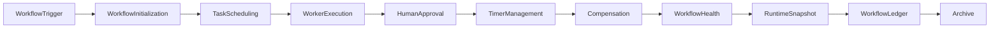

# Enterprise AI Software Factory
# Architecture Design Specification (ADS)

> **Document ID:** ADS-040-v5
>
> **Document Name:** Enterprise Workflow Orchestration & Business Process Automation Platform — End-to-End Workflow Lifecycle
>
> **Version:** 1.0.0
>
> **Classification:** Enterprise Reference Lifecycle
>
> **Importance:** CRITICAL
>
> **Depends On:** ADS-040-v1
>
> **Depends On:** ADS-040-v2
>
> **Depends On:** ADS-040-v3
>
> **Depends On:** ADS-040-v4
>
> **Status:** Reference Implementation

---

# Executive Summary

This document demonstrates the complete lifecycle of a governed enterprise workflow.

Each lifecycle stage produces immutable operational artifacts that together provide deterministic execution, governance, replayability, compliance, and observability.

---

# Reference Scenario

Global Insurance Platform

Business Process

Policy Claim Approval

Daily Workflow Executions

8.4 Million

Regions

- North America
- Europe
- Asia-Pacific

Approval Strategy

Sequential

Compensation Strategy

Saga

---

# Complete Lifecycle



Every execution follows a deterministic lifecycle.

---

# Stage 1

## Workflow Trigger

A claim submission initiates a workflow.

Artifact Produced

Workflow

```yaml
workflow:

  workflowId: WF-10021

  workflowName: PolicyClaimApproval

  version: 3.2

  businessDomain: Insurance

  trigger: ClaimSubmitted
```

The Workflow represents the immutable business process definition.

---

# Stage 2

## Workflow Initialization

Workflow Runtime performs

- Version Resolution
- Input Validation
- Context Initialization
- Policy Loading
- Trace Context Generation

Artifact Produced

Workflow Record

```yaml
workflowRecord:

  workflowRecordId: WR-10241

  workflow: WF-10021

  executionStatus: Running

  currentState: Initialized
```

Workflow execution begins.

---

# Stage 3

## Task Scheduling

The Task Runtime schedules

- Claim Validation
- Fraud Analysis
- Coverage Verification

Artifact Produced

Task Record

```yaml
taskRecord:

  taskRecordId: TR-8042

  workflowRecord: WR-10241

  taskName: ClaimValidation

  executionStatus: Running
```

Tasks become independently observable.

---

# Stage 4

## Human Approval

The Approval Runtime assigns a supervisor.

Approval operations

- Assignment
- SLA Tracking
- Decision Capture
- Audit Recording

Artifact Produced

Approval Record

```yaml
approvalRecord:

  approvalRecordId: AR-0183

  workflowRecord: WR-10241

  approver: supervisor-104

  decision: Approved
```

Human decisions become immutable governance artifacts.

---

# Stage 5

## Workflow Session

The Workflow Runtime creates the active execution context.

Artifact Produced

Workflow Session

```yaml
workflowSession:

  workflowSessionId: WS-551

  workflowRecord: WR-10241

  activeTasks: 3

  currentState: Running

  executionContext: Active
```

Workflow Sessions coordinate runtime execution.

---

# Stage 6

## Runtime Health Evaluation

The Health Runtime continuously evaluates workflow execution.

Evaluation includes

- Workflow Runtime Health
- Task Runtime Health
- Worker Health
- Approval Health
- Timer Health
- Compensation Health
- SLA Compliance

Artifact Produced

Workflow Health Record

```yaml
workflowHealthRecord:

  workflowHealthRecordId: WHR-0127

  workflowSession: WS-551

  executionHealth: Healthy

  schedulerHealth: Healthy

  workerHealth: Healthy

  approvalHealth: Healthy

  latencyHealth: Normal
```

Health Records provide continuous operational visibility.

---

# Stage 7

## Runtime Snapshot Generation

The Workflow Runtime periodically captures platform state.

Artifact Produced

Workflow Runtime Snapshot

```yaml
workflowRuntimeSnapshot:

  snapshotId: SNAP-0342

  activeWorkflows: 18425

  activeTasks: 74218

  pendingApprovals: 2184

  activeTimers: 911

  platformHealth: Healthy

  throughput: 12850 workflows/min
```

Snapshots support diagnostics, replay, and disaster recovery.

---

# Stage 8

## Workflow Completion

Workflow Runtime verifies

- Required tasks completed
- Approvals finalized
- Timers satisfied
- Compensation not required
- Output validated

Workflow transitions to **Completed**.

---

# Stage 9

## Immutable Ledger Persistence

The completed lifecycle is permanently recorded.

Artifact Produced

Workflow Ledger Entry

```yaml
workflowLedgerEntry:

  entryId: WL-81024

  workflow: WF-10021

  workflowRecord: WR-10241

  taskRecord: TR-8042

  approvalRecord: AR-0183

  workflowSession: WS-551

  workflowHealthRecord: WHR-0127

  workflowRuntimeSnapshot: SNAP-0342

  traceId: TRC-902114

  digitalSignature: SHA256
```

The Workflow Ledger forms the authoritative operational audit trail.

---

# Stage 10

## Executive Governance Review

Operations leadership evaluates

- Workflow Throughput
- Completion Rate
- Approval SLA Compliance
- Compensation Frequency
- Retry Success
- Runtime Availability
- Policy Compliance
- Operational Risk

Executive dashboards consume immutable lifecycle artifacts for reproducible reporting.

---

# Stage 11

## Archive & Replay

Archived artifacts

- Workflow
- Workflow Record
- Task Record
- Approval Record
- Workflow Session
- Workflow Health Record
- Workflow Runtime Snapshot
- Workflow Ledger Entry

Replay capabilities include

- Workflow Replay
- Task Replay
- Approval Audit
- Compensation Verification
- Incident Investigation
- Compliance Reporting

Archived data remains immutable.

---

# Complete Artifact Lifecycle

```text
Workflow

↓

Workflow Record

↓

Task Record

↓

Approval Record

↓

Workflow Session

↓

Workflow Health Record

↓

Workflow Runtime Snapshot

↓

Workflow Ledger Entry

↓

Archive
```

Every artifact extends operational history without modifying previous artifacts.

---

# Reference Metrics

| Metric | Value |
|---------|------:|
| Workflow Executions / Day | 8.4 Million |
| Active Workflow Sessions | 18,425 |
| Average Workflow Duration | 2.8 min |
| Approval SLA Compliance | 99.8% |
| Retry Success Rate | 99.2% |
| Compensation Rate | 0.18% |
| Runtime Availability | 99.995% |
| Replay Success Rate | 100% |

---

# Lessons Learned

The platform demonstrates that

- Workflow definitions remain immutable.
- Workflow execution is deterministic and durable.
- Tasks are independently observable.
- Human approvals are governed and auditable.
- Runtime health is continuously evaluated.
- Runtime snapshots enable replay and disaster recovery.
- Ledger entries provide end-to-end auditability.

---

# Architecture Decision Records

## ADR-040-13

### Decision

Represent the complete workflow lifecycle using immutable operational artifacts.

### Status

Accepted

### Reason

Provides deterministic execution, governance, replayability, regulatory compliance, and operational resilience.

---

# Technology Decision Records

## TDR-040-06

### Technology

Workflow Ledger

### Decision

Persist all workflow lifecycle artifacts in an append-only ledger.

### Reason

Supports auditing, compliance, replay, incident response, and historical analytics.

---

# Operational Readiness Scorecard

| Capability | Status |
|------------|--------|
| End-to-End Workflow Traceability | ✅ Complete |
| Immutable Audit Trail | ✅ Complete |
| Human Approval Governance | ✅ Complete |
| Deterministic Execution | ✅ Complete |
| Runtime Health Monitoring | ✅ Complete |
| Runtime Snapshotting | ✅ Complete |
| Replay & Recovery | ✅ Complete |
| Executive Governance | ✅ Complete |

---

# Related Documents

ADS-021-v5 — Workflow Kernel

ADS-022-v5 — Identity & Trust Plane

ADS-025-v5 — Compute & Infrastructure Platform

ADS-026-v5 — Security Platform

ADS-027-v5 — Observability Platform

ADS-030-v5 — Integration & Ecosystem Platform

ADS-038-v5 — Enterprise Event Streaming, Messaging & Real-Time Data Platform

ADS-039-v5 — Enterprise API Gateway, Service Mesh & Traffic Management Platform

ADS-040-v1 — Architecture

ADS-040-v2 — Workflow Algorithms & Lifecycle

ADS-040-v3 — APIs, Events & Contracts

ADS-040-v4 — Runtime & Workflow Infrastructure

---

# End of Document
