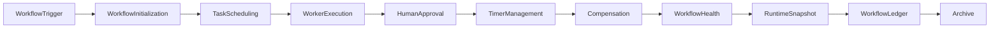

# Enterprise AI Software Factory
# Architecture Design Specification (ADS)

> **Document ID:** ADS-040-v5
>
> **Document Name:** Enterprise Workflow Orchestration & Business Process Automation Platform — End-to-End Workflow Lifecycle
>
> **Version:** 1.0.0
>
> **Classification:** Enterprise Reference Lifecycle
>
> **Importance:** CRITICAL
>
> **Depends On:** ADS-040-v1
>
> **Depends On:** ADS-040-v2
>
> **Depends On:** ADS-040-v3
>
> **Depends On:** ADS-040-v4
>
> **Status:** Reference Implementation

---

# Executive Summary

This document demonstrates the complete lifecycle of a governed enterprise workflow.

Each lifecycle stage produces immutable operational artifacts that together provide deterministic execution, governance, replayability, compliance, and observability.

---

# Reference Scenario

Global Insurance Platform

Business Process

Policy Claim Approval

Daily Workflow Executions

8.4 Million

Regions

- North America
- Europe
- Asia-Pacific

Approval Strategy

Sequential

Compensation Strategy

Saga

---

# Complete Lifecycle



Every execution follows a deterministic lifecycle.

---

# Stage 1

## Workflow Trigger

A claim submission initiates a workflow.

Artifact Produced

Workflow

```yaml
workflow:

  workflowId: WF-10021

  workflowName: PolicyClaimApproval

  version: 3.2

  businessDomain: Insurance

  trigger: ClaimSubmitted
```

The Workflow represents the immutable business process definition.

---

# Stage 2

## Workflow Initialization

Workflow Runtime performs

- Version Resolution
- Input Validation
- Context Initialization
- Policy Loading
- Trace Context Generation

Artifact Produced

Workflow Record

```yaml
workflowRecord:

  workflowRecordId: WR-10241

  workflow: WF-10021

  executionStatus: Running

  currentState: Initialized
```

Workflow execution begins.

---

# Stage 3

## Task Scheduling

The Task Runtime schedules

- Claim Validation
- Fraud Analysis
- Coverage Verification

Artifact Produced

Task Record

```yaml
taskRecord:

  taskRecordId: TR-8042

  workflowRecord: WR-10241

  taskName: ClaimValidation

  executionStatus: Running
```

Tasks become independently observable.

---

# Stage 4

## Human Approval

The Approval Runtime assigns a supervisor.

Approval operations

- Assignment
- SLA Tracking
- Decision Capture
- Audit Recording

Artifact Produced

Approval Record

```yaml
approvalRecord:

  approvalRecordId: AR-0183

  workflowRecord: WR-10241

  approver: supervisor-104

  decision: Approved
```

Human decisions become immutable governance artifacts.

---

# Stage 5

## Workflow Session

The Workflow Runtime creates the active execution context.

Artifact Produced

Workflow Session

```yaml
workflowSession:

  workflowSessionId: WS-551

  workflowRecord: WR-10241

  activeTasks: 3

  currentState: Running

  executionContext: Active
```

Workflow Sessions coordinate runtime execution.

---

# End of Part 1
