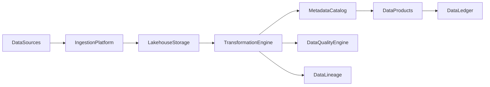
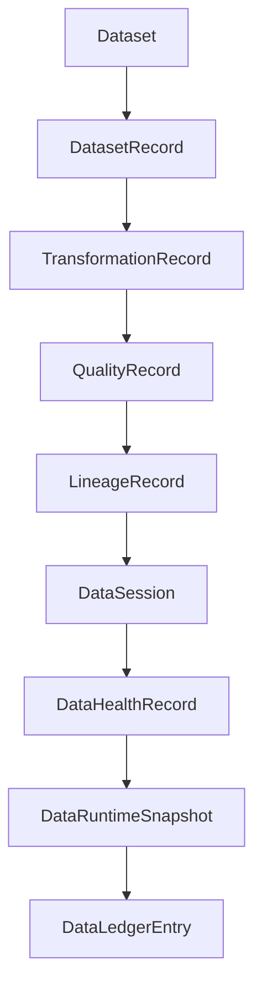

# Enterprise AI Software Factory
# Architecture Design Specification (ADS)

> **Document ID:** ADS-041-v1
>
> **Document Name:** Enterprise Data Platform & Lakehouse Architecture — Architecture
>
> **Version:** 1.0.0
>
> **Classification:** Enterprise Platform Plane
>
> **Importance:** CRITICAL
>
> **Status:** Active

---

# Executive Summary

The Enterprise Data Platform & Lakehouse Architecture provides a unified, governed foundation for storing, processing, cataloging, securing, and serving enterprise data across operational, analytical, streaming, and AI workloads.

The platform integrates batch and streaming pipelines, metadata management, lineage, data quality, governance, and lakehouse storage into a single architecture.

Every dataset is governed.

Every transformation is traceable.

Every data product is auditable.

---

# Platform Responsibilities

The platform SHALL provide

- Data Ingestion
- Batch Processing
- Stream Processing
- Lakehouse Storage
- Metadata Catalog
- Data Lineage
- Data Quality Validation
- Data Governance
- Data Product Management
- Data Ledger

---

# Architectural Principles

The platform follows

- Data as a Product
- Schema Governance
- Immutable Data History
- Lineage by Default
- Policy-Driven Access
- Quality Before Consumption
- Replayable Pipelines
- Operational Observability

---

# High-Level Architecture



The Lakehouse serves as the governed enterprise data foundation.

---

# Core Components

## Data Ingestion Platform

Responsible for

- Batch Ingestion
- Streaming Ingestion
- CDC (Change Data Capture)
- File Import
- API Import

---

## Lakehouse Storage

Responsible for

- Bronze Layer
- Silver Layer
- Gold Layer
- Versioned Tables
- Immutable Storage

---

## Transformation Engine

Responsible for

- ETL
- ELT
- Stream Processing
- Data Enrichment
- Aggregation

---

## Metadata Catalog

Responsible for

- Dataset Registration
- Schema Management
- Ownership
- Discovery
- Classification

---

## Data Quality Engine

Responsible for

- Validation Rules
- Profiling
- Constraint Enforcement
- Completeness
- Freshness

---

## Data Lineage

Responsible for

- Source Tracking
- Transformation History
- Dependency Graphs
- Impact Analysis
- Audit Trails

---

## Data Ledger

Responsible for

- Immutable Data History
- Audit Records
- Replay Support
- Compliance Evidence

---

# Primary Artifact

Every governed dataset begins with a Dataset Definition.

```yaml
dataset:

  datasetId:

  datasetName:

  domain:

  owner:

  schemaVersion:

  storageLayer:

  classification:

  retentionPolicy:

  createdAt:
```

The Dataset Definition is immutable after publication.

---

# Dataset Record

Every published Dataset creates a Dataset Record.

```yaml
datasetRecord:

  datasetRecordId:

  dataset:

  ingestionRun:

  currentVersion:

  storageLocation:

  qualityStatus:

  publicationStatus:

  createdAt:

  updatedAt:
```

Dataset Records maintain immutable publication metadata.

---

# Transformation Record

Every transformation generates a Transformation Record.

```yaml
transformationRecord:

  transformationRecordId:

  datasetRecord:

  transformationName:

  transformationType:

  executionEngine:

  inputDatasets:

  outputDataset:

  executionStatus:

  completedAt:
```

Transformation Records preserve processing lineage.

---

# Quality Record

Every quality evaluation generates a Quality Record.

```yaml
qualityRecord:

  qualityRecordId:

  datasetRecord:

  validationRules:

  completenessScore:

  accuracyScore:

  freshnessScore:

  qualityStatus:

  evaluatedAt:
```

Quality Records remain append-only.

---

# Lineage Record

Every governed transformation creates a Lineage Record.

```yaml
lineageRecord:

  lineageRecordId:

  sourceDatasets:

  targetDataset:

  transformationRecord:

  dependencyGraph:

  lineageStatus:

  recordedAt:
```

Lineage Records provide deterministic traceability.

---

# Data Session

Every ingestion or transformation execution creates a Data Session.

```yaml
dataSession:

  dataSessionId:

  datasetRecord:

  transformationRecord:

  executionContext:

  processingWindow:

  executionState:

  startedAt:

  endedAt:
```

Data Sessions represent active runtime execution.

---

# Data Health Record

Operational health is continuously evaluated.

```yaml
dataHealthRecord:

  dataHealthRecordId:

  dataSession:

  ingestionHealth:

  transformationHealth:

  storageHealth:

  qualityHealth:

  lineageHealth:

  evaluatedAt:
```

Health remains independent from processing history.

---

# Data Runtime Snapshot

The platform periodically generates runtime snapshots.

```yaml
dataRuntimeSnapshot:

  snapshotId:

  generatedAt:

  activeIngestionJobs:

  activeTransformations:

  activeDataSessions:

  platformHealth:

  throughput:
```

Snapshots support replay and disaster recovery.

---

# Data Ledger Entry

Every completed lifecycle generates an immutable ledger entry.

```yaml
dataLedgerEntry:

  entryId:

  dataset:

  datasetRecord:

  transformationRecord:

  qualityRecord:

  lineageRecord:

  dataSession:

  dataHealthRecord:

  dataRuntimeSnapshot:

  traceId:

  timestamp:

  digitalSignature:
```

Ledger Entries provide authoritative audit history.

---

# Platform Architecture



Every artifact extends the operational lifecycle without modifying prior artifacts.

---

# Data Lifecycle Overview

```text
Dataset Definition

↓

Data Ingestion

↓

Transformation

↓

Quality Validation

↓

Lineage Recording

↓

Health Evaluation

↓

Runtime Snapshot

↓

Ledger Persistence

↓

Archive
```

The lifecycle remains deterministic and reproducible.

---

# Platform Guarantees

The Data Platform guarantees

- Immutable Dataset Definitions
- Deterministic Transformations
- Continuous Data Quality Validation
- Complete Lineage Tracking
- Replayable Processing History
- Continuous Health Monitoring
- Immutable Operational History

---

# Architecture Decision Records

## ADR-041-01

### Decision

Represent every governed dataset using immutable operational artifacts.

### Status

Accepted

### Reason

Artifact-centric data management improves governance, lineage, replayability, compliance, and observability.

---

## ADR-041-02

### Decision

Separate dataset definitions from runtime processing state.

### Status

Accepted

### Reason

Enables independent versioning, scalable processing, and deterministic replay.

---

## ADR-041-03

### Decision

Model lineage as an independent Lineage Record.

### Status

Accepted

### Reason

Supports impact analysis, regulatory compliance, root-cause analysis, and enterprise governance.

---

# Operational Readiness Scorecard

| Capability | Status |
|------------|--------|
| Dataset Definitions | ✅ Required |
| Data Ingestion | ✅ Required |
| Transformations | ✅ Required |
| Data Quality | ✅ Required |
| Data Lineage | ✅ Required |
| Runtime Snapshots | ✅ Required |
| Immutable Ledger | ✅ Required |
| Deterministic Replay | ✅ Required |

---

# Related Documents

ADS-021-v5 — Workflow Kernel

ADS-022-v5 — Identity & Trust Plane

ADS-025-v5 — Compute & Infrastructure Platform

ADS-026-v5 — Security Platform

ADS-027-v5 — Observability Platform

ADS-030-v5 — Integration & Ecosystem Platform

ADS-038-v5 — Enterprise Event Streaming, Messaging & Real-Time Data Platform

ADS-039-v5 — Enterprise API Gateway, Service Mesh & Traffic Management Platform

ADS-040-v5 — Enterprise Workflow Orchestration & Business Process Automation Platform

ADS-041-v2 — Data Algorithms & Lifecycle

---

# End of Document
