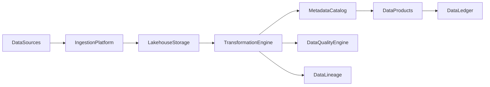

# Enterprise AI Software Factory
# Architecture Design Specification (ADS)

> **Document ID:** ADS-041-v1
>
> **Document Name:** Enterprise Data Platform & Lakehouse Architecture — Architecture
>
> **Version:** 1.0.0
>
> **Classification:** Enterprise Platform Plane
>
> **Importance:** CRITICAL
>
> **Status:** Active

---

# Executive Summary

The Enterprise Data Platform & Lakehouse Architecture provides a unified, governed foundation for storing, processing, cataloging, securing, and serving enterprise data across operational, analytical, streaming, and AI workloads.

The platform integrates batch and streaming pipelines, metadata management, lineage, data quality, governance, and lakehouse storage into a single architecture.

Every dataset is governed.

Every transformation is traceable.

Every data product is auditable.

---

# Platform Responsibilities

The platform SHALL provide

- Data Ingestion
- Batch Processing
- Stream Processing
- Lakehouse Storage
- Metadata Catalog
- Data Lineage
- Data Quality Validation
- Data Governance
- Data Product Management
- Data Ledger

---

# Architectural Principles

The platform follows

- Data as a Product
- Schema Governance
- Immutable Data History
- Lineage by Default
- Policy-Driven Access
- Quality Before Consumption
- Replayable Pipelines
- Operational Observability

---

# High-Level Architecture



The Lakehouse serves as the governed enterprise data foundation.

---

# Core Components

## Data Ingestion Platform

Responsible for

- Batch Ingestion
- Streaming Ingestion
- CDC (Change Data Capture)
- File Import
- API Import

---

## Lakehouse Storage

Responsible for

- Bronze Layer
- Silver Layer
- Gold Layer
- Versioned Tables
- Immutable Storage

---

## Transformation Engine

Responsible for

- ETL
- ELT
- Stream Processing
- Data Enrichment
- Aggregation

---

## Metadata Catalog

Responsible for

- Dataset Registration
- Schema Management
- Ownership
- Discovery
- Classification

---

## Data Quality Engine

Responsible for

- Validation Rules
- Profiling
- Constraint Enforcement
- Completeness
- Freshness

---

## Data Lineage

Responsible for

- Source Tracking
- Transformation History
- Dependency Graphs
- Impact Analysis
- Audit Trails

---

## Data Ledger

Responsible for

- Immutable Data History
- Audit Records
- Replay Support
- Compliance Evidence

---

# Primary Artifact

Every governed dataset begins with a Dataset Definition.

```yaml
dataset:

  datasetId:

  datasetName:

  domain:

  owner:

  schemaVersion:

  storageLayer:

  classification:

  retentionPolicy:

  createdAt:
```

The Dataset Definition is immutable after publication.

---

# End of Part 1
