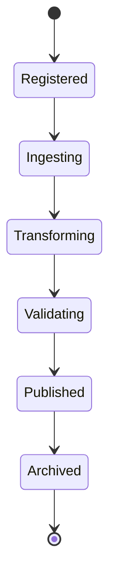

# Enterprise AI Software Factory
# Architecture Design Specification (ADS)

> **Document ID:** ADS-041-v2
>
> **Document Name:** Enterprise Data Platform & Lakehouse Architecture — Data Algorithms & Lifecycle
>
> **Version:** 1.0.0
>
> **Classification:** Enterprise Platform Plane
>
> **Importance:** CRITICAL
>
> **Depends On:** ADS-041-v1
>
> **Next:** ADS-041-v3 — APIs, Schemas & Contracts

---

# Executive Summary

This document defines the lifecycle algorithms governing enterprise data ingestion, transformation, quality validation, lineage generation, publication, retention, and archival.

Every dataset follows a deterministic lifecycle.

Every transformation is observable.

Every quality decision is auditable.

---

# Design Philosophy

The Data Lifecycle follows six principles.

- Deterministic Processing
- Immutable Dataset History
- Quality Before Publication
- Complete Lineage
- Replayable Pipelines
- Policy-Driven Governance

---

# ALG-041-001

## Dataset Registration

Every governed dataset SHALL begin with Dataset Registration.

Registration performs

- Dataset Validation
- Schema Verification
- Ownership Assignment
- Domain Classification
- Retention Policy Assignment
- Metadata Registration

Successful registration creates a Dataset Record.

---

# Dataset

```yaml
dataset:

  datasetId:

  datasetName:

  domain:

  owner:

  schemaVersion:

  storageLayer:

  classification:

  retentionPolicy:

  createdAt:
```

Dataset definitions remain immutable.

---

# ALG-041-002

## Data Ingestion

The Ingestion Platform coordinates

- Batch Import
- Streaming Import
- CDC Processing
- API Import
- File Import
- Metadata Capture

Every ingestion creates a Data Session.

---

# ALG-041-003

## Transformation Execution

The Transformation Engine performs

- Cleansing
- Normalization
- Enrichment
- Aggregation
- Filtering
- Schema Mapping

Every transformation generates a Transformation Record.

---

# ALG-041-004

## Data Quality Validation

The Data Quality Engine evaluates

- Completeness
- Accuracy
- Consistency
- Freshness
- Uniqueness
- Referential Integrity

Validation produces a Quality Record.

---

# Quality Gates

| Gate | Purpose |
|--------|----------|
| Bronze | Raw validation |
| Silver | Cleansed validation |
| Gold | Business-ready validation |

Datasets advance only after passing the required quality gate.

---

# ALG-041-005

## Lineage Generation

The Lineage Engine records

- Source Dataset
- Target Dataset
- Transformation
- Processing Engine
- Dependency Graph
- Execution Timestamp

Every lineage update creates a Lineage Record.

---

# Dataset States

| State | Description |
|---------|-------------|
| Registered | Dataset defined |
| Ingesting | Data being imported |
| Transforming | Processing active |
| Validating | Quality evaluation |
| Published | Available for consumption |
| Archived | Retained for history |

State transitions remain deterministic.

---

# Dataset Record

Every dataset publication generates a Dataset Record.

```yaml
datasetRecord:

  datasetRecordId:

  dataset:

  ingestionRun:

  currentVersion:

  storageLocation:

  qualityStatus:

  publicationStatus:

  createdAt:

  updatedAt:
```

Dataset Records remain append-only.

---

# ALG-041-006

## Dataset Publication

A dataset becomes available for consumption only after

- Successful ingestion
- Completed transformations
- Quality gate approval
- Metadata registration
- Lineage recording
- Governance validation

Successful publication updates the Dataset Record.

---

# ALG-041-007

## Data Retention

Retention policies evaluate

- Dataset Classification
- Regulatory Requirements
- Business Policies
- Retention Duration
- Archival Strategy
- Deletion Authorization

Retention remains policy-driven.

---

# ALG-041-008

## Dataset Archival

Completed datasets transition to archival.

Archival records

- Dataset Definition
- Dataset Record
- Transformation Records
- Quality Records
- Lineage Records
- Data Session
- Runtime Snapshot
- Ledger Entry

Archived datasets remain replayable.

---

# Transformation Record

Every transformation generates a Transformation Record.

```yaml
transformationRecord:

  transformationRecordId:

  datasetRecord:

  transformationName:

  transformationType:

  executionEngine:

  inputDatasets:

  outputDataset:

  executionStatus:

  startedAt:

  completedAt:
```

Transformation Records remain immutable after completion.

---

# Data Lifecycle



Every dataset progresses through deterministic lifecycle states.

---

# Transformation Pipeline

```text
Dataset Registered

↓

Data Ingestion

↓

Transformation

↓

Quality Validation

↓

Lineage Recording

↓

Dataset Publication

↓

Archival
```

Every processing stage remains reproducible.

---

# Quality Validation Pipeline

```text
Dataset Received

↓

Schema Validation

↓

Completeness Check

↓

Accuracy Check

↓

Consistency Check

↓

Freshness Check

↓

Quality Decision
```

Only validated datasets proceed to publication.

---

# Failure Handling

Failures are classified as

| Failure | Recovery Strategy |
|----------|-------------------|
| Ingestion Failure | Retry Import |
| Transformation Failure | Retry Execution |
| Quality Failure | Reject Publication |
| Lineage Failure | Regenerate Lineage |
| Storage Failure | Failover Storage |
| Metadata Failure | Retry Registration |

Recovery policies remain governance-controlled.

---

# Prometheus Metrics

```text
dataset_registrations_total

data_ingestions_total

transformation_executions_total

quality_validations_total

quality_failures_total

lineage_records_total

published_datasets_total

archived_datasets_total

data_processing_duration_seconds

dataset_replay_total
```

---

# Structured Logging

Example

```json
{
  "datasetRecord":"DR-4108",
  "transformationRecord":"TF-2091",
  "qualityRecord":"QR-1147",
  "lineageRecord":"LR-0812",
  "processingState":"Published",
  "traceId":"TRC-410221"
}
```

Logs remain immutable and fully correlated.

---

# Architecture Decision Records

## ADR-041-04

### Decision

Require successful quality validation before dataset publication.

### Status

Accepted

### Reason

Ensures downstream consumers receive governed, trusted data.

---

## ADR-041-05

### Decision

Represent every transformation as an independent Transformation Record.

### Status

Accepted

### Reason

Supports lineage, replay, optimization, and operational observability.

---

## ADR-041-06

### Decision

Persist immutable dataset history for replay.

### Status

Accepted

### Reason

Supports auditing, diagnostics, regulatory compliance, and deterministic data replay.

---

# Operational Readiness Scorecard

| Capability | Status |
|------------|--------|
| Dataset Registration | ✅ Required |
| Data Ingestion | ✅ Required |
| Transformations | ✅ Required |
| Quality Validation | ✅ Required |
| Lineage Generation | ✅ Required |
| Data Retention | ✅ Required |
| Immutable History | ✅ Required |
| Replay Support | ✅ Required |

---

# Related Documents

ADS-021-v5 — Workflow Kernel

ADS-022-v5 — Identity & Trust Plane

ADS-025-v5 — Compute & Infrastructure Platform

ADS-026-v5 — Security Platform

ADS-027-v5 — Observability Platform

ADS-030-v5 — Integration & Ecosystem Platform

ADS-038-v5 — Enterprise Event Streaming, Messaging & Real-Time Data Platform

ADS-039-v5 — Enterprise API Gateway, Service Mesh & Traffic Management Platform

ADS-040-v5 — Enterprise Workflow Orchestration & Business Process Automation Platform

ADS-041-v1 — Architecture

ADS-041-v3 — APIs, Schemas & Contracts

---

# End of Document
