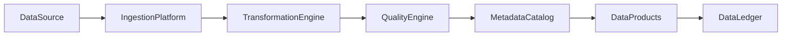

# Enterprise AI Software Factory
# Architecture Design Specification (ADS)

> **Document ID:** ADS-041-v3
>
> **Document Name:** Enterprise Data Platform & Lakehouse Architecture — APIs, Schemas & Contracts
>
> **Version:** 1.0.0
>
> **Classification:** Enterprise Platform Plane
>
> **Importance:** CRITICAL
>
> **Depends On:** ADS-041-v1
>
> **Depends On:** ADS-041-v2
>
> **Next:** ADS-041-v4 — Runtime & Data Infrastructure

---

# Executive Summary

This document defines the APIs, contracts, schemas, metadata interfaces, and governance mechanisms for the Enterprise Data Platform & Lakehouse Architecture.

Every dataset contract is versioned.

Every transformation is governed.

Every quality decision is auditable.

---

# REST APIs

## API-041-001

### Register Dataset

```http
POST /data/v1/datasets
```

Registers a governed dataset definition.

---

## API-041-002

### Start Ingestion

```http
POST /data/v1/ingestions
```

Starts an ingestion execution.

Request

```json
{
  "datasetId":"DS-10084",
  "ingestionMode":"Batch",
  "source":"crm-system",
  "tenant":"tenant-a",
  "traceId":"TRC-410221"
}
```

Response

```json
{
  "datasetRecordId":"DR-4108",
  "dataSessionId":"DSN-1029",
  "status":"Running"
}
```

---

## API-041-003

### Execute Transformation

```http
POST /data/v1/transformations
```

Starts a governed transformation.

---

## API-041-004

### Publish Dataset

```http
POST /data/v1/publications
```

Publishes a dataset after successful governance validation.

---

## API-041-005

### Query Dataset

```http
GET /data/v1/datasets/{datasetRecordId}
```

Returns the governed dataset state.

---

# gRPC Service

```protobuf
service EnterpriseDataPlatformService {

  rpc RegisterDataset(DatasetDefinition)
      returns (DatasetResponse);

  rpc StartIngestion(IngestionRequest)
      returns (IngestionResponse);

  rpc ExecuteTransformation(TransformationRequest)
      returns (TransformationResponse);

  rpc PublishDataset(PublicationRequest)
      returns (PublicationResponse);

  rpc QueryDataset(QueryDatasetRequest)
      returns (DatasetRecord);
}
```

---

# Core Schemas

## Dataset

```yaml
dataset:

  datasetId:

  datasetName:

  domain:

  owner:

  schemaVersion:

  storageLayer:

  classification:

  retentionPolicy:

  createdAt:
```

---

## Dataset Record

```yaml
datasetRecord:

  datasetRecordId:

  dataset:

  ingestionRun:

  currentVersion:

  storageLocation:

  qualityStatus:

  publicationStatus:

  createdAt:

  updatedAt:
```

---

## Transformation Record

```yaml
transformationRecord:

  transformationRecordId:

  datasetRecord:

  transformationName:

  transformationType:

  executionEngine:

  inputDatasets:

  outputDataset:

  executionStatus:

  startedAt:

  completedAt:
```

---

## Quality Record

```yaml
qualityRecord:

  qualityRecordId:

  datasetRecord:

  transformationRecord:

  validationProfile:

  ruleResults:

  qualityScore:

  certificationStatus:

  evaluatedAt:
```

---

# MCP Tools

The platform exposes

- register_dataset
- start_ingestion
- execute_transformation
- publish_dataset
- query_dataset
- data_quality_status
- lineage_diagnostics
- storage_health

---

# Platform Events

## EVT-041-001

DatasetRegistered

---

## EVT-041-002

IngestionStarted

---

## EVT-041-003

TransformationCompleted

---

## EVT-041-004

QualityValidated

---

## EVT-041-005

DatasetPublished

---

## EVT-041-006

LineageRecorded

---

## EVT-041-007

DatasetArchived

---

## EVT-041-008

RetentionExpired

---

# Data Event Flow



Every data operation produces immutable operational evidence.

---

# End of Part 1
