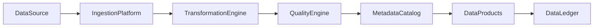

# Enterprise AI Software Factory
# Architecture Design Specification (ADS)

> **Document ID:** ADS-041-v3
>
> **Document Name:** Enterprise Data Platform & Lakehouse Architecture — APIs, Schemas & Contracts
>
> **Version:** 1.0.0
>
> **Classification:** Enterprise Platform Plane
>
> **Importance:** CRITICAL
>
> **Depends On:** ADS-041-v1
>
> **Depends On:** ADS-041-v2
>
> **Next:** ADS-041-v4 — Runtime & Data Infrastructure

---

# Executive Summary

This document defines the APIs, contracts, schemas, metadata interfaces, and governance mechanisms for the Enterprise Data Platform & Lakehouse Architecture.

Every dataset contract is versioned.

Every transformation is governed.

Every quality decision is auditable.

---

# REST APIs

## API-041-001

### Register Dataset

```http
POST /data/v1/datasets
```

Registers a governed dataset definition.

---

## API-041-002

### Start Ingestion

```http
POST /data/v1/ingestions
```

Starts an ingestion execution.

Request

```json
{
  "datasetId":"DS-10084",
  "ingestionMode":"Batch",
  "source":"crm-system",
  "tenant":"tenant-a",
  "traceId":"TRC-410221"
}
```

Response

```json
{
  "datasetRecordId":"DR-4108",
  "dataSessionId":"DSN-1029",
  "status":"Running"
}
```

---

## API-041-003

### Execute Transformation

```http
POST /data/v1/transformations
```

Starts a governed transformation.

---

## API-041-004

### Publish Dataset

```http
POST /data/v1/publications
```

Publishes a dataset after successful governance validation.

---

## API-041-005

### Query Dataset

```http
GET /data/v1/datasets/{datasetRecordId}
```

Returns the governed dataset state.

---

# gRPC Service

```protobuf
service EnterpriseDataPlatformService {

  rpc RegisterDataset(DatasetDefinition)
      returns (DatasetResponse);

  rpc StartIngestion(IngestionRequest)
      returns (IngestionResponse);

  rpc ExecuteTransformation(TransformationRequest)
      returns (TransformationResponse);

  rpc PublishDataset(PublicationRequest)
      returns (PublicationResponse);

  rpc QueryDataset(QueryDatasetRequest)
      returns (DatasetRecord);
}
```

---

# Core Schemas

## Dataset

```yaml
dataset:

  datasetId:

  datasetName:

  domain:

  owner:

  schemaVersion:

  storageLayer:

  classification:

  retentionPolicy:

  createdAt:
```

---

## Dataset Record

```yaml
datasetRecord:

  datasetRecordId:

  dataset:

  ingestionRun:

  currentVersion:

  storageLocation:

  qualityStatus:

  publicationStatus:

  createdAt:

  updatedAt:
```

---

## Transformation Record

```yaml
transformationRecord:

  transformationRecordId:

  datasetRecord:

  transformationName:

  transformationType:

  executionEngine:

  inputDatasets:

  outputDataset:

  executionStatus:

  startedAt:

  completedAt:
```

---

## Quality Record

```yaml
qualityRecord:

  qualityRecordId:

  datasetRecord:

  transformationRecord:

  validationProfile:

  ruleResults:

  qualityScore:

  certificationStatus:

  evaluatedAt:
```

---

# MCP Tools

The platform exposes

- register_dataset
- start_ingestion
- execute_transformation
- publish_dataset
- query_dataset
- data_quality_status
- lineage_diagnostics
- storage_health

---

# Platform Events

## EVT-041-001

DatasetRegistered

---

## EVT-041-002

IngestionStarted

---

## EVT-041-003

TransformationCompleted

---

## EVT-041-004

QualityValidated

---

## EVT-041-005

DatasetPublished

---

## EVT-041-006

LineageRecorded

---

## EVT-041-007

DatasetArchived

---

## EVT-041-008

RetentionExpired

---

# Data Event Flow



Every data operation produces immutable operational evidence.

---

# Request Validation Pipeline

Every data platform request SHALL pass through a deterministic validation pipeline.

```text
Receive Request

↓

Authenticate Identity

↓

Authorize Data Operation

↓

Validate Dataset Contract

↓

Validate Input

↓

Apply Governance Policies

↓

Execute Data Operation

↓

Persist Dataset Record

↓

Return Response
```

No data operation bypasses validation.

---

# Authentication

Supported authentication mechanisms

- OAuth 2.1
- OpenID Connect (OIDC)
- Mutual TLS (mTLS)
- JWT Bearer Tokens
- API Keys (Policy Controlled)
- SPIFFE / SPIRE Workload Identity

Every user, service, and processing engine has a verifiable identity.

---

# Authorization

Authorization evaluates

- User Identity
- Service Identity
- Tenant
- Dataset Permissions
- Transformation Permissions
- Data Classification
- Governance Policies

Decision flow

```text
Request

↓

Identity Verification

↓

Policy Engine

↓

Permit / Deny

↓

Audit Record
```

Authorization remains centrally governed.

---

# Data Session

Every ingestion or transformation execution creates an immutable Data Session.

```yaml
dataSession:

  dataSessionId:

  datasetRecord:

  transformationRecord:

  executionContext:

  processingWindow:

  executionState:

  storageTargets:

  startedAt:

  endedAt:
```

Data Sessions remain independently traceable.

---

# Dataset Contracts

Every dataset contract defines

- Schema Version
- Storage Layer
- Classification
- Ownership
- Retention Policy
- Publication Rules
- Deprecation Timeline

Contracts are version-controlled.

---

# Transformation Contracts

Every transformation defines

- Transformation Type
- Execution Engine
- Input Schema
- Output Schema
- Validation Rules
- Failure Policy
- Success Criteria

Transformation contracts remain immutable until superseded.

---

# Governance Policies

Every governed dataset defines

- Data Classification
- Access Policy
- Encryption Requirements
- Retention Policy
- Quality Thresholds
- Publication Rules
- Lineage Requirements

Policies remain version-controlled.

---

# Distributed Tracing

Trace propagation

```text
Data Source

↓

Ingestion Platform

↓

Transformation Engine

↓

Quality Engine

↓

Metadata Catalog

↓

Data Ledger
```

Every component contributes OpenTelemetry spans using the shared Trace ID.

---

# Prometheus Metrics

```text
dataset_registrations_total

ingestion_requests_total

transformation_requests_total

quality_validations_total

published_datasets_total

active_data_sessions_total

lineage_generation_duration_seconds

dataset_processing_duration_seconds

quality_gate_failures_total

data_platform_success_rate
```

Metrics provide continuous operational visibility.

---

# Structured Logging

Example

```json
{
  "datasetRecord":"DR-4108",
  "dataSession":"DSN-1029",
  "transformationRecord":"TF-2091",
  "qualityRecord":"QR-1147",
  "processingState":"Published",
  "traceId":"TRC-410221"
}
```

Logs remain immutable and fully correlated.

---

# Standard Error Model

```json
{
  "code":"DATASET_QUALITY_VALIDATION_FAILED",
  "message":"Dataset failed mandatory quality certification.",
  "traceId":"TRC-410221",
  "timestamp":"2027-08-02T09:52:14Z"
}
```

Every error is auditable.

---

# Architecture Decision Records

## ADR-041-07

### Decision

Require dataset contract validation before ingestion.

### Status

Accepted

### Reason

Prevents invalid datasets from entering the governed platform.

---

## ADR-041-08

### Decision

Represent runtime execution through immutable Data Sessions.

### Status

Accepted

### Reason

Improves replayability, observability, diagnostics, and governance.

---

## ADR-041-09

### Decision

Version dataset and transformation contracts independently.

### Status

Accepted

### Reason

Supports controlled evolution while preserving backward compatibility.

---

# Operational Readiness Scorecard

| Capability | Status |
|------------|--------|
| REST APIs | ✅ Required |
| gRPC Services | ✅ Required |
| Dataset Contracts | ✅ Required |
| Transformation Contracts | ✅ Required |
| Data Governance | ✅ Required |
| OpenTelemetry | ✅ Required |
| Prometheus Metrics | ✅ Required |
| Immutable Contracts | ✅ Required |

---

# Related Documents

ADS-021-v5 — Workflow Kernel

ADS-022-v5 — Identity & Trust Plane

ADS-025-v5 — Compute & Infrastructure Platform

ADS-026-v5 — Security Platform

ADS-027-v5 — Observability Platform

ADS-030-v5 — Integration & Ecosystem Platform

ADS-038-v5 — Enterprise Event Streaming, Messaging & Real-Time Data Platform

ADS-039-v5 — Enterprise API Gateway, Service Mesh & Traffic Management Platform

ADS-040-v5 — Enterprise Workflow Orchestration & Business Process Automation Platform

ADS-041-v1 — Architecture

ADS-041-v2 — Data Algorithms & Lifecycle

ADS-041-v4 — Runtime & Data Infrastructure

---

# End of Document
