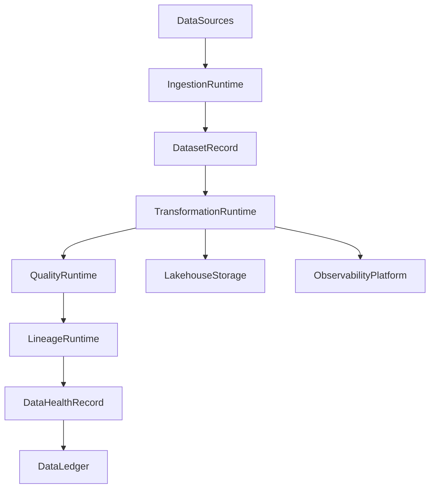

# Enterprise AI Software Factory
# Architecture Design Specification (ADS)

> **Document ID:** ADS-041-v4
>
> **Document Name:** Enterprise Data Platform & Lakehouse Architecture — Runtime & Data Infrastructure
>
> **Version:** 1.0.0
>
> **Classification:** Enterprise Runtime Specification
>
> **Importance:** CRITICAL
>
> **Depends On:** ADS-041-v1
>
> **Depends On:** ADS-041-v2
>
> **Depends On:** ADS-041-v3
>
> **Next:** ADS-041-v5 — End-to-End Data Lifecycle

---

# Executive Summary

This document specifies the runtime architecture responsible for continuously operating the Enterprise Data Platform & Lakehouse Architecture.

The Data Runtime coordinates ingestion, transformation, quality validation, lineage generation, metadata synchronization, storage management, and runtime observability while maintaining deterministic execution across distributed infrastructure.

Every ingestion is durable.

Every transformation is observable.

Every runtime interaction becomes immutable operational evidence.

---

# Runtime Philosophy

The Data Runtime follows eight principles.

- Deterministic Processing
- Durable Storage
- Immutable Data History
- Continuous Quality Enforcement
- Complete Lineage
- Operational Observability
- Replayable Pipelines
- Operational Resilience

Runtime execution never bypasses governance.

---

# Runtime Layers

## Ingestion Runtime

Responsible for

- Batch Ingestion
- Streaming Ingestion
- CDC Processing
- API Import
- File Import

---

## Transformation Runtime

Responsible for

- ETL
- ELT
- Data Enrichment
- Aggregation
- Normalization

---

## Quality Runtime

Responsible for

- Schema Validation
- Rule Evaluation
- Profiling
- Certification
- Quality Gates

---

## Lineage Runtime

Responsible for

- Dependency Recording
- Source Tracking
- Impact Analysis
- Metadata Synchronization
- Lineage Persistence

---

## Storage Runtime

Responsible for

- Bronze Layer
- Silver Layer
- Gold Layer
- Versioned Storage
- Data Lifecycle Management

---

## Health Runtime

Responsible for

- Ingestion Health
- Transformation Health
- Storage Health
- Quality Health
- Runtime Monitoring

---

# Runtime Architecture



The runtime coordinates every governed data lifecycle.

---

# Runtime Components

| Component | Responsibility |
|------------|----------------|
| Ingestion Runtime | Data acquisition |
| Transformation Runtime | Data processing |
| Quality Runtime | Data validation |
| Lineage Runtime | Dependency tracking |
| Storage Runtime | Lakehouse management |
| Health Runtime | Runtime monitoring |
| Data Ledger | Immutable operational history |

---

# Runtime Pipeline

```text
Register Dataset

↓

Ingest Data

↓

Transform Data

↓

Validate Quality

↓

Generate Lineage

↓

Publish Dataset

↓

Evaluate Health

↓

Persist Data Ledger
```

Every dataset follows the same runtime pipeline.

---

# Ingestion Runtime

Ingestion Runtime manages

- Source Connectivity
- Import Scheduling
- Schema Discovery
- Metadata Capture
- Data Partitioning
- Trace Context

Execution remains deterministic.

---

# Transformation Runtime

Transformation Runtime coordinates

- Data Cleansing
- Enrichment
- Schema Mapping
- Aggregation
- Partition Optimization
- Version Management

Transformation remains reproducible.

---

# Data Session Management

Every runtime execution creates or participates in a Data Session.

Each Data Session tracks

- Dataset Record
- Transformation Record
- Processing Window
- Execution Context
- Storage Targets
- Runtime Metadata

Data Sessions remain immutable.

---

# Runtime Guarantees

The Data Runtime guarantees

- Deterministic Data Processing
- Durable Dataset Storage
- Reliable Quality Validation
- Complete Lineage Generation
- Replayable Runtime History
- Observable Execution
- Immutable Operational History

---

# End of Part 1
