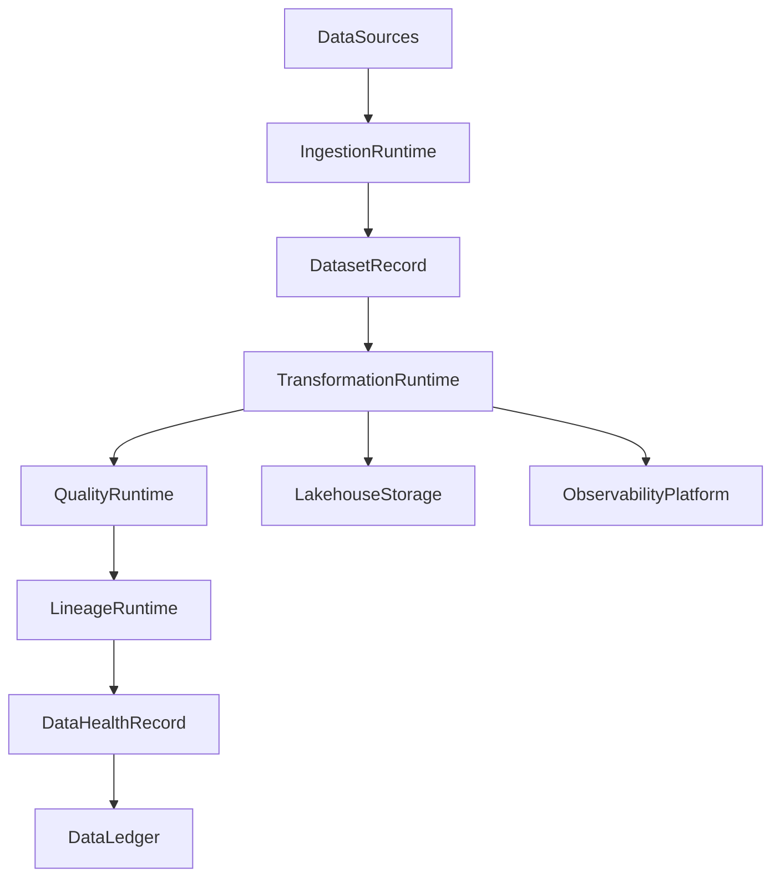
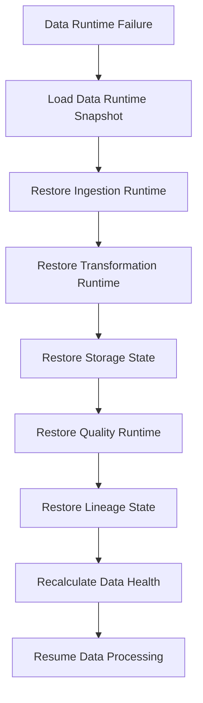

# Enterprise AI Software Factory
# Architecture Design Specification (ADS)

> **Document ID:** ADS-041-v4
>
> **Document Name:** Enterprise Data Platform & Lakehouse Architecture — Runtime & Data Infrastructure
>
> **Version:** 1.0.0
>
> **Classification:** Enterprise Runtime Specification
>
> **Importance:** CRITICAL
>
> **Depends On:** ADS-041-v1
>
> **Depends On:** ADS-041-v2
>
> **Depends On:** ADS-041-v3
>
> **Next:** ADS-041-v5 — End-to-End Data Lifecycle

---

# Executive Summary

This document specifies the runtime architecture responsible for continuously operating the Enterprise Data Platform & Lakehouse Architecture.

The Data Runtime coordinates ingestion, transformation, quality validation, lineage generation, metadata synchronization, storage management, and runtime observability while maintaining deterministic execution across distributed infrastructure.

Every ingestion is durable.

Every transformation is observable.

Every runtime interaction becomes immutable operational evidence.

---

# Runtime Philosophy

The Data Runtime follows eight principles.

- Deterministic Processing
- Durable Storage
- Immutable Data History
- Continuous Quality Enforcement
- Complete Lineage
- Operational Observability
- Replayable Pipelines
- Operational Resilience

Runtime execution never bypasses governance.

---

# Runtime Layers

## Ingestion Runtime

Responsible for

- Batch Ingestion
- Streaming Ingestion
- CDC Processing
- API Import
- File Import

---

## Transformation Runtime

Responsible for

- ETL
- ELT
- Data Enrichment
- Aggregation
- Normalization

---

## Quality Runtime

Responsible for

- Schema Validation
- Rule Evaluation
- Profiling
- Certification
- Quality Gates

---

## Lineage Runtime

Responsible for

- Dependency Recording
- Source Tracking
- Impact Analysis
- Metadata Synchronization
- Lineage Persistence

---

## Storage Runtime

Responsible for

- Bronze Layer
- Silver Layer
- Gold Layer
- Versioned Storage
- Data Lifecycle Management

---

## Health Runtime

Responsible for

- Ingestion Health
- Transformation Health
- Storage Health
- Quality Health
- Runtime Monitoring

---

# Runtime Architecture



The runtime coordinates every governed data lifecycle.

---

# Runtime Components

| Component | Responsibility |
|------------|----------------|
| Ingestion Runtime | Data acquisition |
| Transformation Runtime | Data processing |
| Quality Runtime | Data validation |
| Lineage Runtime | Dependency tracking |
| Storage Runtime | Lakehouse management |
| Health Runtime | Runtime monitoring |
| Data Ledger | Immutable operational history |

---

# Runtime Pipeline

```text
Register Dataset

↓

Ingest Data

↓

Transform Data

↓

Validate Quality

↓

Generate Lineage

↓

Publish Dataset

↓

Evaluate Health

↓

Persist Data Ledger
```

Every dataset follows the same runtime pipeline.

---

# Ingestion Runtime

Ingestion Runtime manages

- Source Connectivity
- Import Scheduling
- Schema Discovery
- Metadata Capture
- Data Partitioning
- Trace Context

Execution remains deterministic.

---

# Transformation Runtime

Transformation Runtime coordinates

- Data Cleansing
- Enrichment
- Schema Mapping
- Aggregation
- Partition Optimization
- Version Management

Transformation remains reproducible.

---

# Data Session Management

Every runtime execution creates or participates in a Data Session.

Each Data Session tracks

- Dataset Record
- Transformation Record
- Processing Window
- Execution Context
- Storage Targets
- Runtime Metadata

Data Sessions remain immutable.

---

# Runtime Guarantees

The Data Runtime guarantees

- Deterministic Data Processing
- Durable Dataset Storage
- Reliable Quality Validation
- Complete Lineage Generation
- Replayable Runtime History
- Observable Execution
- Immutable Operational History

---

# Failure Recovery

The Data Runtime automatically recovers from ingestion, transformation, storage, quality, lineage, and infrastructure failures while preserving deterministic execution.

Recovery follows approved governance policies.



Recovery guarantees

- No committed dataset loss
- No transformation duplication
- No lineage corruption
- Deterministic recovery

---

# Runtime Health Monitoring

Every runtime component continuously reports health.

Collected metrics

- Ingestion Runtime Health
- Transformation Runtime Health
- Storage Health
- Quality Runtime Health
- Lineage Runtime Health
- Active Data Sessions
- Processing Throughput
- Processing Latency

Health Flow

```text
Runtime Component

↓

Heartbeat

↓

Data Runtime Monitor

↓

Operations Dashboard

↓

Alert Engine

↓

Operations Team
```

Health monitoring remains continuous.

---

# Data Runtime Snapshot

The runtime periodically generates Data Runtime Snapshots.

```yaml
dataRuntimeSnapshot:

  snapshotId:

  generatedAt:

  activeIngestionJobs:

  activeTransformations:

  activeDataSessions:

  storageUtilization:

  qualityGateStatus:

  platformHealth:

  throughput:
```

Runtime Snapshots provide deterministic operational state.

---

# Runtime Configuration

Example

```yaml
dataRuntime:

  ingestion: enabled

  transformations: enabled

  qualityValidation: enabled

  lineageTracking: enabled

  lakehouseStorage: enabled

  dataLedger: enabled

  runtimeSnapshots: enabled

  snapshotInterval: 5m
```

Configuration remains version-controlled.

---

# Runtime Scaling

The Data Runtime supports

- Horizontal Ingestion Scaling
- Elastic Transformation Clusters
- Distributed Lakehouse Storage
- Parallel Quality Validation
- Multi-Region Replication

Scaling remains policy-driven.

---

# Runtime Isolation

The Data Runtime isolates

- Tenants
- Datasets
- Processing Jobs
- Storage Layers
- Quality Pipelines
- Lineage Pipelines

Isolation prevents cross-tenant and cross-domain interference.

---

# Prometheus Metrics

```text
data_runtime_snapshots_total

active_ingestion_jobs_total

active_transformations_total

active_data_sessions_total

storage_utilization_bytes

quality_gate_failures_total

lineage_generation_duration_seconds

data_runtime_health_score

dataset_processing_latency_seconds

data_throughput_bytes_total
```

---

# OpenTelemetry

Distributed tracing spans

```text
Data Source

↓

Ingestion Runtime

↓

Transformation Runtime

↓

Quality Runtime

↓

Lineage Runtime

↓

Lakehouse Storage

↓

Data Ledger
```

Every runtime stage contributes trace spans.

---

# Structured Logging

Example

```json
{
  "dataSession":"DSN-1029",
  "dataHealthRecord":"DHR-0144",
  "dataRuntimeSnapshot":"SNAP-0671",
  "dataset":"customer-master",
  "processingState":"Published",
  "traceId":"TRC-410221"
}
```

Logs remain immutable and correlated.

---

# Disaster Recovery

Recovery flow

```text
Data Runtime Failure

↓

Restore Data Runtime Snapshot

↓

Restore Processing State

↓

Restore Active Transformations

↓

Restore Quality State

↓

Validate Data Health

↓

Resume Data Processing
```

Recovery targets

Recovery Point Objective (RPO)

Near-zero committed data loss

Recovery Time Objective (RTO)

Less than five minutes

---

# Recommended Production Deployment

```text
Data Sources

↓

Ingestion Cluster

↓

Transformation Cluster

↓

Lakehouse Storage

↓

Quality Engine

↓

Metadata Catalog

↓

Lineage Engine

↓

Data Ledger

↓

OpenTelemetry

↓

Prometheus

↓

Grafana
```

---

# Technology Decision Records

## TDR-041-01

### Technology

Apache Spark (or equivalent distributed processing engine)

### Decision

Use a distributed data processing engine for large-scale batch and streaming transformations.

### Reason

Provides scalable processing, fault tolerance, and deterministic execution.

---

## TDR-041-02

### Technology

Open Table Format (Apache Iceberg, Delta Lake, or Apache Hudi)

### Decision

Adopt a transactional table format for lakehouse storage.

### Reason

Supports ACID transactions, schema evolution, versioning, and time travel.

---

## TDR-041-03

### Technology

Data Runtime Snapshot

### Decision

Persist periodic runtime snapshots.

### Reason

Supports diagnostics, replay, disaster recovery, and operational visibility.

---

## TDR-041-04

### Technology

Metadata Catalog

### Decision

Maintain a centralized metadata catalog for discovery and governance.

### Reason

Provides schema governance, ownership, lineage integration, and enterprise discoverability.

---

## TDR-041-05

### Technology

Data Quality Engine

### Decision

Enforce automated quality validation before publication.

### Reason

Ensures trusted, certified datasets for downstream consumers.

---

# Runtime Checklist

The Data Platform MUST

- Persist durable dataset state
- Execute deterministic transformations
- Enforce quality validation
- Generate complete lineage
- Generate Data Runtime Snapshots
- Maintain immutable operational history
- Continuously monitor runtime health

The Data Platform MUST NOT

- Publish uncertified datasets
- Lose committed dataset history
- Bypass governance policies
- Break tenant isolation
- Omit lineage for governed transformations

---

# Architecture Decision Records

## ADR-041-10

### Decision

Treat Data Runtime Snapshots as immutable runtime artifacts.

### Status

Accepted

### Reason

Snapshots improve diagnostics, replay, disaster recovery, and operational resilience.

---

## ADR-041-11

### Decision

Separate Ingestion Runtime from Transformation Runtime.

### Status

Accepted

### Reason

Independent scaling and lifecycle management improve throughput and maintainability.

---

## ADR-041-12

### Decision

Represent runtime execution through immutable Data Sessions.

### Status

Accepted

### Reason

Provides deterministic traceability, replayability, governance, and operational observability.

---

# Operational Readiness Scorecard

| Capability | Status |
|------------|--------|
| Ingestion Runtime | ✅ Required |
| Transformation Runtime | ✅ Required |
| Runtime Snapshots | ✅ Required |
| Quality Runtime | ✅ Required |
| Runtime Recovery | ✅ Required |
| Lineage Runtime | ✅ Required |
| OpenTelemetry | ✅ Required |
| Deterministic Execution | ✅ Required |

---

# Related Documents

ADS-021-v5 — Workflow Kernel

ADS-022-v5 — Identity & Trust Plane

ADS-025-v5 — Compute & Infrastructure Platform

ADS-026-v5 — Security Platform

ADS-027-v5 — Observability Platform

ADS-030-v5 — Integration & Ecosystem Platform

ADS-038-v5 — Enterprise Event Streaming, Messaging & Real-Time Data Platform

ADS-039-v5 — Enterprise API Gateway, Service Mesh & Traffic Management Platform

ADS-040-v5 — Enterprise Workflow Orchestration & Business Process Automation Platform

ADS-041-v1 — Architecture

ADS-041-v2 — Data Algorithms & Lifecycle

ADS-041-v3 — APIs, Schemas & Contracts

ADS-041-v5 — End-to-End Data Lifecycle

---

# End of Document
