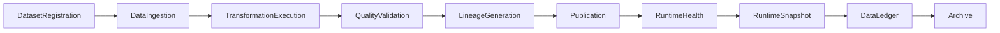

# Enterprise AI Software Factory
# Architecture Design Specification (ADS)

> **Document ID:** ADS-041-v5
>
> **Document Name:** Enterprise Data Platform & Lakehouse Architecture — End-to-End Data Lifecycle
>
> **Version:** 1.0.0
>
> **Classification:** Enterprise Reference Lifecycle
>
> **Importance:** CRITICAL
>
> **Depends On:** ADS-041-v1
>
> **Depends On:** ADS-041-v2
>
> **Depends On:** ADS-041-v3
>
> **Depends On:** ADS-041-v4
>
> **Status:** Reference Implementation

---

# Executive Summary

This document demonstrates the complete lifecycle of a governed enterprise dataset.

Each lifecycle stage produces immutable operational artifacts that together provide deterministic processing, governance, replayability, compliance, lineage, and observability.

---

# Reference Scenario

Global Retail Platform

Dataset

Customer Master

Daily Records Processed

1.8 Billion

Processing Modes

- Batch
- Streaming
- CDC

Storage Layers

- Bronze
- Silver
- Gold

Publication Policy

Quality Certified

---

# Complete Lifecycle



Every dataset follows a deterministic lifecycle.

---

# Stage 1

## Dataset Registration

A governed dataset is registered.

Artifact Produced

Dataset

```yaml
dataset:

  datasetId: DS-10084

  datasetName: CustomerMaster

  domain: Retail

  owner: CustomerPlatform

  schemaVersion: 4.1

  storageLayer: Bronze
```

The Dataset represents the immutable business definition.

---

# Stage 2

## Dataset Registration Processing

The Metadata Catalog performs

- Schema Validation
- Ownership Verification
- Classification
- Retention Assignment
- Governance Registration

Artifact Produced

Dataset Record

```yaml
datasetRecord:

  datasetRecordId: DR-4108

  dataset: DS-10084

  publicationStatus: Registered

  currentVersion: 4.1
```

The dataset is now governed.

---

# Stage 3

## Data Ingestion

The Ingestion Runtime performs

- Batch Import
- CDC Processing
- Streaming Capture
- Metadata Recording

Artifact Produced

Data Session

```yaml
dataSession:

  dataSessionId: DSN-1029

  datasetRecord: DR-4108

  executionState: Running

  processingWindow: Daily
```

The Data Session coordinates runtime processing.

---

# Stage 4

## Transformation Execution

The Transformation Runtime performs

- Cleansing
- Enrichment
- Normalization
- Aggregation

Artifact Produced

Transformation Record

```yaml
transformationRecord:

  transformationRecordId: TF-2091

  datasetRecord: DR-4108

  transformationName: CustomerNormalization

  executionStatus: Completed
```

Transformation history becomes immutable.

---

# Stage 5

## Quality Certification

The Quality Runtime evaluates

- Completeness
- Accuracy
- Consistency
- Freshness
- Referential Integrity

Artifact Produced

Quality Record

```yaml
qualityRecord:

  qualityRecordId: QR-1147

  datasetRecord: DR-4108

  certificationStatus: Certified

  qualityScore: 99.82
```

Only certified datasets proceed to publication.

---

# Stage 6

## Lineage Generation

The Lineage Runtime records complete data provenance.

Recorded information

- Source Datasets
- Target Dataset
- Transformation Dependencies
- Processing Engine
- Execution Timestamp
- Version Relationships

Artifact Produced

Lineage Record

```yaml
lineageRecord:

  lineageRecordId: LR-0812

  sourceDatasets:

    - CRM-Customer

    - Loyalty-Platform

  targetDataset: CustomerMaster

  transformationRecord: TF-2091

  lineageStatus: Complete
```

Lineage provides deterministic traceability.

---

# Stage 7

## Runtime Health Evaluation

The Health Runtime continuously evaluates platform health.

Evaluation includes

- Ingestion Runtime Health
- Transformation Runtime Health
- Storage Health
- Quality Runtime Health
- Lineage Runtime Health
- Processing Latency

Artifact Produced

Data Health Record

```yaml
dataHealthRecord:

  dataHealthRecordId: DHR-0144

  dataSession: DSN-1029

  ingestionHealth: Healthy

  transformationHealth: Healthy

  storageHealth: Healthy

  qualityHealth: Healthy

  latencyHealth: Normal
```

Health Records provide continuous operational visibility.

---

# Stage 8

## Runtime Snapshot Generation

The Data Runtime periodically captures platform state.

Artifact Produced

Data Runtime Snapshot

```yaml
dataRuntimeSnapshot:

  snapshotId: SNAP-0671

  activeIngestionJobs: 42

  activeTransformations: 118

  activeDataSessions: 97

  storageUtilization: 74%

  platformHealth: Healthy

  throughput: 14.2 TB/hour
```

Snapshots support diagnostics, replay, and disaster recovery.

---

# Stage 9

## Dataset Publication

The platform verifies

- Ingestion completed
- Transformations completed
- Quality certified
- Lineage recorded
- Governance approved

Dataset transitions to **Published**.

---

# Stage 10

## Immutable Ledger Persistence

The completed lifecycle is permanently recorded.

Artifact Produced

Data Ledger Entry

```yaml
dataLedgerEntry:

  entryId: DL-90218

  dataset: DS-10084

  datasetRecord: DR-4108

  transformationRecord: TF-2091

  qualityRecord: QR-1147

  lineageRecord: LR-0812

  dataSession: DSN-1029

  dataHealthRecord: DHR-0144

  dataRuntimeSnapshot: SNAP-0671

  traceId: TRC-410221

  digitalSignature: SHA256
```

The Data Ledger forms the authoritative operational audit trail.

---

# Stage 11

## Executive Governance Review

Enterprise leadership evaluates

- Dataset Freshness
- Data Quality Scores
- Pipeline Success Rate
- Storage Utilization
- Lineage Completeness
- Runtime Availability
- Governance Compliance
- Operational Risk

Executive dashboards consume immutable lifecycle artifacts for reproducible reporting.

---

# Stage 12

## Archive & Replay

Archived artifacts

- Dataset
- Dataset Record
- Transformation Record
- Quality Record
- Lineage Record
- Data Session
- Data Health Record
- Data Runtime Snapshot
- Data Ledger Entry

Replay capabilities include

- Ingestion Replay
- Transformation Replay
- Quality Verification
- Lineage Reconstruction
- Incident Investigation
- Compliance Reporting

Archived data remains immutable.

---

# Complete Artifact Lifecycle

```text
Dataset

↓

Dataset Record

↓

Transformation Record

↓

Quality Record

↓

Lineage Record

↓

Data Session

↓

Data Health Record

↓

Data Runtime Snapshot

↓

Data Ledger Entry

↓

Archive
```

Every artifact extends operational history without modifying previous artifacts.

---

# Reference Metrics

| Metric | Value |
|---------|------:|
| Records Processed / Day | 1.8 Billion |
| Active Data Sessions | 97 |
| Average Processing Latency | 4.3 min |
| Quality Certification Rate | 99.82% |
| Pipeline Success Rate | 99.94% |
| Lineage Coverage | 100% |
| Runtime Availability | 99.995% |
| Replay Success Rate | 100% |

---

# Lessons Learned

The platform demonstrates that

- Dataset definitions remain immutable.
- Data processing is deterministic and replayable.
- Quality validation is enforced before publication.
- Lineage is complete and independently traceable.
- Runtime health is continuously evaluated.
- Runtime snapshots enable diagnostics and disaster recovery.
- Ledger entries provide end-to-end auditability.

---

# Architecture Decision Records

## ADR-041-13

### Decision

Represent the complete data lifecycle using immutable operational artifacts.

### Status

Accepted

### Reason

Provides deterministic processing, governance, replayability, regulatory compliance, and operational resilience.

---

# Technology Decision Records

## TDR-041-06

### Technology

Data Ledger

### Decision

Persist all data lifecycle artifacts in an append-only ledger.

### Reason

Supports auditing, compliance, replay, incident response, and historical analytics.

---

# Operational Readiness Scorecard

| Capability | Status |
|------------|--------|
| End-to-End Data Traceability | ✅ Complete |
| Immutable Audit Trail | ✅ Complete |
| Quality Governance | ✅ Complete |
| Deterministic Processing | ✅ Complete |
| Runtime Health Monitoring | ✅ Complete |
| Runtime Snapshotting | ✅ Complete |
| Replay & Recovery | ✅ Complete |
| Executive Governance | ✅ Complete |

---

# Related Documents

ADS-021-v5 — Workflow Kernel

ADS-022-v5 — Identity & Trust Plane

ADS-025-v5 — Compute & Infrastructure Platform

ADS-026-v5 — Security Platform

ADS-027-v5 — Observability Platform

ADS-030-v5 — Integration & Ecosystem Platform

ADS-038-v5 — Enterprise Event Streaming, Messaging & Real-Time Data Platform

ADS-039-v5 — Enterprise API Gateway, Service Mesh & Traffic Management Platform

ADS-040-v5 — Enterprise Workflow Orchestration & Business Process Automation Platform

ADS-041-v1 — Architecture

ADS-041-v2 — Data Algorithms & Lifecycle

ADS-041-v3 — APIs, Schemas & Contracts

ADS-041-v4 — Runtime & Data Infrastructure

---

# End of Document
