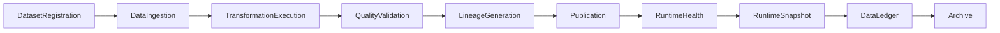

# Enterprise AI Software Factory
# Architecture Design Specification (ADS)

> **Document ID:** ADS-041-v5
>
> **Document Name:** Enterprise Data Platform & Lakehouse Architecture — End-to-End Data Lifecycle
>
> **Version:** 1.0.0
>
> **Classification:** Enterprise Reference Lifecycle
>
> **Importance:** CRITICAL
>
> **Depends On:** ADS-041-v1
>
> **Depends On:** ADS-041-v2
>
> **Depends On:** ADS-041-v3
>
> **Depends On:** ADS-041-v4
>
> **Status:** Reference Implementation

---

# Executive Summary

This document demonstrates the complete lifecycle of a governed enterprise dataset.

Each lifecycle stage produces immutable operational artifacts that together provide deterministic processing, governance, replayability, compliance, lineage, and observability.

---

# Reference Scenario

Global Retail Platform

Dataset

Customer Master

Daily Records Processed

1.8 Billion

Processing Modes

- Batch
- Streaming
- CDC

Storage Layers

- Bronze
- Silver
- Gold

Publication Policy

Quality Certified

---

# Complete Lifecycle



Every dataset follows a deterministic lifecycle.

---

# Stage 1

## Dataset Registration

A governed dataset is registered.

Artifact Produced

Dataset

```yaml
dataset:

  datasetId: DS-10084

  datasetName: CustomerMaster

  domain: Retail

  owner: CustomerPlatform

  schemaVersion: 4.1

  storageLayer: Bronze
```

The Dataset represents the immutable business definition.

---

# Stage 2

## Dataset Registration Processing

The Metadata Catalog performs

- Schema Validation
- Ownership Verification
- Classification
- Retention Assignment
- Governance Registration

Artifact Produced

Dataset Record

```yaml
datasetRecord:

  datasetRecordId: DR-4108

  dataset: DS-10084

  publicationStatus: Registered

  currentVersion: 4.1
```

The dataset is now governed.

---

# Stage 3

## Data Ingestion

The Ingestion Runtime performs

- Batch Import
- CDC Processing
- Streaming Capture
- Metadata Recording

Artifact Produced

Data Session

```yaml
dataSession:

  dataSessionId: DSN-1029

  datasetRecord: DR-4108

  executionState: Running

  processingWindow: Daily
```

The Data Session coordinates runtime processing.

---

# Stage 4

## Transformation Execution

The Transformation Runtime performs

- Cleansing
- Enrichment
- Normalization
- Aggregation

Artifact Produced

Transformation Record

```yaml
transformationRecord:

  transformationRecordId: TF-2091

  datasetRecord: DR-4108

  transformationName: CustomerNormalization

  executionStatus: Completed
```

Transformation history becomes immutable.

---

# Stage 5

## Quality Certification

The Quality Runtime evaluates

- Completeness
- Accuracy
- Consistency
- Freshness
- Referential Integrity

Artifact Produced

Quality Record

```yaml
qualityRecord:

  qualityRecordId: QR-1147

  datasetRecord: DR-4108

  certificationStatus: Certified

  qualityScore: 99.82
```

Only certified datasets proceed to publication.

---

# End of Part 1
