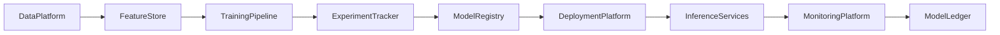

# Enterprise AI Software Factory
# Architecture Design Specification (ADS)

> **Document ID:** ADS-042-v1
>
> **Document Name:** Enterprise AI/ML Platform & MLOps — Architecture
>
> **Version:** 1.0.0
>
> **Classification:** Enterprise Platform Plane
>
> **Importance:** CRITICAL
>
> **Status:** Active

---

# Executive Summary

The Enterprise AI/ML Platform & MLOps provides a governed foundation for developing, training, validating, deploying, monitoring, and continuously improving machine learning models across the enterprise.

The platform unifies feature engineering, experiment tracking, model registry, deployment pipelines, inference services, model monitoring, drift detection, and responsible AI governance into a single architecture.

Every model is versioned.

Every experiment is reproducible.

Every prediction is traceable.

---

# Platform Responsibilities

The platform SHALL provide

- Feature Engineering
- Feature Store
- Experiment Tracking
- Model Training
- Hyperparameter Optimization
- Model Validation
- Model Registry
- Model Deployment
- Online & Batch Inference
- Model Monitoring
- Drift Detection
- Responsible AI Governance
- Model Ledger

---

# Architectural Principles

The platform follows

- Reproducible ML
- Immutable Model History
- Feature Reuse
- Continuous Validation
- Responsible AI by Default
- Policy-Driven Deployment
- Replayable Inference
- Operational Observability

---

# High-Level Architecture



The MLOps Platform governs the entire model lifecycle.

---

# Core Components

## Feature Store

Responsible for

- Offline Features
- Online Features
- Feature Versioning
- Feature Discovery
- Feature Reuse

---

## Training Pipeline

Responsible for

- Dataset Preparation
- Model Training
- Hyperparameter Search
- Distributed Training
- Artifact Generation

---

## Experiment Tracker

Responsible for

- Experiment Recording
- Metrics Tracking
- Parameter Tracking
- Artifact Storage
- Reproducibility

---

## Model Registry

Responsible for

- Model Versioning
- Model Promotion
- Approval Workflow
- Metadata
- Lineage

---

## Deployment Platform

Responsible for

- Batch Deployment
- Online Deployment
- Canary Rollout
- Blue-Green Deployment
- Rollback

---

## Monitoring Platform

Responsible for

- Accuracy Monitoring
- Drift Detection
- Latency Monitoring
- Resource Utilization
- Prediction Quality

---

## Model Ledger

Responsible for

- Immutable Model History
- Audit Records
- Replay Support
- Compliance Evidence

---

# Primary Artifact

Every governed machine learning model begins with a Model Definition.

```yaml
model:

  modelId:

  modelName:

  modelType:

  framework:

  owner:

  version:

  trainingDataset:

  approvalStatus:

  createdAt:
```

The Model Definition is immutable after publication.

---

# End of Part 1
