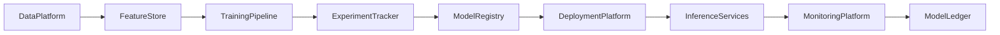
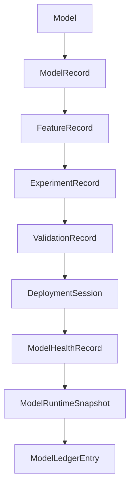

# Enterprise AI Software Factory
# Architecture Design Specification (ADS)

> **Document ID:** ADS-042-v1
>
> **Document Name:** Enterprise AI/ML Platform & MLOps — Architecture
>
> **Version:** 1.0.0
>
> **Classification:** Enterprise Platform Plane
>
> **Importance:** CRITICAL
>
> **Status:** Active

---

# Executive Summary

The Enterprise AI/ML Platform & MLOps provides a governed foundation for developing, training, validating, deploying, monitoring, and continuously improving machine learning models across the enterprise.

The platform unifies feature engineering, experiment tracking, model registry, deployment pipelines, inference services, model monitoring, drift detection, and responsible AI governance into a single architecture.

Every model is versioned.

Every experiment is reproducible.

Every prediction is traceable.

---

# Platform Responsibilities

The platform SHALL provide

- Feature Engineering
- Feature Store
- Experiment Tracking
- Model Training
- Hyperparameter Optimization
- Model Validation
- Model Registry
- Model Deployment
- Online & Batch Inference
- Model Monitoring
- Drift Detection
- Responsible AI Governance
- Model Ledger

---

# Architectural Principles

The platform follows

- Reproducible ML
- Immutable Model History
- Feature Reuse
- Continuous Validation
- Responsible AI by Default
- Policy-Driven Deployment
- Replayable Inference
- Operational Observability

---

# High-Level Architecture



The MLOps Platform governs the entire model lifecycle.

---

# Core Components

## Feature Store

Responsible for

- Offline Features
- Online Features
- Feature Versioning
- Feature Discovery
- Feature Reuse

---

## Training Pipeline

Responsible for

- Dataset Preparation
- Model Training
- Hyperparameter Search
- Distributed Training
- Artifact Generation

---

## Experiment Tracker

Responsible for

- Experiment Recording
- Metrics Tracking
- Parameter Tracking
- Artifact Storage
- Reproducibility

---

## Model Registry

Responsible for

- Model Versioning
- Model Promotion
- Approval Workflow
- Metadata
- Lineage

---

## Deployment Platform

Responsible for

- Batch Deployment
- Online Deployment
- Canary Rollout
- Blue-Green Deployment
- Rollback

---

## Monitoring Platform

Responsible for

- Accuracy Monitoring
- Drift Detection
- Latency Monitoring
- Resource Utilization
- Prediction Quality

---

## Model Ledger

Responsible for

- Immutable Model History
- Audit Records
- Replay Support
- Compliance Evidence

---

# Primary Artifact

Every governed machine learning model begins with a Model Definition.

```yaml
model:

  modelId:

  modelName:

  modelType:

  framework:

  owner:

  version:

  trainingDataset:

  approvalStatus:

  createdAt:
```

The Model Definition is immutable after publication.

---

# Model Record

Every registered model creates a Model Record.

```yaml
modelRecord:

  modelRecordId:

  model:

  experiment:

  registryVersion:

  deploymentStatus:

  validationStatus:

  approvalStatus:

  createdAt:

  updatedAt:
```

Model Records maintain immutable publication metadata.

---

# Feature Record

Every governed feature generates a Feature Record.

```yaml
featureRecord:

  featureRecordId:

  featureName:

  featureVersion:

  sourceDataset:

  transformationLogic:

  featureOwner:

  featureStatus:

  createdAt:
```

Feature Records preserve feature lineage and reuse.

---

# Experiment Record

Every training execution generates an Experiment Record.

```yaml
experimentRecord:

  experimentRecordId:

  modelRecord:

  trainingDataset:

  hyperparameters:

  metrics:

  executionEnvironment:

  experimentStatus:

  completedAt:
```

Experiment Records ensure reproducibility.

---

# Validation Record

Every validation process creates a Validation Record.

```yaml
validationRecord:

  validationRecordId:

  modelRecord:

  validationDataset:

  evaluationMetrics:

  fairnessAssessment:

  robustnessAssessment:

  validationStatus:

  evaluatedAt:
```

Validation Records remain append-only.

---

# Deployment Session

Every deployment creates a Deployment Session.

```yaml
deploymentSession:

  deploymentSessionId:

  modelRecord:

  deploymentStrategy:

  targetEnvironment:

  deploymentState:

  rolloutPercentage:

  startedAt:

  completedAt:
```

Deployment Sessions represent active runtime deployment.

---

# Model Health Record

Operational model health is continuously evaluated.

```yaml
modelHealthRecord:

  modelHealthRecordId:

  deploymentSession:

  inferenceHealth:

  latencyHealth:

  driftHealth:

  accuracyHealth:

  resourceHealth:

  evaluatedAt:
```

Health remains independent from deployment history.

---

# Model Runtime Snapshot

The platform periodically generates runtime snapshots.

```yaml
modelRuntimeSnapshot:

  snapshotId:

  generatedAt:

  activeDeployments:

  activeInferenceEndpoints:

  activeExperiments:

  platformHealth:

  throughput:
```

Snapshots support replay and disaster recovery.

---

# Model Ledger Entry

Every completed lifecycle generates an immutable ledger entry.

```yaml
modelLedgerEntry:

  entryId:

  model:

  modelRecord:

  featureRecord:

  experimentRecord:

  validationRecord:

  deploymentSession:

  modelHealthRecord:

  modelRuntimeSnapshot:

  traceId:

  timestamp:

  digitalSignature:
```

Ledger Entries provide authoritative audit history.

---

# Platform Architecture



Every artifact extends the operational lifecycle without modifying prior artifacts.

---

# Model Lifecycle Overview

```text
Model Definition

↓

Feature Engineering

↓

Model Training

↓

Validation

↓

Deployment

↓

Inference

↓

Health Evaluation

↓

Runtime Snapshot

↓

Ledger Persistence

↓

Archive
```

The lifecycle remains deterministic and reproducible.

---

# Platform Guarantees

The AI/ML Platform guarantees

- Immutable Model Definitions
- Reproducible Training
- Feature Reuse
- Continuous Model Validation
- Responsible AI Governance
- Replayable Inference History
- Continuous Health Monitoring
- Immutable Operational History

---

# Architecture Decision Records

## ADR-042-01

### Decision

Represent every governed model using immutable operational artifacts.

### Status

Accepted

### Reason

Artifact-centric model management improves governance, reproducibility, compliance, and observability.

---

## ADR-042-02

### Decision

Separate model definitions from runtime deployment state.

### Status

Accepted

### Reason

Enables independent versioning, scalable deployment, rollback, and deterministic replay.

---

## ADR-042-03

### Decision

Model feature engineering as independent Feature Records.

### Status

Accepted

### Reason

Supports feature reuse, lineage, governance, and reproducible training.

---

# Operational Readiness Scorecard

| Capability | Status |
|------------|--------|
| Model Definitions | ✅ Required |
| Feature Store | ✅ Required |
| Experiment Tracking | ✅ Required |
| Model Validation | ✅ Required |
| Model Deployment | ✅ Required |
| Runtime Snapshots | ✅ Required |
| Immutable Ledger | ✅ Required |
| Deterministic Replay | ✅ Required |

---

# Related Documents

ADS-021-v5 — Workflow Kernel

ADS-022-v5 — Identity & Trust Plane

ADS-025-v5 — Compute & Infrastructure Platform

ADS-026-v5 — Security Platform

ADS-027-v5 — Observability Platform

ADS-030-v5 — Integration & Ecosystem Platform

ADS-038-v5 — Enterprise Event Streaming, Messaging & Real-Time Data Platform

ADS-039-v5 — Enterprise API Gateway, Service Mesh & Traffic Management Platform

ADS-040-v5 — Enterprise Workflow Orchestration & Business Process Automation Platform

ADS-041-v5 — Enterprise Data Platform & Lakehouse Architecture

ADS-042-v2 — ML Algorithms & Lifecycle

---

# End of Document
