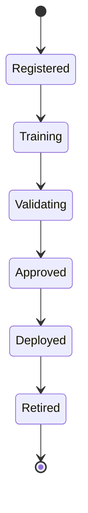

# Enterprise AI Software Factory
# Architecture Design Specification (ADS)

> **Document ID:** ADS-042-v2
>
> **Document Name:** Enterprise AI/ML Platform & MLOps — ML Algorithms & Lifecycle
>
> **Version:** 1.0.0
>
> **Classification:** Enterprise Platform Plane
>
> **Importance:** CRITICAL
>
> **Depends On:** ADS-042-v1
>
> **Next:** ADS-042-v3 — APIs, Models & Contracts

---

# Executive Summary

This document defines the lifecycle algorithms governing feature engineering, experiment execution, model training, validation, deployment, inference, monitoring, drift detection, and model retirement.

Every model follows a deterministic lifecycle.

Every experiment is reproducible.

Every deployment is governed.

---

# Design Philosophy

The Model Lifecycle follows six principles.

- Reproducible Training
- Immutable Model History
- Feature Reuse
- Continuous Validation
- Responsible AI
- Policy-Driven Deployment

---

# ALG-042-001

## Model Registration

Every governed model SHALL begin with Model Registration.

Registration performs

- Model Validation
- Framework Verification
- Ownership Assignment
- Domain Classification
- Registry Initialization
- Metadata Registration

Successful registration creates a Model Record.

---

# Model

```yaml
model:

  modelId:

  modelName:

  modelType:

  framework:

  owner:

  version:

  trainingDataset:

  approvalStatus:

  createdAt:
```

Model definitions remain immutable.

---

# ALG-042-002

## Feature Engineering

The Feature Store coordinates

- Feature Extraction
- Feature Normalization
- Feature Encoding
- Feature Versioning
- Feature Registration
- Feature Reuse

Every feature update generates a Feature Record.

---

# ALG-042-003

## Model Training

The Training Pipeline performs

- Dataset Preparation
- Feature Loading
- Training Execution
- Hyperparameter Search
- Checkpointing
- Artifact Generation

Every training execution generates an Experiment Record.

---

# ALG-042-004

## Model Validation

The Validation Engine evaluates

- Accuracy
- Precision
- Recall
- F1 Score
- Fairness
- Robustness
- Explainability

Validation produces a Validation Record.

---

# Validation Gates

| Gate | Purpose |
|--------|----------|
| Functional | Model correctness |
| Statistical | Performance metrics |
| Responsible AI | Fairness & bias |
| Operational | Deployment readiness |

Models advance only after passing the required validation gates.

---

# ALG-042-005

## Deployment Promotion

The Deployment Platform evaluates

- Validation Status
- Approval Status
- Rollout Strategy
- Environment Readiness
- Deployment Policy
- Rollback Criteria

Successful promotion creates a Deployment Session.

---

# Model States

| State | Description |
|---------|-------------|
| Registered | Model defined |
| Training | Model learning |
| Validating | Evaluation in progress |
| Approved | Ready for deployment |
| Deployed | Serving inference |
| Retired | No longer active |

State transitions remain deterministic.

---

# Model Record

Every registered model generates a Model Record.

```yaml
modelRecord:

  modelRecordId:

  model:

  experiment:

  registryVersion:

  deploymentStatus:

  validationStatus:

  approvalStatus:

  createdAt:

  updatedAt:
```

Model Records remain append-only.

---

# ALG-042-006

## Online & Batch Inference

The Inference Platform executes predictions through governed inference pipelines.

Inference evaluates

- Feature Availability
- Model Version
- Deployment Status
- Request Validation
- Resource Availability
- Policy Compliance

Every inference is traceable.

---

# ALG-042-007

## Model Monitoring

The Monitoring Platform continuously evaluates

- Prediction Accuracy
- Latency
- Throughput
- Resource Utilization
- Error Rate
- Drift Indicators

Monitoring updates Model Health Records.

---

# ALG-042-008

## Model Retirement

A model transitions to retirement when

- Superseded by a newer version
- Business approval granted
- Regulatory retention satisfied
- Deployment removed
- Historical artifacts archived

Retirement preserves all operational evidence.

---

# Experiment Record

Every training execution generates an Experiment Record.

```yaml
experimentRecord:

  experimentRecordId:

  modelRecord:

  trainingDataset:

  featureSet:

  hyperparameters:

  metrics:

  executionEnvironment:

  experimentStatus:

  startedAt:

  completedAt:
```

Experiment Records remain immutable after completion.

---

# Model Lifecycle



Every model progresses through deterministic lifecycle states.

---

# Training Pipeline

```text
Model Registered

↓

Feature Engineering

↓

Training

↓

Validation

↓

Approval

↓

Deployment

↓

Inference

↓

Retirement
```

Every training stage remains reproducible.

---

# Inference Pipeline

```text
Inference Request

↓

Feature Retrieval

↓

Model Selection

↓

Prediction

↓

Post Processing

↓

Prediction Response

↓

Inference Logging
```

Every prediction remains auditable.

---

# Failure Handling

Failures are classified as

| Failure | Recovery Strategy |
|----------|-------------------|
| Training Failure | Retry Training |
| Validation Failure | Reject Promotion |
| Deployment Failure | Rollback |
| Inference Failure | Retry / Failover |
| Drift Detection | Trigger Retraining |
| Registry Failure | Retry Registration |

Recovery policies remain governance-controlled.

---

# Prometheus Metrics

```text
model_registrations_total

training_runs_total

experiment_executions_total

validation_runs_total

deployment_promotions_total

prediction_requests_total

prediction_latency_seconds

model_drift_events_total

model_retirements_total

training_duration_seconds
```

---

# Structured Logging

Example

```json
{
  "modelRecord":"MR-5104",
  "experimentRecord":"ER-1208",
  "validationRecord":"VR-0441",
  "deploymentSession":"DEP-3017",
  "modelState":"Deployed",
  "traceId":"TRC-520441"
}
```

Logs remain immutable and fully correlated.

---

# Architecture Decision Records

## ADR-042-04

### Decision

Require successful validation before deployment promotion.

### Status

Accepted

### Reason

Ensures only governed, verified models reach production.

---

## ADR-042-05

### Decision

Represent every training execution as an independent Experiment Record.

### Status

Accepted

### Reason

Supports reproducibility, benchmarking, optimization, and operational observability.

---

## ADR-042-06

### Decision

Persist immutable model history for replay.

### Status

Accepted

### Reason

Supports auditing, diagnostics, regulatory compliance, and deterministic inference replay.

---

# Operational Readiness Scorecard

| Capability | Status |
|------------|--------|
| Model Registration | ✅ Required |
| Feature Engineering | ✅ Required |
| Model Training | ✅ Required |
| Validation | ✅ Required |
| Deployment Promotion | ✅ Required |
| Model Monitoring | ✅ Required |
| Immutable History | ✅ Required |
| Replay Support | ✅ Required |

---

# Related Documents

ADS-021-v5 — Workflow Kernel

ADS-022-v5 — Identity & Trust Plane

ADS-025-v5 — Compute & Infrastructure Platform

ADS-026-v5 — Security Platform

ADS-027-v5 — Observability Platform

ADS-030-v5 — Integration & Ecosystem Platform

ADS-038-v5 — Enterprise Event Streaming, Messaging & Real-Time Data Platform

ADS-039-v5 — Enterprise API Gateway, Service Mesh & Traffic Management Platform

ADS-040-v5 — Enterprise Workflow Orchestration & Business Process Automation Platform

ADS-041-v5 — Enterprise Data Platform & Lakehouse Architecture

ADS-042-v1 — Architecture

ADS-042-v3 — APIs, Models & Contracts

---

# End of Document
