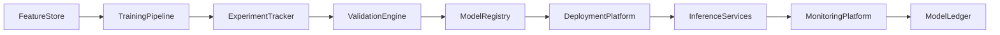

# Enterprise AI Software Factory
# Architecture Design Specification (ADS)

> **Document ID:** ADS-042-v3
>
> **Document Name:** Enterprise AI/ML Platform & MLOps — APIs, Models & Contracts
>
> **Version:** 1.0.0
>
> **Classification:** Enterprise Platform Plane
>
> **Importance:** CRITICAL
>
> **Depends On:** ADS-042-v1
>
> **Depends On:** ADS-042-v2
>
> **Next:** ADS-042-v4 — Runtime & MLOps Infrastructure

---

# Executive Summary

This document defines the APIs, contracts, schemas, governance interfaces, and operational events for the Enterprise AI/ML Platform & MLOps.

Every model contract is versioned.

Every experiment is governed.

Every deployment is auditable.

---

# REST APIs

## API-042-001

### Register Model

```http
POST /ml/v1/models
```

Registers a governed model definition.

---

## API-042-002

### Start Training

```http
POST /ml/v1/training
```

Starts a training execution.

Request

```json
{
  "modelId":"ML-10091",
  "trainingDataset":"customer-churn-v5",
  "featureSet":"feature-set-v12",
  "tenant":"tenant-a",
  "traceId":"TRC-520441"
}
```

Response

```json
{
  "modelRecordId":"MR-5104",
  "experimentRecordId":"ER-1208",
  "status":"Training"
}
```

---

## API-042-003

### Validate Model

```http
POST /ml/v1/validation
```

Executes governed model validation.

---

## API-042-004

### Deploy Model

```http
POST /ml/v1/deployments
```

Creates a governed deployment.

---

## API-042-005

### Query Model

```http
GET /ml/v1/models/{modelRecordId}
```

Returns the governed model lifecycle state.

---

# gRPC Service

```protobuf
service EnterpriseMLPlatformService {

  rpc RegisterModel(ModelDefinition)
      returns (ModelResponse);

  rpc StartTraining(TrainingRequest)
      returns (TrainingResponse);

  rpc ValidateModel(ValidationRequest)
      returns (ValidationResponse);

  rpc DeployModel(DeploymentRequest)
      returns (DeploymentResponse);

  rpc QueryModel(QueryModelRequest)
      returns (ModelRecord);
}
```

---

# Core Schemas

## Model

```yaml
model:

  modelId:

  modelName:

  modelType:

  framework:

  owner:

  version:

  trainingDataset:

  approvalStatus:

  createdAt:
```

---

## Model Record

```yaml
modelRecord:

  modelRecordId:

  model:

  experiment:

  registryVersion:

  deploymentStatus:

  validationStatus:

  approvalStatus:

  createdAt:

  updatedAt:
```

---

## Experiment Record

```yaml
experimentRecord:

  experimentRecordId:

  modelRecord:

  trainingDataset:

  featureSet:

  hyperparameters:

  metrics:

  executionEnvironment:

  experimentStatus:

  startedAt:

  completedAt:
```

---

## Validation Record

```yaml
validationRecord:

  validationRecordId:

  modelRecord:

  experimentRecord:

  validationDataset:

  evaluationMetrics:

  fairnessAssessment:

  robustnessAssessment:

  explainabilityAssessment:

  certificationStatus:

  evaluatedAt:
```

---

# MCP Tools

The platform exposes

- register_model
- start_training
- validate_model
- deploy_model
- query_model
- inference_status
- model_drift
- deployment_health

---

# Platform Events

## EVT-042-001

ModelRegistered

---

## EVT-042-002

TrainingStarted

---

## EVT-042-003

ExperimentCompleted

---

## EVT-042-004

ModelValidated

---

## EVT-042-005

ModelApproved

---

## EVT-042-006

ModelDeployed

---

## EVT-042-007

DriftDetected

---

## EVT-042-008

ModelRetired

---

# Model Event Flow



Every ML operation produces immutable operational evidence.

---

# End of Part 1
