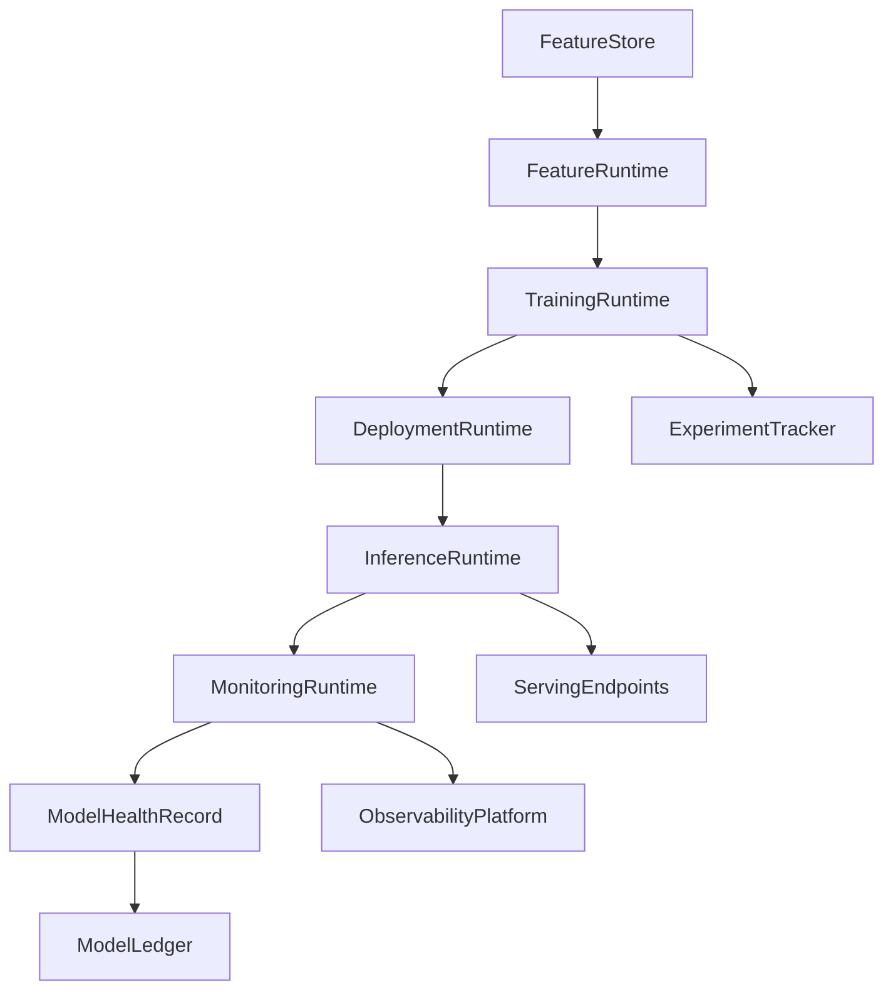
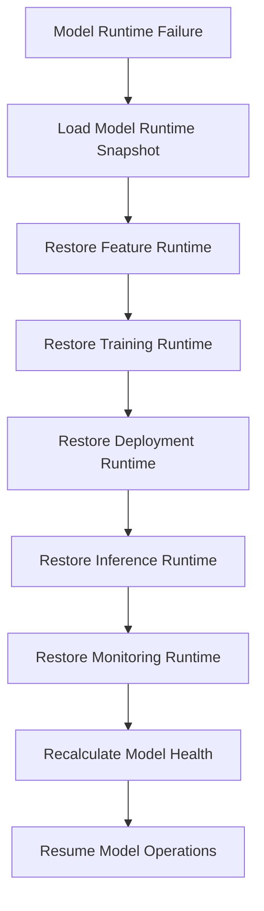

# Enterprise AI Software Factory
# Architecture Design Specification (ADS)

> **Document ID:** ADS-042-v4
>
> **Document Name:** Enterprise AI/ML Platform & MLOps — Runtime & MLOps Infrastructure
>
> **Version:** 1.0.0
>
> **Classification:** Enterprise Runtime Specification
>
> **Importance:** CRITICAL
>
> **Depends On:** ADS-042-v1
>
> **Depends On:** ADS-042-v2
>
> **Depends On:** ADS-042-v3
>
> **Next:** ADS-042-v5 — End-to-End Model Lifecycle

---

# Executive Summary

This document specifies the runtime architecture responsible for continuously operating the Enterprise AI/ML Platform & MLOps.

The Model Runtime coordinates feature serving, model training, validation, deployment orchestration, inference, monitoring, drift detection, rollback, and runtime observability while maintaining deterministic execution across distributed infrastructure.

Every deployment is durable.

Every prediction is observable.

Every runtime interaction becomes immutable operational evidence.

---

# Runtime Philosophy

The Model Runtime follows eight principles.

- Deterministic Inference
- Reproducible Training
- Immutable Model History
- Continuous Monitoring
- Responsible AI Enforcement
- Operational Observability
- Replayable Predictions
- Operational Resilience

Runtime execution never bypasses governance.

---

# Runtime Layers

## Feature Runtime

Responsible for

- Online Feature Serving
- Offline Feature Retrieval
- Feature Cache
- Feature Synchronization
- Feature Freshness

---

## Training Runtime

Responsible for

- Distributed Training
- Hyperparameter Search
- Checkpointing
- Artifact Generation
- Experiment Coordination

---

## Deployment Runtime

Responsible for

- Model Promotion
- Canary Deployment
- Blue-Green Deployment
- Rollback
- Endpoint Management

---

## Inference Runtime

Responsible for

- Request Validation
- Feature Resolution
- Model Selection
- Prediction Execution
- Response Generation

---

## Monitoring Runtime

Responsible for

- Accuracy Monitoring
- Drift Detection
- Latency Monitoring
- Resource Monitoring
- Responsible AI Monitoring

---

## Health Runtime

Responsible for

- Deployment Health
- Inference Health
- Feature Health
- Runtime Health
- Platform Monitoring

---

# Runtime Architecture



The runtime coordinates every governed model lifecycle.

---

# Runtime Components

| Component | Responsibility |
|------------|----------------|
| Feature Runtime | Feature serving |
| Training Runtime | Model training |
| Deployment Runtime | Model deployment |
| Inference Runtime | Prediction execution |
| Monitoring Runtime | Model monitoring |
| Health Runtime | Runtime monitoring |
| Model Ledger | Immutable operational history |

---

# Runtime Pipeline

```text
Register Model

↓

Load Features

↓

Train Model

↓

Validate Model

↓

Deploy Model

↓

Serve Predictions

↓

Monitor Model

↓

Persist Model Ledger
```

Every model follows the same runtime pipeline.

---

# Feature Runtime

Feature Runtime manages

- Feature Retrieval
- Feature Freshness
- Feature Versioning
- Cache Management
- Trace Context
- Consistency Verification

Execution remains deterministic.

---

# Inference Runtime

Inference Runtime coordinates

- Request Validation
- Feature Resolution
- Model Selection
- Prediction Execution
- Response Generation
- Prediction Logging

Inference remains reproducible.

---

# Deployment Session Management

Every runtime deployment creates or participates in a Deployment Session.

Each Deployment Session tracks

- Model Record
- Deployment Strategy
- Active Endpoints
- Rollout Percentage
- Runtime Metadata
- Deployment Context

Deployment Sessions remain immutable.

---

# Runtime Guarantees

The Model Runtime guarantees

- Deterministic Predictions
- Reproducible Training
- Reliable Model Deployment
- Continuous Drift Detection
- Replayable Runtime History
- Observable Execution
- Immutable Operational History

---

# Failure Recovery

The Model Runtime automatically recovers from training, deployment, inference, feature serving, monitoring, and infrastructure failures while preserving deterministic execution.

Recovery follows approved governance policies.



Recovery guarantees

- No deployed model loss
- No experiment duplication
- No inference audit loss
- Deterministic recovery

---

# Runtime Health Monitoring

Every runtime component continuously reports health.

Collected metrics

- Feature Runtime Health
- Training Runtime Health
- Deployment Runtime Health
- Inference Runtime Health
- Monitoring Runtime Health
- Active Deployment Sessions
- Prediction Throughput
- Prediction Latency

Health Flow

```text
Runtime Component

↓

Heartbeat

↓

Model Runtime Monitor

↓

Operations Dashboard

↓

Alert Engine

↓

Operations Team
```

Health monitoring remains continuous.

---

# Model Runtime Snapshot

The runtime periodically generates Model Runtime Snapshots.

```yaml
modelRuntimeSnapshot:

  snapshotId:

  generatedAt:

  activeDeployments:

  activeInferenceEndpoints:

  activeTrainingJobs:

  activeExperiments:

  driftStatus:

  platformHealth:

  throughput:
```

Runtime Snapshots provide deterministic operational state.

---

# Runtime Configuration

Example

```yaml
modelRuntime:

  featureServing: enabled

  training: enabled

  validation: enabled

  deployments: enabled

  inference: enabled

  driftDetection: enabled

  modelLedger: enabled

  runtimeSnapshots: enabled

  snapshotInterval: 5m
```

Configuration remains version-controlled.

---

# Runtime Scaling

The Model Runtime supports

- Horizontal Inference Scaling
- Elastic Training Clusters
- Distributed Feature Serving
- Multi-Region Deployments
- GPU Resource Pooling

Scaling remains policy-driven.

---

# Runtime Isolation

The Model Runtime isolates

- Tenants
- Model Deployments
- Training Jobs
- Inference Endpoints
- Feature Stores
- Monitoring Pipelines

Isolation prevents cross-tenant and cross-model interference.

---

# Prometheus Metrics

```text
model_runtime_snapshots_total

active_training_jobs_total

active_deployments_total

active_inference_endpoints_total

prediction_requests_total

prediction_latency_seconds

model_drift_events_total

feature_cache_hit_ratio

model_runtime_health_score

gpu_utilization_percent
```

---

# OpenTelemetry

Distributed tracing spans

```text
Inference Request

↓

Feature Runtime

↓

Inference Runtime

↓

Monitoring Runtime

↓

Model Ledger
```

Training flow

```text
Training Request

↓

Training Runtime

↓

Experiment Tracker

↓

Validation Runtime

↓

Model Registry

↓

Deployment Runtime
```

Every runtime stage contributes trace spans.

---

# Structured Logging

Example

```json
{
  "deploymentSession":"DEP-3017",
  "modelHealthRecord":"MHR-0209",
  "modelRuntimeSnapshot":"SNAP-0874",
  "model":"customer-churn-v12",
  "deploymentState":"Active",
  "traceId":"TRC-520441"
}
```

Logs remain immutable and correlated.

---

# Disaster Recovery

Recovery flow

```text
Model Runtime Failure

↓

Restore Model Runtime Snapshot

↓

Restore Deployment State

↓

Restore Active Endpoints

↓

Restore Monitoring State

↓

Validate Model Health

↓

Resume Inference
```

Recovery targets

Recovery Point Objective (RPO)

Near-zero operational state loss

Recovery Time Objective (RTO)

Less than five minutes

---

# Recommended Production Deployment

```text
Feature Store

↓

Training Cluster

↓

Model Registry

↓

Deployment Platform

↓

Inference Gateway

↓

Inference Endpoints

↓

Serving Endpoints

↓

Monitoring Platform

↓

Model Ledger

↓

OpenTelemetry

↓

Prometheus

↓

Grafana
```

---

# Technology Decision Records

## TDR-042-01

### Technology

Kubeflow (or equivalent ML workflow platform)

### Decision

Use a managed ML workflow platform for training orchestration and pipeline automation.

### Reason

Provides reproducible workflows, distributed execution, and experiment coordination.

---

## TDR-042-02

### Technology

MLflow (or equivalent model registry)

### Decision

Maintain a centralized model registry with versioning and promotion workflows.

### Reason

Supports model governance, reproducibility, approvals, and deployment traceability.

---

## TDR-042-03

### Technology

Model Runtime Snapshot

### Decision

Persist periodic runtime snapshots.

### Reason

Supports diagnostics, replay, disaster recovery, and operational visibility.

---

## TDR-042-04

### Technology

Feature Store

### Decision

Use a centralized online/offline feature store.

### Reason

Ensures feature consistency between training and inference while enabling feature reuse.

---

## TDR-042-05

### Technology

Model Monitoring Platform

### Decision

Continuously monitor deployed models for accuracy, latency, drift, and fairness.

### Reason

Maintains model quality and enables proactive retraining and governance.

---

# Runtime Checklist

The AI/ML Platform MUST

- Persist durable model state
- Execute reproducible training
- Serve deterministic inference
- Detect model drift continuously
- Generate Model Runtime Snapshots
- Maintain immutable operational history
- Continuously monitor runtime health

The AI/ML Platform MUST NOT

- Deploy unvalidated models
- Lose experiment history
- Bypass governance policies
- Break tenant isolation
- Omit inference audit records

---

# Architecture Decision Records

## ADR-042-10

### Decision

Treat Model Runtime Snapshots as immutable runtime artifacts.

### Status

Accepted

### Reason

Snapshots improve diagnostics, replay, disaster recovery, and operational resilience.

---

## ADR-042-11

### Decision

Separate Training Runtime from Inference Runtime.

### Status

Accepted

### Reason

Independent scaling and lifecycle management improve throughput, availability, and maintainability.

---

## ADR-042-12

### Decision

Represent runtime execution through immutable Deployment Sessions.

### Status

Accepted

### Reason

Provides deterministic traceability, replayability, governance, and operational observability.

---

# Operational Readiness Scorecard

| Capability | Status |
|------------|--------|
| Feature Runtime | ✅ Required |
| Training Runtime | ✅ Required |
| Runtime Snapshots | ✅ Required |
| Inference Runtime | ✅ Required |
| Runtime Recovery | ✅ Required |
| Drift Detection | ✅ Required |
| OpenTelemetry | ✅ Required |
| Deterministic Execution | ✅ Required |

---

# Related Documents

ADS-021-v5 — Workflow Kernel

ADS-022-v5 — Identity & Trust Plane

ADS-025-v5 — Compute & Infrastructure Platform

ADS-026-v5 — Security Platform

ADS-027-v5 — Observability Platform

ADS-030-v5 — Integration & Ecosystem Platform

ADS-038-v5 — Enterprise Event Streaming, Messaging & Real-Time Data Platform

ADS-039-v5 — Enterprise API Gateway, Service Mesh & Traffic Management Platform

ADS-040-v5 — Enterprise Workflow Orchestration & Business Process Automation Platform

ADS-041-v5 — Enterprise Data Platform & Lakehouse Architecture

ADS-042-v1 — Architecture

ADS-042-v2 — ML Algorithms & Lifecycle

ADS-042-v3 — APIs, Models & Contracts

ADS-042-v5 — End-to-End Model Lifecycle

---

# End of Document
