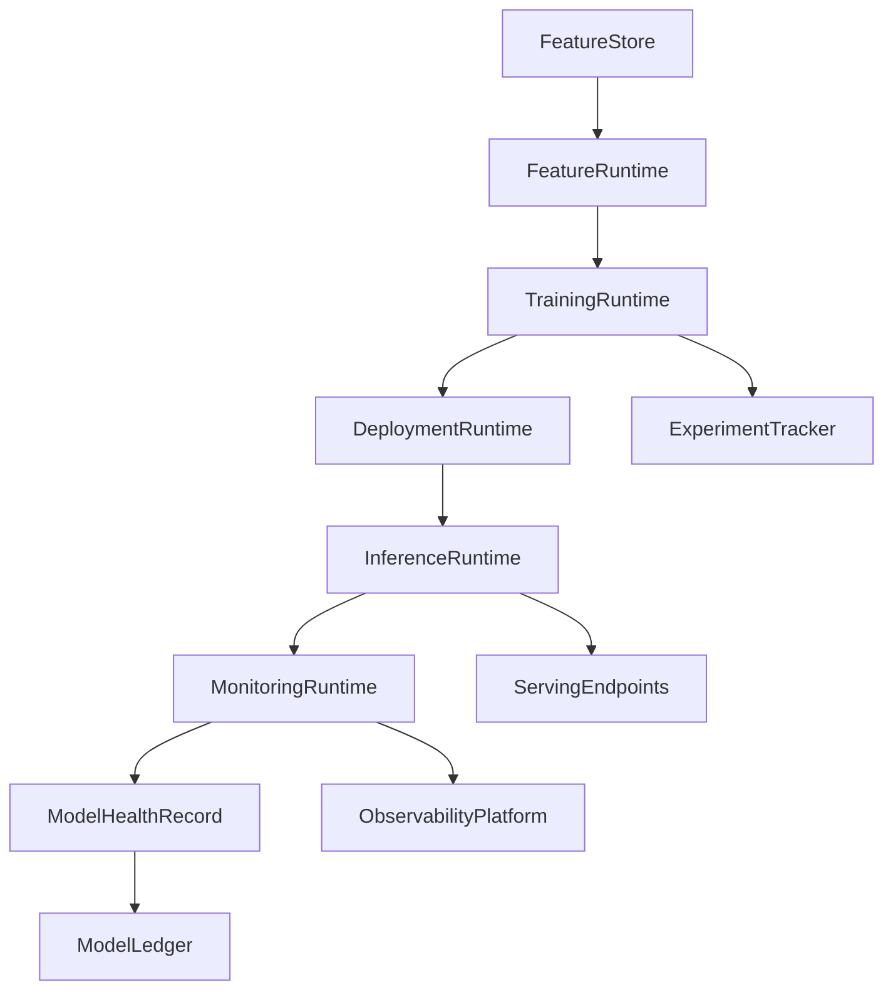

# Enterprise AI Software Factory
# Architecture Design Specification (ADS)

> **Document ID:** ADS-042-v4
>
> **Document Name:** Enterprise AI/ML Platform & MLOps — Runtime & MLOps Infrastructure
>
> **Version:** 1.0.0
>
> **Classification:** Enterprise Runtime Specification
>
> **Importance:** CRITICAL
>
> **Depends On:** ADS-042-v1
>
> **Depends On:** ADS-042-v2
>
> **Depends On:** ADS-042-v3
>
> **Next:** ADS-042-v5 — End-to-End Model Lifecycle

---

# Executive Summary

This document specifies the runtime architecture responsible for continuously operating the Enterprise AI/ML Platform & MLOps.

The Model Runtime coordinates feature serving, model training, validation, deployment orchestration, inference, monitoring, drift detection, rollback, and runtime observability while maintaining deterministic execution across distributed infrastructure.

Every deployment is durable.

Every prediction is observable.

Every runtime interaction becomes immutable operational evidence.

---

# Runtime Philosophy

The Model Runtime follows eight principles.

- Deterministic Inference
- Reproducible Training
- Immutable Model History
- Continuous Monitoring
- Responsible AI Enforcement
- Operational Observability
- Replayable Predictions
- Operational Resilience

Runtime execution never bypasses governance.

---

# Runtime Layers

## Feature Runtime

Responsible for

- Online Feature Serving
- Offline Feature Retrieval
- Feature Cache
- Feature Synchronization
- Feature Freshness

---

## Training Runtime

Responsible for

- Distributed Training
- Hyperparameter Search
- Checkpointing
- Artifact Generation
- Experiment Coordination

---

## Deployment Runtime

Responsible for

- Model Promotion
- Canary Deployment
- Blue-Green Deployment
- Rollback
- Endpoint Management

---

## Inference Runtime

Responsible for

- Request Validation
- Feature Resolution
- Model Selection
- Prediction Execution
- Response Generation

---

## Monitoring Runtime

Responsible for

- Accuracy Monitoring
- Drift Detection
- Latency Monitoring
- Resource Monitoring
- Responsible AI Monitoring

---

## Health Runtime

Responsible for

- Deployment Health
- Inference Health
- Feature Health
- Runtime Health
- Platform Monitoring

---

# Runtime Architecture



The runtime coordinates every governed model lifecycle.

---

# Runtime Components

| Component | Responsibility |
|------------|----------------|
| Feature Runtime | Feature serving |
| Training Runtime | Model training |
| Deployment Runtime | Model deployment |
| Inference Runtime | Prediction execution |
| Monitoring Runtime | Model monitoring |
| Health Runtime | Runtime monitoring |
| Model Ledger | Immutable operational history |

---

# Runtime Pipeline

```text
Register Model

↓

Load Features

↓

Train Model

↓

Validate Model

↓

Deploy Model

↓

Serve Predictions

↓

Monitor Model

↓

Persist Model Ledger
```

Every model follows the same runtime pipeline.

---

# Feature Runtime

Feature Runtime manages

- Feature Retrieval
- Feature Freshness
- Feature Versioning
- Cache Management
- Trace Context
- Consistency Verification

Execution remains deterministic.

---

# Inference Runtime

Inference Runtime coordinates

- Request Validation
- Feature Resolution
- Model Selection
- Prediction Execution
- Response Generation
- Prediction Logging

Inference remains reproducible.

---

# Deployment Session Management

Every runtime deployment creates or participates in a Deployment Session.

Each Deployment Session tracks

- Model Record
- Deployment Strategy
- Active Endpoints
- Rollout Percentage
- Runtime Metadata
- Deployment Context

Deployment Sessions remain immutable.

---

# Runtime Guarantees

The Model Runtime guarantees

- Deterministic Predictions
- Reproducible Training
- Reliable Model Deployment
- Continuous Drift Detection
- Replayable Runtime History
- Observable Execution
- Immutable Operational History

---

# End of Part 1
