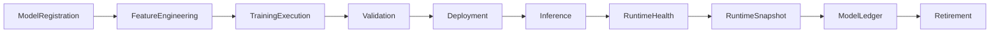

# Enterprise AI Software Factory
# Architecture Design Specification (ADS)

> **Document ID:** ADS-042-v5
>
> **Document Name:** Enterprise AI/ML Platform & MLOps — End-to-End Model Lifecycle
>
> **Version:** 1.0.0
>
> **Classification:** Enterprise Reference Lifecycle
>
> **Importance:** CRITICAL
>
> **Depends On:** ADS-042-v1
>
> **Depends On:** ADS-042-v2
>
> **Depends On:** ADS-042-v3
>
> **Depends On:** ADS-042-v4
>
> **Status:** Reference Implementation

---

# Executive Summary

This document demonstrates the complete lifecycle of a governed enterprise machine learning model.

Each lifecycle stage produces immutable operational artifacts that together provide reproducible training, deterministic inference, governance, compliance, replayability, and operational observability.

---

# Reference Scenario

Global Banking Platform

Model

Fraud Detection

Framework

XGBoost

Training Dataset

Transactions-v18

Serving Mode

Online Inference

Deployment Strategy

Canary

Responsible AI Policy

Mandatory

---

# Complete Lifecycle



Every model follows a deterministic lifecycle.

---

# Stage 1

## Model Registration

A governed model is registered.

Artifact Produced

Model

```yaml
model:

  modelId: ML-10091

  modelName: FraudDetection

  modelType: BinaryClassification

  framework: XGBoost

  owner: FraudPlatform

  version: 5.3
```

The Model represents the immutable AI definition.

---

# Stage 2

## Feature Engineering

The Feature Store performs

- Feature Extraction
- Feature Normalization
- Feature Encoding
- Feature Registration
- Feature Versioning

Artifact Produced

Feature Record

```yaml
featureRecord:

  featureRecordId: FR-3107

  featureName: transaction_velocity

  featureVersion: 12

  sourceDataset: Transactions-v18

  featureStatus: Active
```

Feature engineering becomes reproducible.

---

# Stage 3

## Model Training

The Training Runtime performs

- Dataset Preparation
- Hyperparameter Search
- Distributed Training
- Checkpointing

Artifact Produced

Experiment Record

```yaml
experimentRecord:

  experimentRecordId: ER-1208

  modelRecord: MR-5104

  experimentStatus: Completed

  metrics:

    auc: 0.991

    precision: 0.982
```

Training history becomes immutable.

---

# Stage 4

## Model Validation

The Validation Runtime evaluates

- Accuracy
- Precision
- Recall
- Fairness
- Explainability
- Robustness

Artifact Produced

Validation Record

```yaml
validationRecord:

  validationRecordId: VR-0441

  certificationStatus: Certified

  fairnessAssessment: Passed

  robustnessAssessment: Passed
```

Only certified models proceed to deployment.

---

# Stage 5

## Deployment

The Deployment Runtime performs

- Canary Rollout
- Endpoint Registration
- Traffic Allocation
- Rollback Preparation

Artifact Produced

Deployment Session

```yaml
deploymentSession:

  deploymentSessionId: DEP-3017

  deploymentStrategy: Canary

  rolloutPercentage: 10

  deploymentState: Active
```

Deployment Sessions coordinate runtime execution.

---

# Stage 6

## Runtime Health Evaluation

The Monitoring Runtime continuously evaluates deployed model health.

Evaluation includes

- Inference Health
- Prediction Accuracy
- Latency
- Resource Utilization
- Drift Indicators
- Fairness Monitoring
- Service Availability

Artifact Produced

Model Health Record

```yaml
modelHealthRecord:

  modelHealthRecordId: MHR-0209

  deploymentSession: DEP-3017

  inferenceHealth: Healthy

  accuracyHealth: Healthy

  driftHealth: Normal

  latencyHealth: Normal

  fairnessHealth: Passed
```

Health Records provide continuous operational visibility.

---

# Stage 7

## Runtime Snapshot Generation

The Model Runtime periodically captures platform state.

Artifact Produced

Model Runtime Snapshot

```yaml
modelRuntimeSnapshot:

  snapshotId: SNAP-0874

  activeDeployments: 184

  activeInferenceEndpoints: 372

  activeTrainingJobs: 24

  activeExperiments: 39

  driftStatus: Stable

  platformHealth: Healthy

  throughput: 248000 predictions/min
```

Snapshots support diagnostics, replay, and disaster recovery.

---

# Stage 8

## Online Inference

The Inference Runtime processes prediction requests.

Inference performs

- Feature Retrieval
- Model Selection
- Prediction Execution
- Post-Processing
- Prediction Logging

Every prediction is fully traceable through immutable operational artifacts.

---

# Stage 9

## Immutable Ledger Persistence

The completed lifecycle is permanently recorded.

Artifact Produced

Model Ledger Entry

```yaml
modelLedgerEntry:

  entryId: MLL-71024

  model: ML-10091

  modelRecord: MR-5104

  featureRecord: FR-3107

  experimentRecord: ER-1208

  validationRecord: VR-0441

  deploymentSession: DEP-3017

  modelHealthRecord: MHR-0209

  modelRuntimeSnapshot: SNAP-0874

  traceId: TRC-520441

  digitalSignature: SHA256
```

The Model Ledger forms the authoritative operational audit trail.

---

# Stage 10

## Executive Governance Review

Enterprise leadership evaluates

- Prediction Accuracy
- Model Drift
- Fairness Metrics
- Deployment Success Rate
- Resource Utilization
- Runtime Availability
- Regulatory Compliance
- Operational Risk

Executive dashboards consume immutable lifecycle artifacts for reproducible reporting.

---

# Stage 11

## Model Retirement & Replay

Retired artifacts

- Model
- Model Record
- Feature Record
- Experiment Record
- Validation Record
- Deployment Session
- Model Health Record
- Model Runtime Snapshot
- Model Ledger Entry

Replay capabilities include

- Training Replay
- Inference Replay
- Validation Verification
- Deployment Audit
- Incident Investigation
- Compliance Reporting

Archived models remain immutable.

---

# Complete Artifact Lifecycle

```text
Model

↓

Model Record

↓

Feature Record

↓

Experiment Record

↓

Validation Record

↓

Deployment Session

↓

Model Health Record

↓

Model Runtime Snapshot

↓

Model Ledger Entry

↓

Retirement
```

Every artifact extends operational history without modifying previous artifacts.

---

# Reference Metrics

| Metric | Value |
|---------|------:|
| Models Deployed | 184 |
| Active Inference Endpoints | 372 |
| Predictions / Minute | 248,000 |
| Average Prediction Latency | 42 ms |
| Validation Certification Rate | 99.7% |
| Drift Detection Coverage | 100% |
| Runtime Availability | 99.995% |
| Replay Success Rate | 100% |

---

# Lessons Learned

The platform demonstrates that

- Model definitions remain immutable.
- Training is reproducible and independently auditable.
- Feature engineering is reusable and versioned.
- Validation enforces quality, robustness, and Responsible AI before deployment.
- Runtime health is continuously evaluated.
- Runtime snapshots enable diagnostics and disaster recovery.
- Ledger entries provide end-to-end governance and operational traceability.

---

# Architecture Decision Records

## ADR-042-13

### Decision

Represent the complete model lifecycle using immutable operational artifacts.

### Status

Accepted

### Reason

Provides reproducible ML operations, governance, replayability, regulatory compliance, and operational resilience.

---

# Technology Decision Records

## TDR-042-06

### Technology

Model Ledger

### Decision

Persist all model lifecycle artifacts in an append-only ledger.

### Reason

Supports auditing, compliance, replay, incident response, historical analytics, and governance.

---

# Operational Readiness Scorecard

| Capability | Status |
|------------|--------|
| End-to-End Model Traceability | ✅ Complete |
| Immutable Audit Trail | ✅ Complete |
| Responsible AI Governance | ✅ Complete |
| Reproducible Training | ✅ Complete |
| Runtime Health Monitoring | ✅ Complete |
| Runtime Snapshotting | ✅ Complete |
| Replay & Recovery | ✅ Complete |
| Executive Governance | ✅ Complete |

---

# Related Documents

ADS-021-v5 — Workflow Kernel

ADS-022-v5 — Identity & Trust Plane

ADS-025-v5 — Compute & Infrastructure Platform

ADS-026-v5 — Security Platform

ADS-027-v5 — Observability Platform

ADS-030-v5 — Integration & Ecosystem Platform

ADS-038-v5 — Enterprise Event Streaming, Messaging & Real-Time Data Platform

ADS-039-v5 — Enterprise API Gateway, Service Mesh & Traffic Management Platform

ADS-040-v5 — Enterprise Workflow Orchestration & Business Process Automation Platform

ADS-041-v5 — Enterprise Data Platform & Lakehouse Architecture

ADS-041-v5 — Enterprise Data Platform & Lakehouse Architecture

ADS-042-v1 — Architecture

ADS-042-v2 — ML Algorithms & Lifecycle

ADS-042-v3 — APIs, Models & Contracts

ADS-042-v4 — Runtime & MLOps Infrastructure

---

# End of Document
