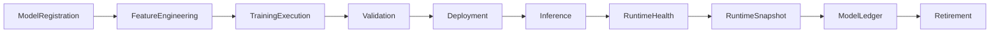

# Enterprise AI Software Factory
# Architecture Design Specification (ADS)

> **Document ID:** ADS-042-v5
>
> **Document Name:** Enterprise AI/ML Platform & MLOps — End-to-End Model Lifecycle
>
> **Version:** 1.0.0
>
> **Classification:** Enterprise Reference Lifecycle
>
> **Importance:** CRITICAL
>
> **Depends On:** ADS-042-v1
>
> **Depends On:** ADS-042-v2
>
> **Depends On:** ADS-042-v3
>
> **Depends On:** ADS-042-v4
>
> **Status:** Reference Implementation

---

# Executive Summary

This document demonstrates the complete lifecycle of a governed enterprise machine learning model.

Each lifecycle stage produces immutable operational artifacts that together provide reproducible training, deterministic inference, governance, compliance, replayability, and operational observability.

---

# Reference Scenario

Global Banking Platform

Model

Fraud Detection

Framework

XGBoost

Training Dataset

Transactions-v18

Serving Mode

Online Inference

Deployment Strategy

Canary

Responsible AI Policy

Mandatory

---

# Complete Lifecycle



Every model follows a deterministic lifecycle.

---

# Stage 1

## Model Registration

A governed model is registered.

Artifact Produced

Model

```yaml
model:

  modelId: ML-10091

  modelName: FraudDetection

  modelType: BinaryClassification

  framework: XGBoost

  owner: FraudPlatform

  version: 5.3
```

The Model represents the immutable AI definition.

---

# Stage 2

## Feature Engineering

The Feature Store performs

- Feature Extraction
- Feature Normalization
- Feature Encoding
- Feature Registration
- Feature Versioning

Artifact Produced

Feature Record

```yaml
featureRecord:

  featureRecordId: FR-3107

  featureName: transaction_velocity

  featureVersion: 12

  sourceDataset: Transactions-v18

  featureStatus: Active
```

Feature engineering becomes reproducible.

---

# Stage 3

## Model Training

The Training Runtime performs

- Dataset Preparation
- Hyperparameter Search
- Distributed Training
- Checkpointing

Artifact Produced

Experiment Record

```yaml
experimentRecord:

  experimentRecordId: ER-1208

  modelRecord: MR-5104

  experimentStatus: Completed

  metrics:

    auc: 0.991

    precision: 0.982
```

Training history becomes immutable.

---

# Stage 4

## Model Validation

The Validation Runtime evaluates

- Accuracy
- Precision
- Recall
- Fairness
- Explainability
- Robustness

Artifact Produced

Validation Record

```yaml
validationRecord:

  validationRecordId: VR-0441

  certificationStatus: Certified

  fairnessAssessment: Passed

  robustnessAssessment: Passed
```

Only certified models proceed to deployment.

---

# Stage 5

## Deployment

The Deployment Runtime performs

- Canary Rollout
- Endpoint Registration
- Traffic Allocation
- Rollback Preparation

Artifact Produced

Deployment Session

```yaml
deploymentSession:

  deploymentSessionId: DEP-3017

  deploymentStrategy: Canary

  rolloutPercentage: 10

  deploymentState: Active
```

Deployment Sessions coordinate runtime execution.

---

# End of Part 1
