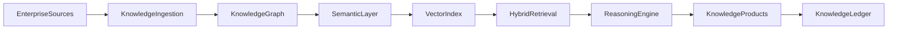
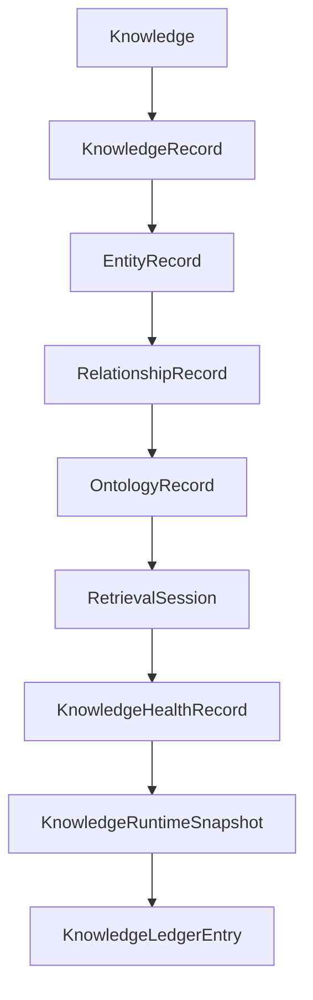

# Enterprise AI Software Factory
# Architecture Design Specification (ADS)

> **Document ID:** ADS-043-v1
>
> **Document Name:** Enterprise Knowledge Graph, Semantic Layer & Retrieval Platform — Architecture
>
> **Version:** 1.0.0
>
> **Classification:** Enterprise Platform Plane
>
> **Importance:** CRITICAL
>
> **Status:** Active

---

# Executive Summary

The Enterprise Knowledge Graph, Semantic Layer & Retrieval Platform provides a unified semantic foundation for enterprise knowledge management, retrieval, reasoning, graph analytics, and Retrieval-Augmented Generation (RAG).

The platform integrates ontologies, knowledge graphs, vector indexes, hybrid search, semantic ranking, entity linking, graph reasoning, and governance into a single enterprise architecture.

Every knowledge asset is governed.

Every relationship is traceable.

Every retrieval is explainable.

---

# Platform Responsibilities

The platform SHALL provide

- Knowledge Graph
- Ontology Management
- Semantic Layer
- Entity Resolution
- Relationship Management
- Vector Index
- Hybrid Search
- Graph Reasoning
- Retrieval Pipeline
- Knowledge Governance
- Knowledge Ledger

---

# Architectural Principles

The platform follows

- Knowledge as an Enterprise Asset
- Ontology First
- Explainable Retrieval
- Immutable Knowledge History
- Policy-Driven Governance
- Hybrid Retrieval
- Replayable Queries
- Operational Observability

---

# High-Level Architecture



The Semantic Layer becomes the enterprise intelligence foundation.

---

# Core Components

## Knowledge Ingestion

Responsible for

- Structured Data Import
- Document Processing
- Entity Extraction
- Relationship Discovery
- Metadata Capture

---

## Knowledge Graph

Responsible for

- Entity Storage
- Relationship Storage
- Graph Traversal
- Versioning
- Provenance

---

## Semantic Layer

Responsible for

- Ontologies
- Taxonomies
- Business Vocabulary
- Semantic Mapping
- Canonical Definitions

---

## Vector Index

Responsible for

- Embedding Storage
- Similarity Search
- ANN Indexing
- Vector Versioning
- Embedding Metadata

---

## Hybrid Retrieval

Responsible for

- Keyword Search
- Semantic Search
- Graph Traversal
- Result Fusion
- Ranking

---

## Reasoning Engine

Responsible for

- Rule Evaluation
- Graph Reasoning
- Inference
- Path Discovery
- Knowledge Expansion

---

## Knowledge Ledger

Responsible for

- Immutable Knowledge History
- Audit Records
- Replay Support
- Compliance Evidence

---

# Primary Artifact

Every governed knowledge asset begins with a Knowledge Definition.

```yaml
knowledge:

  knowledgeId:

  knowledgeName:

  knowledgeType:

  domain:

  owner:

  ontology:

  classification:

  createdAt:
```

The Knowledge Definition is immutable after publication.

---

# Knowledge Record

Every published Knowledge Definition creates a Knowledge Record.

```yaml
knowledgeRecord:

  knowledgeRecordId:

  knowledge:

  graphVersion:

  semanticVersion:

  publicationStatus:

  governanceStatus:

  createdAt:

  updatedAt:
```

Knowledge Records maintain immutable publication metadata.

---

# Entity Record

Every governed entity generates an Entity Record.

```yaml
entityRecord:

  entityRecordId:

  entityId:

  entityType:

  canonicalName:

  sourceSystems:

  confidenceScore:

  entityStatus:

  createdAt:
```

Entity Records preserve canonical identity and provenance.

---

# Relationship Record

Every discovered or curated relationship generates a Relationship Record.

```yaml
relationshipRecord:

  relationshipRecordId:

  sourceEntity:

  targetEntity:

  relationshipType:

  confidenceScore:

  provenance:

  relationshipStatus:

  createdAt:
```

Relationship Records provide immutable graph connectivity.

---

# Ontology Record

Every ontology revision creates an Ontology Record.

```yaml
ontologyRecord:

  ontologyRecordId:

  ontology:

  ontologyVersion:

  namespace:

  governingDomain:

  approvalStatus:

  publishedAt:
```

Ontology Records remain append-only.

---

# Retrieval Session

Every retrieval execution creates a Retrieval Session.

```yaml
retrievalSession:

  retrievalSessionId:

  knowledgeRecord:

  query:

  retrievalStrategy:

  semanticContext:

  executionState:

  startedAt:

  completedAt:
```

Retrieval Sessions represent governed runtime retrieval.

---

# Knowledge Health Record

Operational knowledge health is continuously evaluated.

```yaml
knowledgeHealthRecord:

  knowledgeHealthRecordId:

  retrievalSession:

  graphHealth:

  ontologyHealth:

  vectorIndexHealth:

  retrievalHealth:

  reasoningHealth:

  evaluatedAt:
```

Health remains independent from retrieval history.

---

# Knowledge Runtime Snapshot

The platform periodically generates runtime snapshots.

```yaml
knowledgeRuntimeSnapshot:

  snapshotId:

  generatedAt:

  activeRetrievalSessions:

  indexedEntities:

  indexedRelationships:

  activeReasoningJobs:

  platformHealth:

  throughput:
```

Snapshots support replay and disaster recovery.

---

# Knowledge Ledger Entry

Every completed lifecycle generates an immutable ledger entry.

```yaml
knowledgeLedgerEntry:

  entryId:

  knowledge:

  knowledgeRecord:

  entityRecord:

  relationshipRecord:

  ontologyRecord:

  retrievalSession:

  knowledgeHealthRecord:

  knowledgeRuntimeSnapshot:

  traceId:

  timestamp:

  digitalSignature:
```

Ledger Entries provide authoritative audit history.

---

# Platform Architecture



Every artifact extends the operational lifecycle without modifying prior artifacts.

---

# Knowledge Lifecycle Overview

```text
Knowledge Definition

↓

Knowledge Ingestion

↓

Entity Resolution

↓

Relationship Discovery

↓

Ontology Alignment

↓

Hybrid Retrieval

↓

Reasoning

↓

Health Evaluation

↓

Runtime Snapshot

↓

Ledger Persistence

↓

Archive
```

The lifecycle remains deterministic and reproducible.

---

# Platform Guarantees

The Knowledge Platform guarantees

- Immutable Knowledge Definitions
- Deterministic Entity Resolution
- Explainable Retrieval
- Complete Relationship Traceability
- Replayable Query History
- Continuous Health Monitoring
- Immutable Operational History

---

# Architecture Decision Records

## ADR-043-01

### Decision

Represent every governed knowledge asset using immutable operational artifacts.

### Status

Accepted

### Reason

Artifact-centric knowledge management improves governance, provenance, explainability, replayability, and observability.

---

## ADR-043-02

### Decision

Separate knowledge definitions from runtime retrieval state.

### Status

Accepted

### Reason

Enables independent versioning, scalable retrieval, reasoning, and deterministic replay.

---

## ADR-043-03

### Decision

Model ontology evolution as independent Ontology Records.

### Status

Accepted

### Reason

Supports semantic evolution, governance, compatibility management, and enterprise-wide consistency.

---

# Operational Readiness Scorecard

| Capability | Status |
|------------|--------|
| Knowledge Definitions | ✅ Required |
| Entity Resolution | ✅ Required |
| Relationship Management | ✅ Required |
| Ontology Management | ✅ Required |
| Hybrid Retrieval | ✅ Required |
| Runtime Snapshots | ✅ Required |
| Immutable Ledger | ✅ Required |
| Deterministic Replay | ✅ Required |

---

# Related Documents

ADS-021-v5 — Workflow Kernel

ADS-022-v5 — Identity & Trust Plane

ADS-025-v5 — Compute & Infrastructure Platform

ADS-026-v5 — Security Platform

ADS-027-v5 — Observability Platform

ADS-030-v5 — Integration & Ecosystem Platform

ADS-038-v5 — Enterprise Event Streaming, Messaging & Real-Time Data Platform

ADS-039-v5 — Enterprise API Gateway, Service Mesh & Traffic Management Platform

ADS-040-v5 — Enterprise Workflow Orchestration & Business Process Automation Platform

ADS-041-v5 — Enterprise Data Platform & Lakehouse Architecture

ADS-042-v5 — Enterprise AI/ML Platform & MLOps

ADS-043-v2 — Knowledge Algorithms & Lifecycle

---

# End of Document
