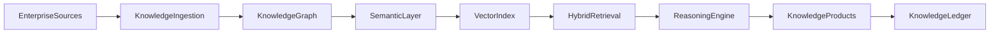

# Enterprise AI Software Factory
# Architecture Design Specification (ADS)

> **Document ID:** ADS-043-v1
>
> **Document Name:** Enterprise Knowledge Graph, Semantic Layer & Retrieval Platform — Architecture
>
> **Version:** 1.0.0
>
> **Classification:** Enterprise Platform Plane
>
> **Importance:** CRITICAL
>
> **Status:** Active

---

# Executive Summary

The Enterprise Knowledge Graph, Semantic Layer & Retrieval Platform provides a unified semantic foundation for enterprise knowledge management, retrieval, reasoning, graph analytics, and Retrieval-Augmented Generation (RAG).

The platform integrates ontologies, knowledge graphs, vector indexes, hybrid search, semantic ranking, entity linking, graph reasoning, and governance into a single enterprise architecture.

Every knowledge asset is governed.

Every relationship is traceable.

Every retrieval is explainable.

---

# Platform Responsibilities

The platform SHALL provide

- Knowledge Graph
- Ontology Management
- Semantic Layer
- Entity Resolution
- Relationship Management
- Vector Index
- Hybrid Search
- Graph Reasoning
- Retrieval Pipeline
- Knowledge Governance
- Knowledge Ledger

---

# Architectural Principles

The platform follows

- Knowledge as an Enterprise Asset
- Ontology First
- Explainable Retrieval
- Immutable Knowledge History
- Policy-Driven Governance
- Hybrid Retrieval
- Replayable Queries
- Operational Observability

---

# High-Level Architecture



The Semantic Layer becomes the enterprise intelligence foundation.

---

# Core Components

## Knowledge Ingestion

Responsible for

- Structured Data Import
- Document Processing
- Entity Extraction
- Relationship Discovery
- Metadata Capture

---

## Knowledge Graph

Responsible for

- Entity Storage
- Relationship Storage
- Graph Traversal
- Versioning
- Provenance

---

## Semantic Layer

Responsible for

- Ontologies
- Taxonomies
- Business Vocabulary
- Semantic Mapping
- Canonical Definitions

---

## Vector Index

Responsible for

- Embedding Storage
- Similarity Search
- ANN Indexing
- Vector Versioning
- Embedding Metadata

---

## Hybrid Retrieval

Responsible for

- Keyword Search
- Semantic Search
- Graph Traversal
- Result Fusion
- Ranking

---

## Reasoning Engine

Responsible for

- Rule Evaluation
- Graph Reasoning
- Inference
- Path Discovery
- Knowledge Expansion

---

## Knowledge Ledger

Responsible for

- Immutable Knowledge History
- Audit Records
- Replay Support
- Compliance Evidence

---

# Primary Artifact

Every governed knowledge asset begins with a Knowledge Definition.

```yaml
knowledge:

  knowledgeId:

  knowledgeName:

  knowledgeType:

  domain:

  owner:

  ontology:

  classification:

  createdAt:
```

The Knowledge Definition is immutable after publication.

---

# End of Part 1
