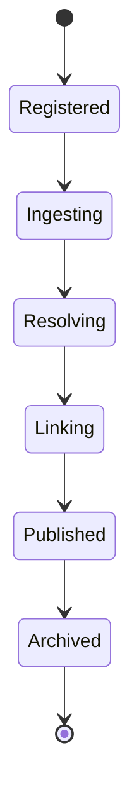

# Enterprise AI Software Factory
# Architecture Design Specification (ADS)

> **Document ID:** ADS-043-v2
>
> **Document Name:** Enterprise Knowledge Graph, Semantic Layer & Retrieval Platform — Knowledge Algorithms & Lifecycle
>
> **Version:** 1.0.0
>
> **Classification:** Enterprise Platform Plane
>
> **Importance:** CRITICAL
>
> **Depends On:** ADS-043-v1
>
> **Next:** ADS-043-v3 — APIs, Schemas & Contracts

---

# Executive Summary

This document defines the lifecycle algorithms governing enterprise knowledge ingestion, entity resolution, relationship discovery, ontology evolution, embedding generation, hybrid retrieval, graph reasoning, and Retrieval-Augmented Generation (RAG).

Every knowledge asset follows a deterministic lifecycle.

Every relationship is explainable.

Every retrieval is reproducible.

---

# Design Philosophy

The Knowledge Lifecycle follows six principles.

- Deterministic Knowledge Processing
- Immutable Knowledge History
- Explainable Relationships
- Ontology-Driven Semantics
- Replayable Retrieval
- Policy-Driven Governance

---

# ALG-043-001

## Knowledge Registration

Every governed knowledge asset SHALL begin with Knowledge Registration.

Registration performs

- Knowledge Validation
- Domain Classification
- Ontology Assignment
- Ownership Assignment
- Metadata Registration
- Governance Validation

Successful registration creates a Knowledge Record.

---

# Knowledge

```yaml
knowledge:

  knowledgeId:

  knowledgeName:

  knowledgeType:

  domain:

  owner:

  ontology:

  classification:

  createdAt:
```

Knowledge definitions remain immutable.

---

# ALG-043-002

## Knowledge Ingestion

The Knowledge Ingestion Platform coordinates

- Structured Data Import
- Document Processing
- Metadata Extraction
- Content Normalization
- Provenance Capture
- Incremental Updates

Every ingestion updates the Knowledge Record.

---

# ALG-043-003

## Entity Resolution

The Entity Resolution Engine performs

- Entity Extraction
- Canonicalization
- Duplicate Detection
- Identity Resolution
- Confidence Scoring
- Provenance Recording

Every resolved entity generates an Entity Record.

---

# ALG-043-004

## Relationship Discovery

The Relationship Engine evaluates

- Explicit Relationships
- Inferred Relationships
- Semantic Similarity
- Temporal Relationships
- Hierarchical Relationships
- Confidence Scoring

Relationship discovery produces a Relationship Record.

---

# Relationship Validation

| Validation | Purpose |
|------------|---------|
| Schema Validation | Graph correctness |
| Ontology Validation | Semantic consistency |
| Confidence Validation | Relationship quality |
| Provenance Validation | Traceability |

Relationships advance only after validation.

---

# ALG-043-005

## Ontology Evolution

The Ontology Platform manages

- Ontology Versioning
- Concept Addition
- Concept Deprecation
- Taxonomy Updates
- Semantic Mapping
- Compatibility Validation

Every ontology update generates an Ontology Record.

---

# Knowledge States

| State | Description |
|--------|-------------|
| Registered | Knowledge defined |
| Ingesting | Knowledge acquisition |
| Resolving | Entity resolution |
| Linking | Relationship generation |
| Published | Available for retrieval |
| Archived | Retained for history |

State transitions remain deterministic.

---

# Knowledge Record

Every governed knowledge publication generates a Knowledge Record.

```yaml
knowledgeRecord:

  knowledgeRecordId:

  knowledge:

  graphVersion:

  semanticVersion:

  publicationStatus:

  governanceStatus:

  createdAt:

  updatedAt:
```

Knowledge Records remain append-only.

---

# ALG-043-006

## Embedding Generation

The Embedding Engine generates vector representations for governed knowledge assets.

Embedding generation performs

- Content Tokenization
- Semantic Encoding
- Vector Normalization
- Metadata Association
- Version Assignment
- Index Registration

Every embedding remains versioned and reproducible.

---

# ALG-043-007

## Hybrid Retrieval

The Retrieval Engine executes

- Keyword Search
- Semantic Search
- Vector Similarity
- Graph Traversal
- Result Fusion
- Ranking

Every retrieval creates a Retrieval Session.

---

# ALG-043-008

## Graph Reasoning

The Reasoning Engine performs

- Rule Evaluation
- Multi-Hop Traversal
- Path Discovery
- Semantic Inference
- Context Expansion
- Confidence Calculation

Reasoning remains deterministic and explainable.

---

# Relationship Record

Every relationship generates a Relationship Record.

```yaml
relationshipRecord:

  relationshipRecordId:

  sourceEntity:

  targetEntity:

  relationshipType:

  confidenceScore:

  provenance:

  relationshipStatus:

  createdAt:
```

Relationship Records remain immutable after publication.

---

# Knowledge Lifecycle



Every knowledge asset progresses through deterministic lifecycle states.

---

# Knowledge Processing Pipeline

```text
Knowledge Registered

↓

Knowledge Ingestion

↓

Entity Resolution

↓

Relationship Discovery

↓

Ontology Alignment

↓

Embedding Generation

↓

Hybrid Retrieval

↓

Reasoning

↓

Publication

↓

Archival
```

Every processing stage remains reproducible.

---

# Retrieval Pipeline

```text
User Query

↓

Query Understanding

↓

Ontology Expansion

↓

Vector Search

↓

Graph Traversal

↓

Hybrid Ranking

↓

Reasoning

↓

Context Assembly

↓

Response Generation
```

Only governed knowledge participates in retrieval.

---

# Failure Handling

Failures are classified as

| Failure | Recovery Strategy |
|----------|-------------------|
| Ingestion Failure | Retry Import |
| Entity Resolution Failure | Retry Resolution |
| Relationship Failure | Regenerate Relationships |
| Embedding Failure | Regenerate Embeddings |
| Retrieval Failure | Retry Query Execution |
| Reasoning Failure | Fallback to Hybrid Retrieval |

Recovery policies remain governance-controlled.

---

# Prometheus Metrics

```text
knowledge_registrations_total

entity_resolution_total

relationship_discoveries_total

ontology_updates_total

embedding_generations_total

hybrid_retrieval_requests_total

graph_reasoning_executions_total

knowledge_publications_total

knowledge_processing_duration_seconds

retrieval_latency_seconds
```

---

# Structured Logging

Example

```json
{
  "knowledgeRecord":"KR-7002",
  "entityRecord":"ER-3188",
  "relationshipRecord":"RR-5114",
  "retrievalSession":"RS-0982",
  "knowledgeState":"Published",
  "traceId":"TRC-610882"
}
```

Logs remain immutable and fully correlated.

---

# Architecture Decision Records

## ADR-043-04

### Decision

Generate embeddings only from governed knowledge assets.

### Status

Accepted

### Reason

Ensures semantic consistency, traceability, and retrieval quality.

---

## ADR-043-05

### Decision

Represent every resolved relationship as an independent Relationship Record.

### Status

Accepted

### Reason

Supports explainability, provenance tracking, graph evolution, and auditing.

---

## ADR-043-06

### Decision

Use hybrid retrieval combining graph traversal and vector search.

### Status

Accepted

### Reason

Improves recall, precision, explainability, and enterprise search quality.

---

# Operational Readiness Scorecard

| Capability | Status |
|------------|--------|
| Knowledge Registration | ✅ Required |
| Entity Resolution | ✅ Required |
| Relationship Discovery | ✅ Required |
| Embedding Generation | ✅ Required |
| Hybrid Retrieval | ✅ Required |
| Graph Reasoning | ✅ Required |
| Immutable History | ✅ Required |
| Replay Support | ✅ Required |

---

# Related Documents

ADS-021-v5 — Workflow Kernel

ADS-022-v5 — Identity & Trust Plane

ADS-025-v5 — Compute & Infrastructure Platform

ADS-026-v5 — Security Platform

ADS-027-v5 — Observability Platform

ADS-030-v5 — Integration & Ecosystem Platform

ADS-038-v5 — Enterprise Event Streaming, Messaging & Real-Time Data Platform

ADS-039-v5 — Enterprise API Gateway, Service Mesh & Traffic Management Platform

ADS-040-v5 — Enterprise Workflow Orchestration & Business Process Automation Platform

ADS-041-v5 — Enterprise Data Platform & Lakehouse Architecture

ADS-042-v5 — Enterprise AI/ML Platform & MLOps

ADS-043-v1 — Architecture

ADS-043-v3 — APIs, Schemas & Contracts

---

# End of Document
