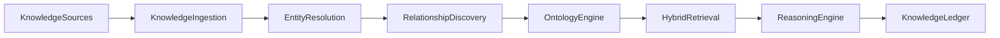

# Enterprise AI Software Factory
# Architecture Design Specification (ADS)

> **Document ID:** ADS-043-v3
>
> **Document Name:** Enterprise Knowledge Graph, Semantic Layer & Retrieval Platform — APIs, Schemas & Contracts
>
> **Version:** 1.0.0
>
> **Classification:** Enterprise Platform Plane
>
> **Importance:** CRITICAL
>
> **Depends On:** ADS-043-v1
>
> **Depends On:** ADS-043-v2
>
> **Next:** ADS-043-v4 — Runtime & Retrieval Infrastructure

---

# Executive Summary

This document defines the APIs, contracts, schemas, governance interfaces, and operational events for the Enterprise Knowledge Graph, Semantic Layer & Retrieval Platform.

Every knowledge contract is versioned.

Every ontology is governed.

Every retrieval is explainable.

---

# REST APIs

## API-043-001

### Register Knowledge

```http
POST /knowledge/v1/assets
```

Registers a governed knowledge definition.

---

## API-043-002

### Start Knowledge Ingestion

```http
POST /knowledge/v1/ingestions
```

Starts knowledge ingestion.

Request

```json
{
  "knowledgeId":"KN-10021",
  "source":"enterprise-docs",
  "ontology":"enterprise-core-v7",
  "tenant":"tenant-a",
  "traceId":"TRC-610882"
}
```

Response

```json
{
  "knowledgeRecordId":"KR-7002",
  "retrievalSessionId":"RS-0982",
  "status":"Running"
}
```

---

## API-043-003

### Resolve Entities

```http
POST /knowledge/v1/entities/resolve
```

Executes governed entity resolution.

---

## API-043-004

### Execute Retrieval

```http
POST /knowledge/v1/retrieval
```

Executes hybrid enterprise retrieval.

---

## API-043-005

### Query Knowledge

```http
GET /knowledge/v1/assets/{knowledgeRecordId}
```

Returns the governed knowledge lifecycle state.

---

# gRPC Service

```protobuf
service EnterpriseKnowledgePlatformService {

  rpc RegisterKnowledge(KnowledgeDefinition)
      returns (KnowledgeResponse);

  rpc StartIngestion(IngestionRequest)
      returns (IngestionResponse);

  rpc ResolveEntities(EntityResolutionRequest)
      returns (EntityResolutionResponse);

  rpc ExecuteRetrieval(RetrievalRequest)
      returns (RetrievalResponse);

  rpc QueryKnowledge(QueryKnowledgeRequest)
      returns (KnowledgeRecord);
}
```

---

# Core Schemas

## Knowledge

```yaml
knowledge:

  knowledgeId:

  knowledgeName:

  knowledgeType:

  domain:

  owner:

  ontology:

  classification:

  createdAt:
```

---

## Knowledge Record

```yaml
knowledgeRecord:

  knowledgeRecordId:

  knowledge:

  graphVersion:

  semanticVersion:

  publicationStatus:

  governanceStatus:

  createdAt:

  updatedAt:
```

---

## Entity Record

```yaml
entityRecord:

  entityRecordId:

  canonicalEntityId:

  entityType:

  canonicalName:

  aliases:

  confidenceScore:

  provenance:

  entityStatus:

  createdAt:
```

---

## Ontology Record

```yaml
ontologyRecord:

  ontologyRecordId:

  ontology:

  ontologyVersion:

  namespace:

  semanticMappings:

  compatibilityStatus:

  approvalStatus:

  publishedAt:
```

---

# MCP Tools

The platform exposes

- register_knowledge
- start_ingestion
- resolve_entities
- execute_retrieval
- query_knowledge
- graph_diagnostics
- ontology_validation
- retrieval_health

---

# Platform Events

## EVT-043-001

KnowledgeRegistered

---

## EVT-043-002

KnowledgeIngestionStarted

---

## EVT-043-003

EntitiesResolved

---

## EVT-043-004

RelationshipsDiscovered

---

## EVT-043-005

OntologyUpdated

---

## EVT-043-006

RetrievalExecuted

---

## EVT-043-007

ReasoningCompleted

---

## EVT-043-008

KnowledgeArchived

---

# Knowledge Event Flow



Every knowledge operation produces immutable operational evidence.

---

# End of Part 1
