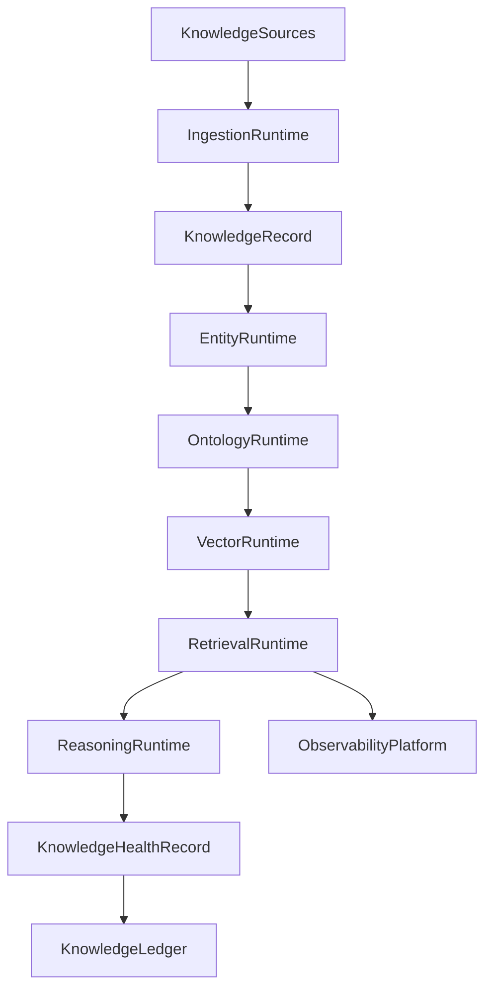

# Enterprise AI Software Factory
# Architecture Design Specification (ADS)

> **Document ID:** ADS-043-v4
>
> **Document Name:** Enterprise Knowledge Graph, Semantic Layer & Retrieval Platform — Runtime & Retrieval Infrastructure
>
> **Version:** 1.0.0
>
> **Classification:** Enterprise Runtime Specification
>
> **Importance:** CRITICAL
>
> **Depends On:** ADS-043-v1
>
> **Depends On:** ADS-043-v2
>
> **Depends On:** ADS-043-v3
>
> **Next:** ADS-043-v5 — End-to-End Knowledge Lifecycle

---

# Executive Summary

This document specifies the runtime architecture responsible for continuously operating the Enterprise Knowledge Graph, Semantic Layer & Retrieval Platform.

The Knowledge Runtime coordinates knowledge ingestion, entity resolution, ontology management, vector indexing, hybrid retrieval, graph reasoning, semantic ranking, and runtime observability while maintaining deterministic execution across distributed infrastructure.

Every retrieval is durable.

Every reasoning operation is observable.

Every runtime interaction becomes immutable operational evidence.

---

# Runtime Philosophy

The Knowledge Runtime follows eight principles.

- Deterministic Retrieval
- Immutable Knowledge History
- Explainable Reasoning
- Continuous Ontology Governance
- Hybrid Search by Default
- Operational Observability
- Replayable Retrieval
- Operational Resilience

Runtime execution never bypasses governance.

---

# Runtime Layers

## Ingestion Runtime

Responsible for

- Structured Ingestion
- Document Processing
- Metadata Extraction
- Incremental Updates
- Provenance Capture

---

## Entity Runtime

Responsible for

- Entity Resolution
- Canonicalization
- Duplicate Detection
- Identity Linking
- Confidence Scoring

---

## Ontology Runtime

Responsible for

- Ontology Loading
- Semantic Mapping
- Version Resolution
- Compatibility Validation
- Taxonomy Management

---

## Vector Runtime

Responsible for

- Embedding Generation
- Vector Storage
- ANN Indexing
- Similarity Search
- Index Maintenance

---

## Retrieval Runtime

Responsible for

- Query Understanding
- Hybrid Search
- Graph Traversal
- Semantic Ranking
- Context Assembly

---

## Reasoning Runtime

Responsible for

- Rule Evaluation
- Multi-Hop Traversal
- Path Discovery
- Inference
- Explanation Generation

---

## Health Runtime

Responsible for

- Graph Health
- Ontology Health
- Vector Index Health
- Retrieval Health
- Runtime Monitoring

---

# Runtime Architecture



The runtime coordinates every governed knowledge lifecycle.

---

# Runtime Components

| Component | Responsibility |
|------------|----------------|
| Ingestion Runtime | Knowledge acquisition |
| Entity Runtime | Entity resolution |
| Ontology Runtime | Semantic governance |
| Vector Runtime | Embedding & vector search |
| Retrieval Runtime | Hybrid retrieval |
| Reasoning Runtime | Graph reasoning |
| Health Runtime | Runtime monitoring |
| Knowledge Ledger | Immutable operational history |

---

# Runtime Pipeline

```text
Register Knowledge

↓

Ingest Knowledge

↓

Resolve Entities

↓

Generate Embeddings

↓

Execute Hybrid Retrieval

↓

Run Graph Reasoning

↓

Evaluate Health

↓

Persist Knowledge Ledger
```

Every knowledge asset follows the same runtime pipeline.

---

# Retrieval Runtime

The Retrieval Runtime manages

- Query Parsing
- Semantic Expansion
- Hybrid Ranking
- Context Assembly
- Trace Context
- Result Attribution

Execution remains deterministic.

---

# Reasoning Runtime

The Reasoning Runtime coordinates

- Rule Evaluation
- Multi-Hop Traversal
- Semantic Inference
- Path Optimization
- Confidence Calculation
- Explanation Generation

Reasoning remains reproducible.

---

# Retrieval Session Management

Every runtime execution creates or participates in a Retrieval Session.

Each Retrieval Session tracks

- Knowledge Record
- Query
- Retrieval Strategy
- Graph Traversal
- Retrieved Entities
- Runtime Metadata

Retrieval Sessions remain immutable.

---

# Runtime Guarantees

The Knowledge Runtime guarantees

- Deterministic Retrieval
- Explainable Reasoning
- Reliable Entity Resolution
- Replayable Retrieval History
- Observable Execution
- Immutable Operational History

---

# End of Part 1
