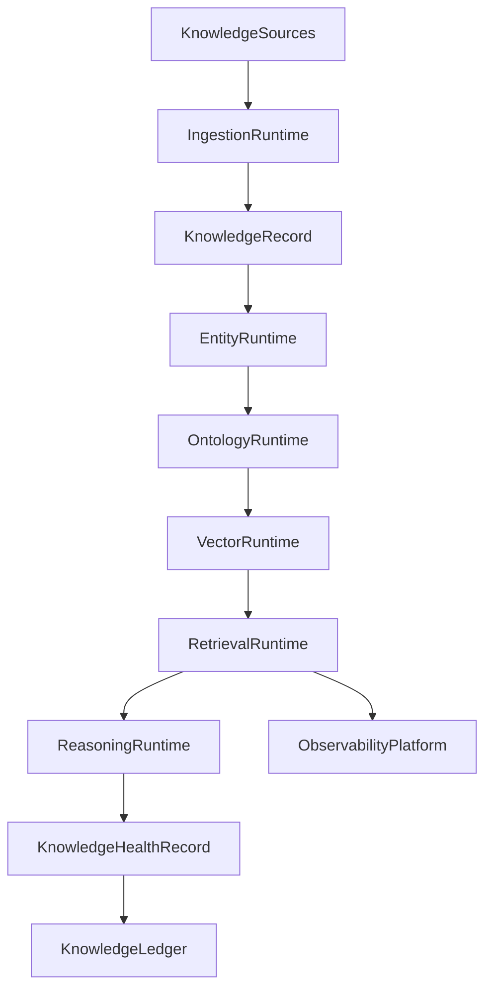
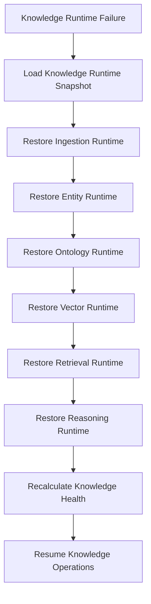

# Enterprise AI Software Factory
# Architecture Design Specification (ADS)

> **Document ID:** ADS-043-v4
>
> **Document Name:** Enterprise Knowledge Graph, Semantic Layer & Retrieval Platform — Runtime & Retrieval Infrastructure
>
> **Version:** 1.0.0
>
> **Classification:** Enterprise Runtime Specification
>
> **Importance:** CRITICAL
>
> **Depends On:** ADS-043-v1
>
> **Depends On:** ADS-043-v2
>
> **Depends On:** ADS-043-v3
>
> **Next:** ADS-043-v5 — End-to-End Knowledge Lifecycle

---

# Executive Summary

This document specifies the runtime architecture responsible for continuously operating the Enterprise Knowledge Graph, Semantic Layer & Retrieval Platform.

The Knowledge Runtime coordinates knowledge ingestion, entity resolution, ontology management, vector indexing, hybrid retrieval, graph reasoning, semantic ranking, and runtime observability while maintaining deterministic execution across distributed infrastructure.

Every retrieval is durable.

Every reasoning operation is observable.

Every runtime interaction becomes immutable operational evidence.

---

# Runtime Philosophy

The Knowledge Runtime follows eight principles.

- Deterministic Retrieval
- Immutable Knowledge History
- Explainable Reasoning
- Continuous Ontology Governance
- Hybrid Search by Default
- Operational Observability
- Replayable Retrieval
- Operational Resilience

Runtime execution never bypasses governance.

---

# Runtime Layers

## Ingestion Runtime

Responsible for

- Structured Ingestion
- Document Processing
- Metadata Extraction
- Incremental Updates
- Provenance Capture

---

## Entity Runtime

Responsible for

- Entity Resolution
- Canonicalization
- Duplicate Detection
- Identity Linking
- Confidence Scoring

---

## Ontology Runtime

Responsible for

- Ontology Loading
- Semantic Mapping
- Version Resolution
- Compatibility Validation
- Taxonomy Management

---

## Vector Runtime

Responsible for

- Embedding Generation
- Vector Storage
- ANN Indexing
- Similarity Search
- Index Maintenance

---

## Retrieval Runtime

Responsible for

- Query Understanding
- Hybrid Search
- Graph Traversal
- Semantic Ranking
- Context Assembly

---

## Reasoning Runtime

Responsible for

- Rule Evaluation
- Multi-Hop Traversal
- Path Discovery
- Inference
- Explanation Generation

---

## Health Runtime

Responsible for

- Graph Health
- Ontology Health
- Vector Index Health
- Retrieval Health
- Runtime Monitoring

---

# Runtime Architecture



The runtime coordinates every governed knowledge lifecycle.

---

# Runtime Components

| Component | Responsibility |
|------------|----------------|
| Ingestion Runtime | Knowledge acquisition |
| Entity Runtime | Entity resolution |
| Ontology Runtime | Semantic governance |
| Vector Runtime | Embedding & vector search |
| Retrieval Runtime | Hybrid retrieval |
| Reasoning Runtime | Graph reasoning |
| Health Runtime | Runtime monitoring |
| Knowledge Ledger | Immutable operational history |

---

# Runtime Pipeline

```text
Register Knowledge

↓

Ingest Knowledge

↓

Resolve Entities

↓

Generate Embeddings

↓

Execute Hybrid Retrieval

↓

Run Graph Reasoning

↓

Evaluate Health

↓

Persist Knowledge Ledger
```

Every knowledge asset follows the same runtime pipeline.

---

# Retrieval Runtime

The Retrieval Runtime manages

- Query Parsing
- Semantic Expansion
- Hybrid Ranking
- Context Assembly
- Trace Context
- Result Attribution

Execution remains deterministic.

---

# Reasoning Runtime

The Reasoning Runtime coordinates

- Rule Evaluation
- Multi-Hop Traversal
- Semantic Inference
- Path Optimization
- Confidence Calculation
- Explanation Generation

Reasoning remains reproducible.

---

# Retrieval Session Management

Every runtime execution creates or participates in a Retrieval Session.

Each Retrieval Session tracks

- Knowledge Record
- Query
- Retrieval Strategy
- Graph Traversal
- Retrieved Entities
- Runtime Metadata

Retrieval Sessions remain immutable.

---

# Runtime Guarantees

The Knowledge Runtime guarantees

- Deterministic Retrieval
- Explainable Reasoning
- Reliable Entity Resolution
- Replayable Retrieval History
- Observable Execution
- Immutable Operational History

---

# Failure Recovery

The Knowledge Runtime automatically recovers from ingestion, entity resolution, ontology, vector indexing, retrieval, reasoning, and infrastructure failures while preserving deterministic execution.

Recovery follows approved governance policies.



Recovery guarantees

- No knowledge graph corruption
- No ontology inconsistency
- No vector index loss
- Deterministic recovery

---

# Runtime Health Monitoring

Every runtime component continuously reports health.

Collected metrics

- Ingestion Runtime Health
- Entity Runtime Health
- Ontology Runtime Health
- Vector Runtime Health
- Retrieval Runtime Health
- Reasoning Runtime Health
- Active Retrieval Sessions
- Retrieval Throughput

Health Flow

```text
Runtime Component

↓

Heartbeat

↓

Knowledge Runtime Monitor

↓

Operations Dashboard

↓

Alert Engine

↓

Operations Team
```

Health monitoring remains continuous.

---

# Knowledge Runtime Snapshot

The runtime periodically generates Knowledge Runtime Snapshots.

```yaml
knowledgeRuntimeSnapshot:

  snapshotId:

  generatedAt:

  activeRetrievalSessions:

  indexedEntities:

  indexedRelationships:

  activeReasoningJobs:

  vectorIndexSize:

  platformHealth:

  throughput:
```

Runtime Snapshots provide deterministic operational state.

---

# Runtime Configuration

Example

```yaml
knowledgeRuntime:

  ingestion: enabled

  entityResolution: enabled

  ontologyManagement: enabled

  vectorIndexing: enabled

  hybridRetrieval: enabled

  graphReasoning: enabled

  knowledgeLedger: enabled

  runtimeSnapshots: enabled

  snapshotInterval: 5m
```

Configuration remains version-controlled.

---

# Runtime Scaling

The Knowledge Runtime supports

- Horizontal Retrieval Scaling
- Distributed Graph Processing
- Elastic Vector Search Clusters
- Multi-Region Knowledge Replication
- Parallel Reasoning Execution

Scaling remains policy-driven.

---

# Runtime Isolation

The Knowledge Runtime isolates

- Tenants
- Knowledge Graphs
- Ontologies
- Retrieval Sessions
- Vector Indexes
- Reasoning Pipelines

Isolation prevents cross-tenant and cross-domain interference.

---

# Prometheus Metrics

```text
knowledge_runtime_snapshots_total

active_retrieval_sessions_total

indexed_entities_total

indexed_relationships_total

graph_reasoning_duration_seconds

retrieval_latency_seconds

vector_index_size_bytes

knowledge_runtime_health_score

knowledge_query_throughput_total

ontology_validation_failures_total
```

---

# OpenTelemetry

Distributed tracing spans

```text
Knowledge Query

↓

Retrieval Runtime

↓

Vector Runtime

↓

Knowledge Graph

↓

Reasoning Runtime

↓

Knowledge Ledger
```

Knowledge ingestion flow

```text
Knowledge Source

↓

Ingestion Runtime

↓

Entity Runtime

↓

Ontology Runtime

↓

Vector Runtime

↓

Knowledge Graph
```

Every runtime stage contributes trace spans.

---

# Structured Logging

Example

```json
{
  "retrievalSession":"RS-0982",
  "knowledgeHealthRecord":"KHR-0184",
  "knowledgeRuntimeSnapshot":"SNAP-0912",
  "knowledge":"EnterprisePolicies",
  "retrievalState":"Completed",
  "traceId":"TRC-610882"
}
```

Logs remain immutable and correlated.

---

# Disaster Recovery

Recovery flow

```text
Knowledge Runtime Failure

↓

Restore Knowledge Runtime Snapshot

↓

Restore Knowledge Graph

↓

Restore Vector Index

↓

Restore Ontology State

↓

Validate Knowledge Health

↓

Resume Retrieval
```

Recovery targets

Recovery Point Objective (RPO)

Near-zero knowledge state loss

Recovery Time Objective (RTO)

Less than five minutes

---

# Recommended Production Deployment

```text
Knowledge Sources

↓

Knowledge Ingestion Cluster

↓

Knowledge Graph

↓

Ontology Service

↓

Vector Database

↓

Hybrid Retrieval Service

↓

Reasoning Engine

↓

Knowledge Ledger

↓

OpenTelemetry

↓

Prometheus

↓

Grafana
```

---

# Technology Decision Records

## TDR-043-01

### Technology

Property Graph Database (or equivalent graph platform)

### Decision

Use a governed graph database for entity and relationship storage.

### Reason

Provides scalable graph traversal, provenance, versioning, and explainable relationship management.

---

## TDR-043-02

### Technology

Vector Database

### Decision

Maintain a dedicated vector index for semantic similarity search.

### Reason

Supports scalable approximate nearest-neighbor search, embedding versioning, and hybrid retrieval.

---

## TDR-043-03

### Technology

Knowledge Runtime Snapshot

### Decision

Persist periodic runtime snapshots.

### Reason

Supports diagnostics, replay, disaster recovery, and operational visibility.

---

## TDR-043-04

### Technology

Ontology Service

### Decision

Maintain a centralized ontology service for semantic governance.

### Reason

Provides controlled ontology evolution, semantic consistency, and enterprise vocabulary management.

---

## TDR-043-05

### Technology

Hybrid Retrieval Engine

### Decision

Combine graph traversal, keyword search, and vector search for retrieval.

### Reason

Improves precision, recall, explainability, and enterprise search quality.

---

# Runtime Checklist

The Knowledge Platform MUST

- Persist durable knowledge state
- Execute deterministic retrieval
- Maintain governed ontologies
- Generate explainable reasoning
- Generate Knowledge Runtime Snapshots
- Maintain immutable operational history
- Continuously monitor runtime health

The Knowledge Platform MUST NOT

- Return ungoverned knowledge
- Lose graph history
- Bypass ontology governance
- Break tenant isolation
- Omit retrieval provenance

---

# Architecture Decision Records

## ADR-043-10

### Decision

Treat Knowledge Runtime Snapshots as immutable runtime artifacts.

### Status

Accepted

### Reason

Snapshots improve diagnostics, replay, disaster recovery, and operational resilience.

---

## ADR-043-11

### Decision

Separate Retrieval Runtime from Reasoning Runtime.

### Status

Accepted

### Reason

Independent scaling and lifecycle management improve throughput, explainability, and maintainability.

---

## ADR-043-12

### Decision

Represent runtime execution through immutable Retrieval Sessions.

### Status

Accepted

### Reason

Provides deterministic traceability, replayability, governance, and operational observability.

---

# Operational Readiness Scorecard

| Capability | Status |
|------------|--------|
| Retrieval Runtime | ✅ Required |
| Reasoning Runtime | ✅ Required |
| Runtime Snapshots | ✅ Required |
| Vector Runtime | ✅ Required |
| Runtime Recovery | ✅ Required |
| Ontology Governance | ✅ Required |
| OpenTelemetry | ✅ Required |
| Deterministic Execution | ✅ Required |

---

# Related Documents

ADS-021-v5 — Workflow Kernel

ADS-022-v5 — Identity & Trust Plane

ADS-025-v5 — Compute & Infrastructure Platform

ADS-026-v5 — Security Platform

ADS-027-v5 — Observability Platform

ADS-030-v5 — Integration & Ecosystem Platform

ADS-038-v5 — Enterprise Event Streaming, Messaging & Real-Time Data Platform

ADS-039-v5 — Enterprise API Gateway, Service Mesh & Traffic Management Platform

ADS-040-v5 — Enterprise Workflow Orchestration & Business Process Automation Platform

ADS-041-v5 — Enterprise Data Platform & Lakehouse Architecture

ADS-042-v5 — Enterprise AI/ML Platform & MLOps

ADS-043-v1 — Architecture

ADS-043-v2 — Knowledge Algorithms & Lifecycle

ADS-043-v3 — APIs, Schemas & Contracts

ADS-043-v5 — End-to-End Knowledge Lifecycle

---

# End of Document
